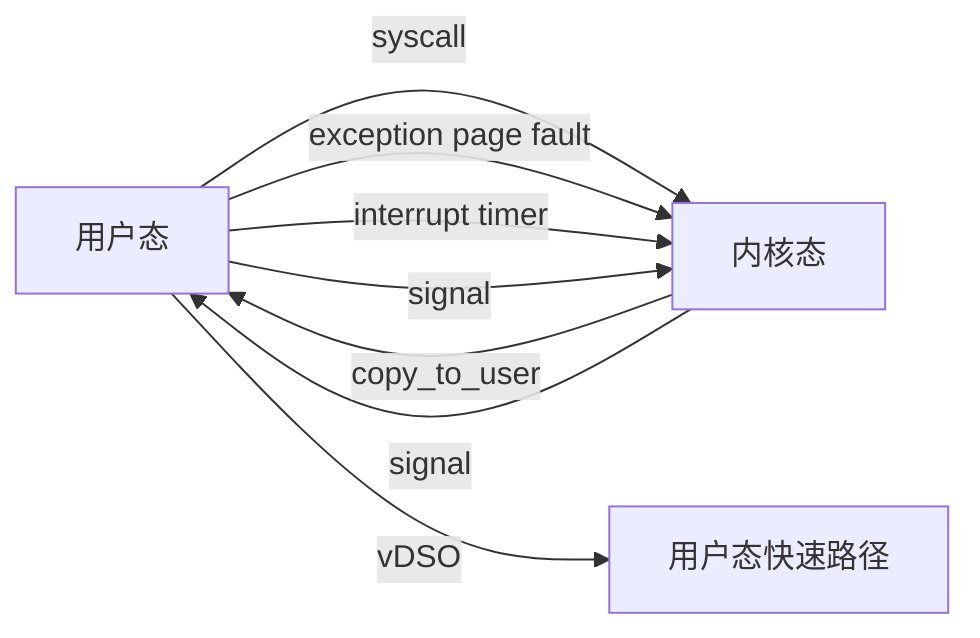
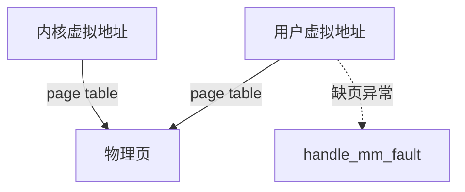

# 内核-用户边界映射

> **目标**：梳理 Linux 内核与用户态之间的所有边界机制：系统调用、异常、中断、虚拟内存、IPC、文件描述符、vDSO、seccomp。

---

## 1. 边界概览

---

## 2. 边界机制

| 机制 | 方向 | 说明 |
|------|------|------|
| 系统调用 | 用户 → 内核 | 受控进入内核的入口 |
| 异常 | 用户 → 内核 | 缺页、非法指令、除零 |
| 中断 | 内核 ← 硬件 | 异步事件，用户态透明 |
| 信号 | 内核 → 用户 | 异步通知机制 |
| vDSO | 内核 → 用户 | 用户态直接读取内核数据 |
| `copy_to_user` | 内核 → 用户 | 安全复制数据到用户空间 |
| `copy_from_user` | 用户 → 内核 | 安全复制用户数据到内核 |
| Netlink | 用户 ↔ 内核 | 网络配置与事件 |
| `ioctl` | 用户 ↔ 内核 | 设备特定命令 |
| `seccomp` | 用户 → 内核 | 限制可使用的系统调用 |

---

## 3. 系统调用入口

| 架构 | 入口指令 | 内核入口 |
|------|----------|----------|
| x86_64 | `syscall` | `entry_SYSCALL_64` |
| x86_32 | `int 0x80` / `sysenter` | `entry_INT80_32` |
| ARM64 | `svc #0` | `el0_sync` |
| ARM32 | `svc #0` | `vector_swi` |
| RISC-V | `ecall` | `handle_exception` |

---

## 4. 虚拟内存边界

- 用户态不能直接访问内核虚拟地址
- 内核通过 `copy_to_user` / `copy_from_user` 安全传输数据
- `mmap` 允许用户态直接映射设备内存或文件页

---

## 5. 安全边界

| 机制 | 作用 |
|------|------|
| 特权级 | 用户态 ring 3，内核态 ring 0 |
| 地址空间隔离 | 页表隔离用户与内核空间 |
| `seccomp` | 限制系统调用白名单 |
| LSM | 强制访问控制 |
| `ptrace` | 受限的跨边界调试 |

---

## 6. 性能边界优化

| 机制 | 优化点 |
|------|--------|
| vDSO | `gettimeofday` 无需系统调用 |
| `io_uring` | 批量化系统调用，减少用户/内核切换 |
| `mmap` | 零拷贝文件访问 |
| `userfaultfd` | 用户态处理缺页 |

---

## 7. 相关文件

- [系统调用接口](./syscall-interface.md)
- [ABI/API 映射](./abi-api.md)
- [安全机制 Linux](../05-linux-kernel/security-linux.md)
