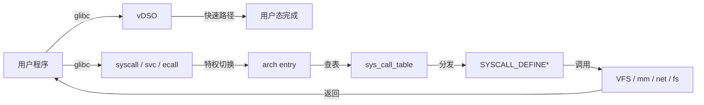

# 系统调用接口（System Call Interface）

> **权威来源**：POSIX.1-2024 §System Interfaces, Intel SDM Vol. 3A, ARM Architecture Reference Manual, Linux Kernel Development, LWN.net。
>
> **目标**：系统讲解系统调用接口的硬件基础、内核实现、ABI 约定、性能优化与安全控制。

---

## 1. 系统调用全景



---

## 2. 硬件基础：特权级与指令

| 架构 | 用户态→内核态指令 | 内核态→用户态指令 | 特权级 |
|------|-------------------|-------------------|--------|
| x86-64 | `syscall` / `sysenter` | `sysret` / `sysexit` | Ring 0/3 |
| ARM64 | `svc #0` | `eret` | EL0/EL1 |
| RISC-V | `ecall` | `sret` | U-mode/S-mode |
| ARM32 | `svc #0` | `movs pc, lr` | User/SVC |

### 2.1 x86-64 syscall 寄存器约定

| 寄存器 | 用途 |
|--------|------|
| `rax` | 系统调用号 / 返回值 |
| `rdi` | 第 1 参数 |
| `rsi` | 第 2 参数 |
| `rdx` | 第 3 参数 |
| `r10` | 第 4 参数（Linux 约定，替代 rcx） |
| `r8`  | 第 5 参数 |
| `r9`  | 第 6 参数 |
| `rcx` | 保存用户态 RIP |
| `r11` | 保存用户态 RFLAGS |

### 2.2 ARM64 syscall 寄存器约定

| 寄存器 | 用途 |
|--------|------|
| `x8` | 系统调用号 |
| `x0`~`x5` | 参数 1~6 |
| `x0` | 返回值 |

---

## 3. Linux 系统调用实现

### 3.1 入口代码

| 架构 | 入口文件 | 说明 |
|------|----------|------|
| x86-64 | `arch/x86/entry/entry_64.S` | `entry_SYSCALL_64` |
| ARM64 | `arch/arm64/kernel/entry.S` | `el0_sync` |
| RISC-V | `arch/riscv/kernel/entry.S` | `handle_exception` |

### 3.2 系统调用表

```c
// arch/x86/entry/syscalls/syscall_64.tbl
0   common  read            sys_read
1   common  write           sys_write
2   common  open            sys_open
...
```

### 3.3 定义系统调用

```c
SYSCALL_DEFINE3(write, unsigned int, fd, const char __user *, buf, size_t, count)
{
    return ksys_write(fd, buf, count);
}
```

### 3.4 关键路径示例：`write()`

```text
用户态 write()
  ↓ libc 设置 rax=1, rdi=fd, rsi=buf, rdx=count
  ↓ syscall 指令
  ↓ entry_SYSCALL_64
    ↓ swapgs, 保存用户态寄存器到 per-cpu stack
    ↓ do_syscall_64()
      ↓ sys_call_table[rax] → __x64_sys_write
        ↓ do_syscall_x64() → __se_sys_write → __do_sys_write
          ↓ ksys_write() → vfs_write()
            ↓ file->f_op->write_iter()
              ↓ ext4_file_write_iter()
    ↓ 恢复现场，sysret
```

---

## 4. vDSO（virtual Dynamic Shared Object）

### 4.1 目的

- 避免某些频繁系统调用的内核态切换开销。
- 例如 `gettimeofday()`, `clock_gettime()`, `getcpu()`。

### 4.2 机制

```text
内核初始化时生成 vDSO 页
  ↓ 映射到每个进程用户态地址空间
  ↓ glibc 调用 __vdso_clock_gettime
    ↓ 直接读取 per-cpu vvar 页中的时间数据
    ↓ 无需进入内核
```

### 4.3 vDSO 符号

| 函数 | 作用 |
|------|------|
| `__vdso_clock_gettime` | 获取时间 |
| `__vdso_gettimeofday` | 获取timeofday |
| `__vdso_time` | 获取 time_t |
| `__vdso_getcpu` | 获取当前 CPU |

---

## 5. seccomp 与系统调用过滤

### 5.1 seccomp 模式

| 模式 | 说明 |
|------|------|
| `SECCOMP_MODE_STRICT` | 只允许 read/write/exit/sigreturn |
| `SECCOMP_MODE_FILTER` | 使用 BPF 程序过滤任意系统调用 |

### 5.2 seccomp-bpf 流程

```text
进程加载 seccomp filter
  ↓ 每次系统调用前执行 BPF prog
    ↓ ALLOW：继续执行系统调用
    ↓ ERRNO：返回错误码，不进入内核
    ↓ TRAP：发送 SIGSYS
    ↓ TRACE：通知 ptracer
```

---

## 6. ptrace

| 用途 | 说明 |
|------|------|
| 调试器 | GDB 通过 ptrace 控制被调试进程 |
| 系统调用跟踪 | strace 使用 `PTRACE_SYSCALL` |
| 进程监控 | 容器/沙箱监控子进程行为 |

---

## 7. /proc 与 /sys 接口

| 路径 | 内容 | 例子 |
|------|------|------|
| `/proc/<pid>/` | 进程信息 | maps, status, fd, exe |
| `/proc/sys/` | 内核参数 | `net.core.somaxconn` |
| `/proc/interrupts` | 中断统计 | - |
| `/sys/class/` | 设备类 | `net/`, `block/`, `gpio/` |
| `/sys/devices/` | 设备树结构 | platform, PCI, USB |
| `/sys/kernel/debug/` | debugfs | 调试信息 |

---

## 8. 系统调用开销与优化

| 开销来源 | 说明 | 优化 |
|----------|------|------|
| 特权切换 | syscall/sysret 约 100~300 cycles | 减少 syscall 次数，批量处理 |
| 参数拷贝 | 用户态/内核态数据拷贝 | mmap, vDSO, io_uring |
| TLB flush | KPTI/PTI 导致 TLB 刷新 | 硬件缓解，PCID |
| 缓存污染 | 内核态污染用户态 cache | 分离关键路径 |

---

## 9. 术语表

| 中文 | 英文 | 一句话定义 |
|------|------|------------|
| 系统调用 | System Call | 用户态请求内核服务的受控入口 |
| ABI | Application Binary Interface | 二进制层面的调用约定与接口规范 |
| vDSO | virtual DSO | 内核映射到用户态的共享库，加速部分系统调用 |
| seccomp | Secure Computing Mode | 使用 BPF 限制进程可使用的系统调用 |
| ptrace | Process Trace | 进程跟踪与调试接口 |
| syscall table | 系统调用表 | 系统调用号到内核处理函数的映射表 |
| context switch | 上下文切换 | 保存/恢复 CPU 状态的过程 |

---

## 10. 国际来源映射

| 概念 | 来源类型 | 来源 | 位置 |
|------|----------|------|------|
| 系统调用 | Standard | POSIX.1-2024 | System Interfaces |
| x86 syscall | Datasheet | Intel | Intel SDM Vol. 3A Ch. 5 |
| ARM64 syscall | Datasheet | ARM | ARM ARM DDI 0487 |
| Linux entry | SourceCode | Linux Kernel | `arch/x86/entry/` |
| seccomp | SourceCode | Linux Kernel | `kernel/seccomp.c` |
| vDSO | SourceCode | Linux Kernel | `arch/x86/entry/vdso/` |

---

## 11. 相关文件

- [ABI/API](./abi-api.md)
- [内核-用户边界](./kernel-user-boundary.md)
- [HAL/BSP/设备树](./hal-bsp-device-tree.md)
- [跨层映射](./cross-layer-mapping.md)
- [POSIX 映射](./posix-mapping.md)

## 国际权威来源链接 / Authoritative Sources

- [POSIX.1-2024 System Interfaces](https://pubs.opengroup.org/onlinepubs/9799919799/)
- [Linux Kernel - System Calls](https://docs.kernel.org/process/syscall-architecture.html)
- [Linux seccomp documentation](https://docs.kernel.org/userspace-api/seccomp_filter.html)
- [Linux vDSO documentation](https://docs.kernel.org/userspace-api/vDSO.html)
- [Intel 64 and IA-32 Architectures Software Developer's Manual, Vol. 3A](https://www.intel.com/content/www/us/en/developer/articles/technical/intel-sdm.html)
