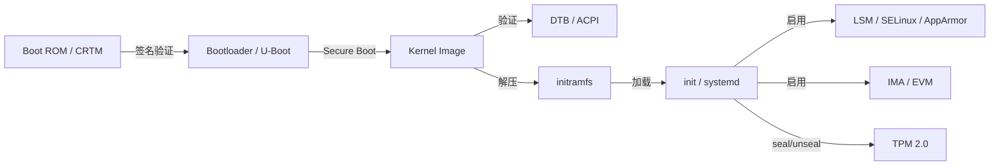
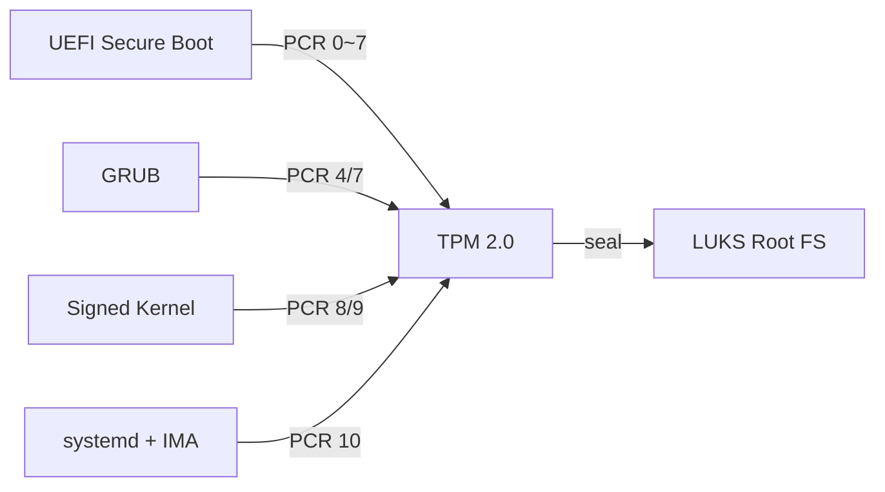
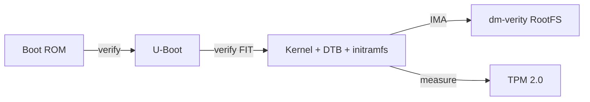
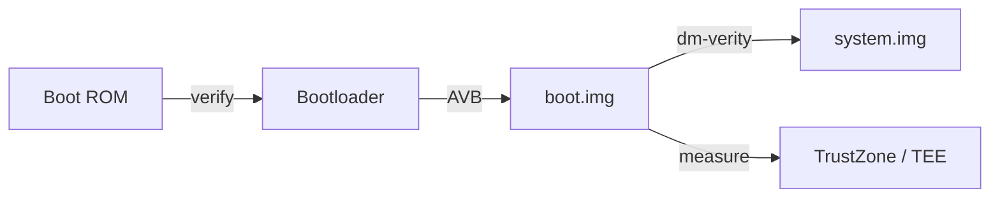

# 可信启动链（Trusted Boot Chain）

<!-- TOC START -->

- [可信启动链（Trusted Boot Chain）](#可信启动链trusted-boot-chain)
  - [1. 启动链概览](#1-启动链概览)
  - [2. 各阶段详细映射](#2-各阶段详细映射)
    - [2.1 Boot ROM / CRTM](#21-boot-rom--crtm)
    - [2.2 Bootloader](#22-bootloader)
    - [2.3 Kernel Image](#23-kernel-image)
    - [2.4 initramfs / init](#24-initramfs--init)
  - [3. 信任根与度量](#3-信任根与度量)
    - [3.1 TPM 2.0 PCR 使用](#31-tpm-20-pcr-使用)
    - [3.2 IMA / EVM 策略示例](#32-ima--evm-策略示例)
  - [4. 安全机制映射](#4-安全机制映射)
  - [5. 攻击面与缓解](#5-攻击面与缓解)
  - [6. 场景示例](#6-场景示例)
    - [6.1 企业服务器](#61-企业服务器)
    - [6.2 嵌入式 Linux 设备](#62-嵌入式-linux-设备)
    - [6.3 Android Verified Boot](#63-android-verified-boot)
  - [7. 国际来源映射](#7-国际来源映射)
  - [8. 相关文件](#8-相关文件)

<!-- TOC END -->

> **权威来源**：UEFI Specification 2.10, TCG TPM 2.0 Library Spec, ACPI 6.5, Linux Kernel Documentation (IMA/EVM), ARM Trusted Firmware。
>
> **目标**：建立从硬件信任根到 OS TCB 的端到端可信启动链，明确每个阶段的度量、验证与安全机制。

---

## 1. 启动链概览



| 阶段 | 组件 | 主要职责 | 关键安全机制 |
|------|------|----------|--------------|
| 0 | Boot ROM / CRTM | 初始化硬件，验证第一阶段启动代码 | 不可变 ROM，Root of Trust |
| 1 | Bootloader (UEFI / U-Boot / GRUB) | 加载内核，可能加载 initramfs | Secure Boot 签名验证 |
| 2 | Kernel Image | 操作系统内核 | 签名验证，锁定内核模块 |
| 3 | DTB / ACPI | 硬件描述 | 签名/完整性校验 |
| 4 | initramfs | 早期用户态环境 | 签名验证，最小化攻击面 |
| 5 | init / systemd | 系统初始化 | LSM, seccomp, capabilities |
| 6 | IMA / EVM | 运行时完整性度量 | 文件哈希/签名 |
| 7 | TPM 2.0 | 存储度量值与密钥 | PCR, sealed storage |

---

## 2. 各阶段详细映射

### 2.1 Boot ROM / CRTM

| 属性 | 说明 |
|------|------|
| 位置 | SoC 内部 ROM 或 SPI Flash 起始段 |
| 信任根 | 硬件 Root of Trust |
| 验证 | 公钥哈希烧录在 eFuse/OTP 中 |
| 后续加载 | Bootloader 第一阶段（BL1/BL2） |

### 2.2 Bootloader

| 形态 | 职责 | 验证对象 |
|------|------|----------|
| UEFI Secure Boot | x86/ARM64 服务器/PC | shim, GRUB, kernel |
| U-Boot SPL | 嵌入式 ARM/MIPS/RISC-V | U-Boot 第二阶段, kernel dtb |
| GRUB | 多系统引导 | kernel, initramfs |
| ARM Trusted Firmware | ARMv8-A 安全启动 | BL31, BL32 (OP-TEE), BL33 (UEFI/UBoot) |

### 2.3 Kernel Image

| 属性 | Linux | 嵌入式 Linux |
|------|-------|--------------|
| 格式 | bzImage / vmlinuz / Image.gz | zImage / uImage / fitImage |
| 签名 | `kernel_module.sig_enforce`, `CONFIG_MODULE_SIG` | 设备树签名, FIT image 签名 |
| 锁定 | `kernel_lockdown` (integrity/confidentiality mode) | 定制锁定 |

### 2.4 initramfs / init

| 属性 | 说明 |
|------|------|
| 职责 | 挂载根文件系统，加载必要驱动，启动 PID 1 |
| 安全 | 越小越好，签名验证，只读或 dm-verity |
| 关键初始化 | LSM policy load, auditd start, IMA policy load |

---

## 3. 信任根与度量

### 3.1 TPM 2.0 PCR 使用

| PCR 索引 | 典型度量内容 |
|-----------|--------------|
| PCR 0 | BIOS/UEFI firmware code |
| PCR 1~3 | UEFI configuration, OEM data |
| PCR 4 | UEFI Boot Manager code |
| PCR 5 | Boot Manager configuration |
| PCR 7 | Secure Boot state |
| PCR 8~9 | Kernel / initramfs (Linux IMA) |
| PCR 10 | IMA measurement log |

### 3.2 IMA / EVM 策略示例

```bash
# IMA 度量策略示例
measure func=BPRM_CHECK
measure func=FILE_MMAP mask=MAY_EXEC
appraise func=BPRM_CHECK fowner=0
```

---

## 4. 安全机制映射

| 安全目标 | 启动链阶段 | 机制 |
|----------|------------|------|
| 防止恶意 bootloader | Boot ROM → Bootloader | Secure Boot 签名链 |
| 防止恶意 kernel | Bootloader → Kernel | kernel 签名验证 |
| 防止篡改 initramfs | Kernel → initramfs | initramfs 签名 / dm-verity |
| 防止运行时文件篡改 | init → 运行期 | IMA appraisal, EVM |
| 防止密钥泄露 | TPM | sealed storage, PCR policy |
| 防止未授权访问 | init → 运行期 | LSM MAC, DAC, capabilities |

---

## 5. 攻击面与缓解

| 攻击面 | 威胁 | 缓解 |
|--------|------|------|
| Bootloader 漏洞 | 持久化 bootkit | Secure Boot, TPM 度量 |
| Kernel 模块签名绕过 | 加载恶意模块 | `module.sig_enforce` |
| initramfs 篡改 | 早期 rootkit | 签名验证, dm-verity |
| PCR 重放 | 伪造启动状态 | TPM 防重放设计, event log |
| DMA 攻击 | 物理内存访问 | IOMMU, kernel lockdown |
| 物理访问 | 篡改 eFuse/Flash | Secure Boot, tamper detection |

---

## 6. 场景示例

### 6.1 企业服务器



### 6.2 嵌入式 Linux 设备



### 6.3 Android Verified Boot



---

## 7. 国际来源映射

| 主题 | 来源类型 | 来源 | 位置 |
|------|----------|------|------|
| UEFI Secure Boot | Standard | UEFI 2.10 | <https://uefi.org/specifications> |
| TPM 2.0 | Standard | TCG | Library Spec v1.83 |
| IMA/EVM | SourceCode | Linux Kernel | `security/integrity/` |
| ARM Trusted Firmware | SourceCode | ARM | <https://github.com/ARM-software/arm-trusted-firmware> |
| dm-verity | SourceCode | Linux Kernel | `drivers/md/dm-verity.c` |
| Android Verified Boot | Documentation | Google | AVB documentation |

---

## 8. 相关文件

- [Common Criteria / NIST / TPM / TrustZone 映射](../../2.0%20国际标准映射/2.0.2.1%20Common-Criteria-NIST-TPM-TrustZone-mapping.md)
- [HAL/BSP/设备树](./hal-bsp-device-tree.md)
- [Linux 安全子系统](../05-linux-kernel/security-linux.md)
- [跨层映射图](./cross-layer-mapping.md)
