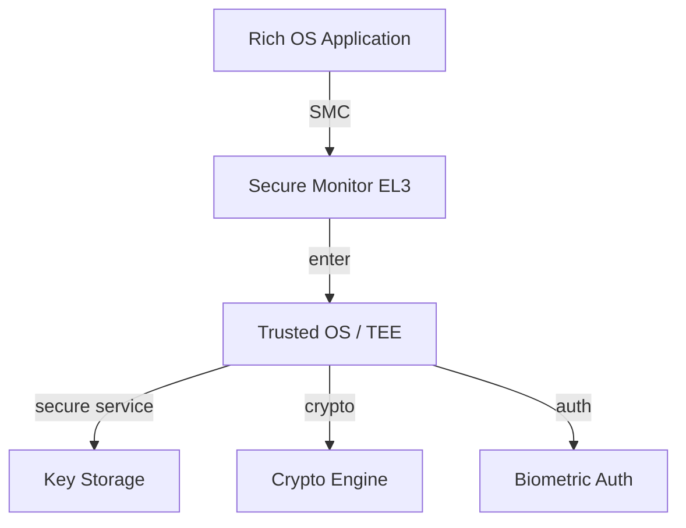

# 操作系统安全与可信计算标准映射（Common Criteria / NIST / TPM / TrustZone）

<!-- TOC START -->

- [操作系统安全与可信计算标准映射（Common Criteria / NIST / TPM / TrustZone）](#操作系统安全与可信计算标准映射common-criteria--nist--tpm--trustzone)
  - [1. 标准清单](#1-标准清单)
  - [2. Common Criteria 2022 → OS 安全机制](#2-common-criteria-2022--os-安全机制)
  - [3. NIST SP 800-53 Rev.5 → OS 安全机制](#3-nist-sp-800-53-rev5--os-安全机制)
  - [4. TCSEC / EAL → OS 安全等级](#4-tcsec--eal--os-安全等级)
  - [5. TPM 2.0 → 可信启动与 TCB](#5-tpm-20--可信启动与-tcb)
  - [6. ARM TrustZone → OS 安全世界](#6-arm-trustzone--os-安全世界)
  - [7. 综合映射表](#7-综合映射表)
  - [8. 覆盖状态与缺口](#8-覆盖状态与缺口)
  - [9. 国际来源映射](#9-国际来源映射)
  - [10. 相关文件](#10-相关文件)

<!-- TOC END -->

> **权威来源**：ISO/IEC 15408:2022 (Common Criteria), NIST SP 800-53 Rev.5, TCG TPM 2.0 Library Spec, ARM TrustZone Technology, TCSEC/Orange Book。
>
> **目标**：将国际安全与可信计算标准条款映射到 Linux/RTOS 的访问控制、隔离、审计、可信启动等机制。

---

## 1. 标准清单

| 标准 | 版本 | 官方链接 | 对应项目章节 |
|------|------|----------|--------------|
| Common Criteria (CC) | ISO/IEC 15408:2022 | <https://www.iso.org/standard/72891.html> | 2.2, 2.4, 2.7 |
| NIST SP 800-53 Rev. 5 | Rev. 5 (2020; upd. 2024) | <https://csrc.nist.gov/publications/detail/sp/800/53/rev-5/final> | 2.2, 2.4, 2.8 |
| TCSEC / Orange Book | DoD 5200.28-STD (1985) | <https://csrc.nist.gov/csrc/media/publications/conference-paper/1998/10/08/proceedings-of-the-21st-nissc-1998/documents/early-cs-papers/tcsec85.pdf> | 2.2 |
| TPM 2.0 Library Spec | v1.83 | <https://trustedcomputinggroup.org/resource/tpm-library-specification/> | 2.2, 2.4, 2.8 |
| ARM TrustZone | ARMv8-M / ARMv9 | <https://developer.arm.com/documentation/100690/latest/> | 2.2, 2.3 |

---

## 2. Common Criteria 2022 → OS 安全机制

Common Criteria 2022 分为四部分，其中与 OS 直接相关的条款：

| CC 2022 条款 | 标题 | OS 安全机制映射 | Linux 实现 | RTOS 实现 |
|--------------|------|-----------------|------------|-----------|
| Part 3 ASE | Security Target evaluation | 安全目标定义 | SELinux policy, AppArmor profiles | 安全配置文件 |
| Part 3 ADV_FSP | Functional specification | 功能规范与接口 | LSM hooks, seccomp filters | MPU region config |
| Part 3 ADV_TDS | TOE design specification | TOE 设计说明 | Kernel architecture docs | RTOS kernel design docs |
| Part 3 ADV_IMP | Implementation representation | 实现表示 | Kernel source code | RTOS source code |
| Part 3 ADV_INT | Internals | 内部结构设计 | Kernel subsystems isolation | Task/memory partitioning |
| Part 3 ALC | Life-cycle support | 生命周期支持 | Kernel signing, reproducible builds | Certified toolchain |
| Part 3 ATE | Tests | 测试 | LTP, kselftests, KUnit | RTOS test suites |
| Part 3 AVA | Vulnerability assessment | 漏洞评估 | CVE process, KASLR, stack canary | Stack guard, MPU |
| Part 3 AGD | Guidance documents | 管理/用户指南 | Linux admin-guide | RTOS integration guide |

---

## 3. NIST SP 800-53 Rev.5 → OS 安全机制

| 控制族 | 控制项 | 标题 | OS 机制映射 | Linux 实现 | RTOS 实现 |
|--------|--------|------|-------------|------------|-----------|
| AC | AC-3 | Access Enforcement | 强制访问控制 | SELinux, AppArmor, LSM | 无/MPU |
| AC | AC-6 | Least Privilege | 最小特权 | Capabilities, sudo, namespaces | 静态权限分配 |
| AC | AC-17 | Remote Access | 远程访问控制 | SSH, VPN, netfilter | 无/自定义 |
| AU | AU-6 | Audit Record Review | 审计记录分析 | auditd, Linux Audit | 可选日志 |
| AU | AU-9 | Protection of Audit Information | 审计信息保护 | audit log permissions | 安全存储 |
| CM | CM-7 | Least Functionality | 最小功能 | kernel config裁剪, seccomp | 静态配置 |
| IA | IA-2 | Identification and Authentication | 身份鉴别 | PAM, Kerberos, TPM | 无/启动认证 |
| IR | IR-4 | Incident Handling | 事件处理 | kernel panic, kdump | watchdog |
| RA | RA-5 | Vulnerability Scanning | 漏洞扫描 | CVE, livepatch | 静态分析 |
| SC | SC-2 | Application Partitioning | 应用分区 | namespaces, cgroups | ARINC 653 partitioning |
| SC | SC-3 | Security Function Isolation | 安全功能隔离 | LSM, kernel lockdown | TrustZone/MPU |
| SC | SC-7 | Boundary Protection | 边界保护 | netfilter, iptables/nftables | 网络栈裁剪 |
| SC | SC-28 | Protection of Information at Rest | 静态信息保护 | dm-crypt, LUKS | 无/Flash 加密 |
| SC | SC-39 | Process Isolation | 进程隔离 | MMU, namespaces | MPU, task isolation |
| SI | SI-2 | Flaw Remediation | 缺陷修复 | Kernel updates, livepatch | OTA/固件更新 |

---

## 4. TCSEC / EAL → OS 安全等级

| TCSEC 等级 | 特征 | 现代对应 | Linux 可达成 | RTOS 可达成 |
|------------|------|----------|--------------|-------------|
| D — Minimal Protection | 无安全要求 | 无 | - | - |
| C1 — Discretionary Security Protection | DAC, 用户标识 | 普通 Linux | ✅ | ✅ |
| C2 — Controlled Access Protection | DAC + 审计 | Linux + auditd | ✅ | 部分 |
| B1 — Labeled Security Protection | MAC, 标签 | SELinux/AppArmor | ✅ | 极少 |
| B2 — Structured Protection | 形式化模型, 隐蔽通道分析 | 高安全系统 | 部分 | 极少 |
| B3 — Security Domains | TCB 最小化, 参考监视器 | seL4, GEMSOS | 部分 (seccomp/LSM) | 极少 |
| A1 — Verified Design | 形式化验证 | seL4 (Isabelle/HOL) | 无原生 | 无原生 |

| EAL 等级 | 保证程度 | 典型 OS |
|----------|----------|---------|
| EAL1 | Functionally tested | 通用软件 |
| EAL2 | Structurally tested | 部分 Linux 发行版 |
| EAL3 | Methodically tested and checked | 加固 Linux |
| EAL4 | Methodically designed, tested and reviewed | 安全 Linux, QNX, Windows |
| EAL5 | Semiformally designed and tested | 航空/高安全 |
| EAL6 | Semiformally verified design and tested | 军事/金融 |
| EAL7 | Formally verified design and tested | seL4, 极少数系统 |

---

## 5. TPM 2.0 → 可信启动与 TCB

| TPM 2.0 概念 | OS 映射 | Linux 实现 |
|--------------|---------|------------|
| PCR (Platform Configuration Registers) | 启动链度量 | `tpm2_pcr_read`, IMA PCR 10 |
| Measured Boot | 每个启动组件被度量 | UEFI Secure Boot + shim + grub + kernel |
| Sealed Storage | 数据密封到 PCR 状态 | LUKS + TPM 2.0 (systemd-cryptenroll) |
| Attestation | 远程证明 | Keylime, Microsoft DHA |
| IMA (Integrity Measurement Architecture) | 运行时文件度量 | `security/integrity/ima/` |
| EVM (Extended Verification Module) | 文件元数据完整性 | `security/integrity/evm/` |
| TCB | 可信计算基 | Kernel + initramfs + LSM + TPM driver |

```mermaid
graph LR
    ROM[Boot ROM / CRTM] -->|measure| BL[Bootloader]
    BL -->|measure| KERNEL[Kernel Image]
    KERNEL -->|measure| INITRAMFS[initramfs]
    INITRAMFS -->|measure| INIT[init / systemd]
    INIT -->|IMA| FILES[/usr/bin/*]
    ROM -->|PCR0| TPM[TPM 2.0 PCR]
    BL -->|PCR4/5/7| TPM
    KERNEL -->|PCR8/9| TPM
    INIT -->|PCR10| TPM
    TPM -->|seal/unseal| KEY[Disk Encryption Key]
```

---

## 6. ARM TrustZone → OS 安全世界

| TrustZone 概念 | OS 映射 | 实现 |
|----------------|---------|------|
| Normal World | 普通 OS（Linux/RTOS） | Rich OS |
| Secure World | 可信执行环境（TEE） | OP-TEE, Trusty, Qualcomm QSEE |
| SMC | 安全监控调用 | `smc` 指令，切换世界 |
| Secure Boot | 安全启动 | ROM 验证 BL2/BL31/BL32/BL33 签名 |
| TZASC | TrustZone Address Space Controller | DDR 分区保护 |
| GPIO/UART 安全 | 外设安全配置 | 安全世界独占某些外设 |



---

## 7. 综合映射表

| 安全需求 | CC 条款 | NIST 控制 | TPM/TrustZone | Linux 机制 | RTOS 机制 |
|----------|---------|-----------|---------------|------------|-----------|
| 访问控制 | ADV_FSP, ASE | AC-3, AC-6 | - | DAC/ACL, SELinux, AppArmor | 任务权限, MPU |
| 审计 | ADV_TDS, ATE | AU-6, AU-9 | PCR | auditd, Linux Audit | 可选日志 |
| 隔离 | ADV_INT, ALC | SC-2, SC-3, SC-39 | TrustZone | namespaces, cgroups, LSM, seccomp | MPU, partitioning |
| 可信启动 | ASE, AVA | IA-2, SC-28 | TPM PCR | UEFI Secure Boot, IMA/EVM, LUKS+TPM | Secure Boot, TEE |
| 漏洞抵抗 | AVA | RA-5, SI-2 | - | KASLR, stack canary, kernel lockdown | Stack guard, W^X |
| 生命周期 | ALC | CM-7 | - | Reproducible builds, signed kernel | Certified toolchain |

---

## 8. 覆盖状态与缺口

| 主题 | 覆盖状态 | 缺口 |
|------|----------|------|
| CC 2022 条款映射 | 已规划/部分覆盖 | ADV/ATE/AVA 细节待阶段四形式化 |
| NIST SP 800-53 控制族 | 已规划/部分覆盖 | 更多控制项（CM-8/SC-12 等）可扩展 |
| TCSEC/EAL 等级 | 已覆盖 | - |
| TPM 2.0 启动链 | 已规划 | 待 `trusted-boot-chain.md` 详细展开 |
| ARM TrustZone | 已规划 | 待与 RTOS/TEE 联合分析 |

---

## 9. 国际来源映射

| 主题 | 来源类型 | 来源 | 位置 |
|------|----------|------|------|
| Common Criteria | Standard | ISO/IEC 15408:2022 | 官方标准 |
| NIST SP 800-53 | Standard | NIST | Rev. 5 final |
| TPM 2.0 | Standard | Trusted Computing Group | Library Spec v1.83 |
| ARM TrustZone | Architecture | ARM Ltd. | ARM Security Technology |
| Linux 安全子系统 | SourceCode | Linux Kernel | security/, integrity/ |
| seL4 形式化验证 | Paper | SOSP 2009 | DOI: 10.1145/1629575.1629596 |

---

## 10. 相关文件

- [2.0.2 操作系统安全与可信计算标准映射](2.0.2%20操作系统安全与可信计算标准映射.md)
- [可信启动链](../02-operating-systems/08-interfaces/trusted-boot-chain.md)
- [Linux 安全子系统](../02-operating-systems/05-linux-kernel/security-linux.md)
- [形式化审计](../../../validation/formal-artifacts-gap-audit.md)
