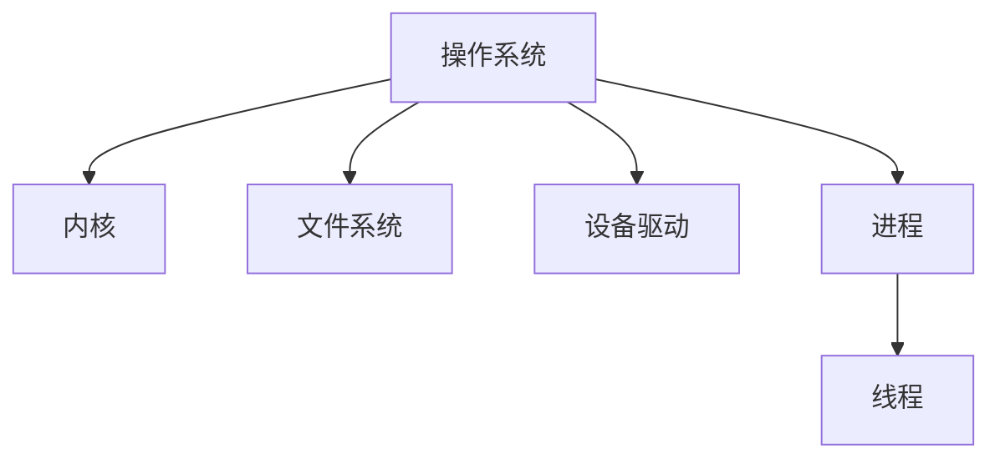

# 2.1.1 基本概念

## 1. 概念定义与背景

- **操作系统（Operating System, OS）**：管理计算机硬件与软件资源，为应用程序提供服务的系统软件。操作系统是计算机系统的核心，负责资源分配、进程管理、文件管理、设备管理等。
- **内核（Kernel）**：操作系统的核心部分，负责底层资源管理和系统调用。
- **用户态/内核态**：操作系统区分用户程序与内核程序的运行权限和空间。

## 2. 相关术语

- 进程（Process）：程序的执行实例，拥有独立的地址空间。
- 线程（Thread）：进程内的最小执行单元，共享进程资源。
- 系统调用（System Call）：用户程序请求操作系统服务的接口。
- 文件系统（File System）：用于管理和存储数据的系统组件。
- 设备驱动（Device Driver）：操作系统与硬件设备之间的接口程序。

## 3. 结构化表达

- 概念图：

- 术语表：
| 编号 | 术语       | 定义 |
|------|------------|------|
| 2.1.1.1 | 操作系统   | 管理硬件与软件资源的系统软件 |
| 2.1.1.2 | 内核       | 操作系统的核心部分 |
| 2.1.1.3 | 进程       | 程序的执行实例 |
| 2.1.1.4 | 线程       | 进程内的最小执行单元 |
| 2.1.1.5 | 系统调用   | 用户与内核交互的接口 |

## 4. 发展脉络

- 1950s：批处理操作系统诞生，实现自动作业管理。
- 1960s：分时操作系统出现，支持多用户并发。
- 1970s：UNIX操作系统推动开放与移植。
- 1980s：图形界面操作系统普及（如Windows、Mac OS）。
- 1990s-至今：网络化、分布式、嵌入式操作系统发展。

## 5. 主要理论/流派

- 批处理系统、分时系统、实时系统、分布式系统、嵌入式系统等。
- 单内核与微内核架构。

## 6. 关键问题与挑战

- 资源分配的公平性与效率
- 并发与同步
- 安全性与隔离性
- 可扩展性与兼容性

## 7. 典型案例

- UNIX/Linux操作系统：多用户、多任务、开源。
- Windows操作系统：图形界面、广泛应用于个人电脑。
- 嵌入式操作系统：如RTOS、Android。

## 8. 批判性分析

- 单内核与微内核的争议
- 开源与闭源操作系统的优劣
- 安全性与易用性的权衡

## 9. 形式化结构与符号表达

- 操作系统OS = (K, P, F, D, S)
  - K：内核
  - P：进程集合
  - F：文件系统
  - D：设备驱动
  - S：系统调用集合

## 10. 形式化命题与推理

- 命题：若操作系统支持多进程，则其内核需实现进程调度与隔离。
- 证明：根据定义，多进程需独立资源与调度，内核必须支持。

## 11. 多表征

- 结构层次图、进程状态转换图、资源分配矩阵等

## 12. 形式语义

- “操作系统”语义：为应用与硬件之间提供抽象与隔离。
- 语义模型：进程状态机、系统调用接口模型
- 语义分析方法：一致性验证、死锁检测

---
> 本文件为递归细化与内容补全示范，后续可继续分解为2.1.1.1、2.1.1.2等子主题，支持持续递归完善。
