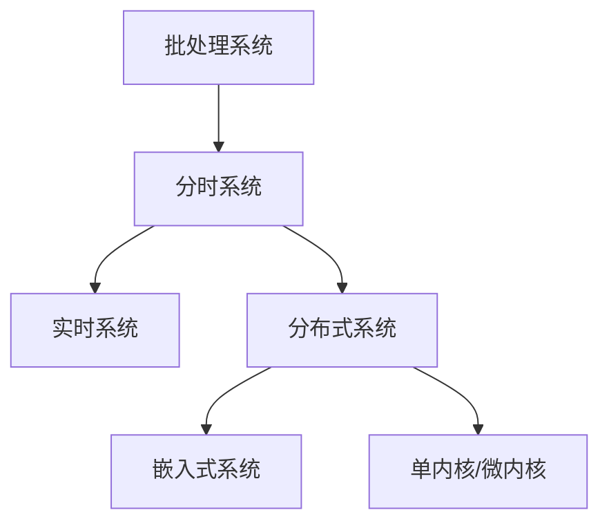

# 2.1.3 主要流派与理论

## 1. 主要流派

- **批处理系统**：自动作业管理，适用于早期大型机。
- **分时系统**：多用户并发，资源共享。
- **实时系统**：对时效性要求高，常用于工业控制。
- **分布式系统**：多机协作，资源分布。
- **嵌入式系统**：专用设备，资源受限。
- **单内核与微内核**：架构差异，影响系统性能与安全。

## 2. 理论比较

- **核心观点**：
  - 批处理系统：作业顺序执行，效率优先。
  - 分时系统：响应时间优先，用户体验提升。
  - 实时系统：确定性与时效性。
  - 分布式系统：资源分布与协作。
  - 嵌入式系统：定制化、低功耗。
- **代表人物**：见上。
- **应用领域**：
  - 批处理：科学计算、数据处理。
  - 分时：教育、科研。
  - 实时：工业、航空。
  - 分布式：云计算、互联网。
  - 嵌入式：物联网、智能设备。
- **异同点分析**：
  - 共同点：均关注资源管理与调度。
  - 区别：架构、目标、应用场景不同。

## 3. 结构化表达

- **流派关系图**：

- **理论对比表**：
| 编号 | 流派/理论 | 核心观点 | 代表人物 | 典型应用 |
|------|----------|----------|----------|----------|
| 2.1.3.1 | 批处理系统 | 作业顺序执行 | 早期IBM团队 | 科学计算 |
| 2.1.3.2 | 分时系统 | 多用户并发 | MIT团队 | 教育、科研 |
| 2.1.3.3 | 实时系统 | 时效性 | 工业控制专家 | 工业、航空 |
| 2.1.3.4 | 分布式系统 | 多机协作 | 分布式计算专家 | 云计算 |
| 2.1.3.5 | 嵌入式系统 | 定制化 | 嵌入式开发者 | 物联网 |

## 4. 多表征

- 理论发展脉络图、对比表、关系网络图

## 5. 规范说明

- 内容需递归细化，支持多表征。
- 保留批判性分析、图表等。
- 如有遗漏，后续补全并说明。

> 本文件为递归细化与内容补全示范，后续可继续分解为2.1.3.1、2.1.3.2等子主题，支持持续递归完善。
