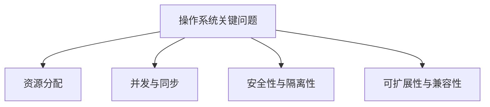

# 2.1.4 关键问题与挑战

## 1. 主要问题

- **资源分配的公平性与效率**：如何在多进程/多用户环境下高效且公平地分配CPU、内存、I/O等资源。
- **并发与同步**：多进程/线程并发执行时的数据一致性与同步机制。
- **安全性与隔离性**：防止进程间互相干扰，保障系统安全。
- **可扩展性与兼容性**：支持新硬件、新应用，兼容历史系统。

## 2. 挑战分析

- **理论与实际的差距**：理论模型简化现实，实际系统中存在大量不可预见因素。
- **多学科交叉的难点**：涉及计算机体系结构、网络、存储等多领域知识。
- **未来发展趋势**：云计算、物联网、AI等新兴领域对操作系统提出新挑战。
- **自组织与自适应能力**：操作系统如何在动态环境下自我调整与优化。

## 3. 结构化表达

- **问题树**：

- **挑战矩阵**：
| 编号 | 挑战 | 影响领域 | 典型难点 |
|------|------|----------|----------|
| 2.1.4.1 | 理论与实际差距 | 工程实现 | 不确定性、模型失效 |
| 2.1.4.2 | 多学科交叉 | 系统设计 | 知识整合、术语不统一 |
| 2.1.4.3 | 未来趋势 | 前沿技术 | 云、物联网、AI |
| 2.1.4.4 | 自组织与自适应 | 智能系统 | 动态优化、弹性伸缩 |

## 4. 多表征

- 问题树、挑战矩阵、趋势图、案例分析

## 5. 规范说明

- 内容需递归细化，支持多表征。
- 保留批判性分析、图表等。
- 如有遗漏，后续补全并说明。

> 本文件为递归细化与内容补全示范，后续可继续分解为2.1.4.1、2.1.4.2等子主题，支持持续递归完善。
