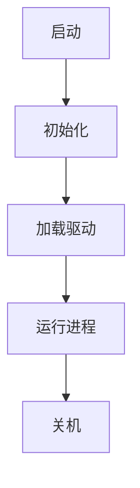

# 2.1.5 相关案例

## 1. 典型案例

- **UNIX操作系统案例**：多用户、多任务、开源。
- **Windows操作系统案例**：图形界面、广泛应用于个人电脑。
- **嵌入式操作系统案例**：如RTOS、Android。
- **分布式操作系统案例**：如Google Fuchsia、Amoeba。

## 2. 案例分析

### 2.1 UNIX操作系统案例

- **案例背景**：20世纪70年代，贝尔实验室开发UNIX，推动多用户多任务。
- **系统结构与要素**：内核、shell、文件系统、进程管理。
- **关键问题与解决方案**：进程调度、文件权限、设备驱动。
- **案例启示**：模块化设计与开源推动技术进步。

### 2.2 Windows操作系统案例

- **案例背景**：微软开发，推动个人电脑普及。
- **系统结构与要素**：图形界面、内核、驱动、注册表。
- **关键问题与解决方案**：兼容性、用户体验、安全性。
- **案例启示**：用户友好与生态系统建设的重要性。

### 2.3 嵌入式操作系统案例：RTOS

- **案例背景**：实时性要求高的工业控制、物联网。
- **系统结构与要素**：实时调度、任务优先级、中断管理。
- **关键问题与解决方案**：确定性、资源受限。
- **案例启示**：专用化与高可靠性。

## 3. 结构化表达

- **案例流程图**：

- **结构表**：
| 编号 | 案例类型 | 主要要素 | 关键机制 | 启示 |
|------|----------|----------|----------|------|
| 2.1.5.1 | UNIX | 内核、shell | 多用户、权限 | 模块化、开源 |
| 2.1.5.2 | Windows | 图形界面、驱动 | 兼容性 | 用户体验 |
| 2.1.5.3 | RTOS | 实时调度 | 确定性 | 高可靠性 |

## 4. 多表征

- 案例流程图、结构表、对比分析、符号化描述

## 5. 规范说明

- 内容需递归细化，支持多表征。
- 保留批判性分析、图表等。
- 如有遗漏，后续补全并说明。

> 本文件为递归细化与内容补全示范，后续可继续分解为2.1.5.1、2.1.5.2等子主题，支持持续递归完善。
