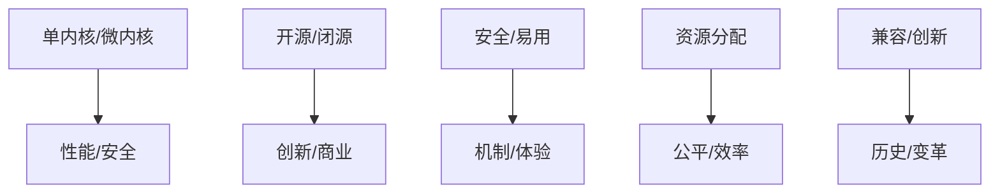

# 2.2.1 主要争议

## 1. 争议主题

- **单内核与微内核之争**：性能与安全性的权衡。
- **开源与闭源操作系统**：开放性、创新性与商业模式的冲突。
- **安全性与易用性**：系统安全机制与用户体验的矛盾。
- **资源分配策略**：公平性与效率的平衡。
- **兼容性与创新性**：向后兼容与新技术引入的冲突。

## 2. 结构化表达

- **争议对比表**：
| 编号 | 争议主题 | 主要观点A | 主要观点B |
|------|----------|----------|----------|
| 2.2.1.1 | 单内核/微内核 | 性能优先 | 安全与模块化 |
| 2.2.1.2 | 开源/闭源 | 创新、开放 | 商业、控制 |
| 2.2.1.3 | 安全/易用 | 严格安全 | 便捷操作 |
| 2.2.1.4 | 资源分配 | 公平性 | 效率 |
| 2.2.1.5 | 兼容/创新 | 兼容历史 | 推动变革 |

- **争议关系图**：

## 3. 多表征

- 对比表、关系图、案例分析、符号化描述

## 4. 规范说明

- 内容需递归细化，支持多表征。
- 保留批判性分析、图表等。
- 如有遗漏，后续补全并说明。

> 本文件为递归细化与内容补全示范，后续可继续分解为2.2.1.1、2.2.1.2等子主题，支持持续递归完善。
