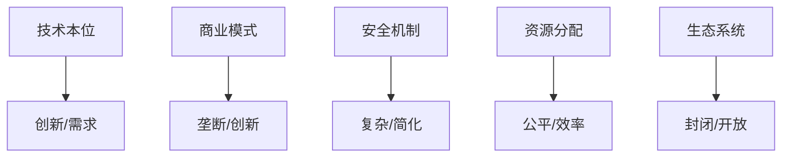

# 2.2.2 批判视角

## 1. 批判视角

- **技术本位批判**：过度追求技术创新可能忽视用户需求。
- **商业模式批判**：闭源操作系统的垄断与创新抑制。
- **安全机制批判**：安全性提升带来的复杂性与用户负担。
- **资源分配批判**：资源分配算法的公平性与实际效果。
- **生态系统批判**：操作系统生态的封闭性与碎片化。

## 2. 结构化表达

- **批判对比表**：
| 编号 | 批判主题 | 传统观点 | 批判观点 |
|------|----------|----------|----------|
| 2.2.2.1 | 技术本位 | 技术优先 | 用户体验优先 |
| 2.2.2.2 | 商业模式 | 商业驱动 | 开放创新 |
| 2.2.2.3 | 安全机制 | 严格安全 | 简化体验 |
| 2.2.2.4 | 资源分配 | 算法最优 | 实际公平 |
| 2.2.2.5 | 生态系统 | 封闭集成 | 开放互通 |

- **批判关系图**：

## 3. 多表征

- 对比表、关系图、案例分析、符号化描述

## 4. 规范说明

- 内容需递归细化，支持多表征。
- 保留批判性分析、图表等。
- 如有遗漏，后续补全并说明。

> 本文件为递归细化与内容补全示范，后续可继续分解为2.2.2.1、2.2.2.2等子主题，支持持续递归完善。
