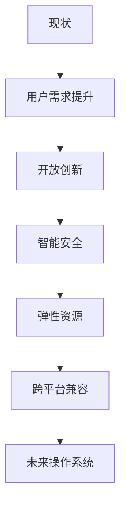

# 2.2.3 反思与重构

## 1. 反思内容

- **技术与用户需求的平衡**：操作系统设计需兼顾创新与易用。
- **开放与封闭的权衡**：生态系统的开放性促进创新，封闭性保障一致性。
- **安全与体验的协同**：安全机制应简化用户操作流程。
- **资源分配机制的优化**：结合算法与实际需求，提升公平性与效率。
- **生态系统的互通性**：推动标准化与兼容性，减少碎片化。

## 2. 重构方向

- **用户中心设计**：以用户体验为核心，简化操作流程。
- **开放创新生态**：鼓励开源与标准化，促进多方协作。
- **智能化安全机制**：引入AI与自动化，提升安全性与便捷性。
- **弹性资源管理**：动态分配资源，适应多样化应用场景。
- **跨平台兼容**：支持多平台协同与数据互通。

## 3. 结构化表达

- **反思路径图**：

- **对比表**：
| 编号 | 现状 | 重构方向 |
|------|------|----------|
| 2.2.3.1 | 技术本位 | 用户中心 |
| 2.2.3.2 | 封闭生态 | 开放创新 |
| 2.2.3.3 | 复杂安全 | 智能简化 |
| 2.2.3.4 | 静态资源 | 弹性管理 |
| 2.2.3.5 | 单平台 | 跨平台 |

## 4. 多表征

- 路径图、对比表、案例分析、符号化描述

## 5. 规范说明

- 内容需递归细化，支持多表征。
- 保留批判性分析、图表等。
- 如有遗漏，后续补全并说明。

> 本文件为递归细化与内容补全示范，后续可继续分解为2.2.3.1、2.2.3.2等子主题，支持持续递归完善。
