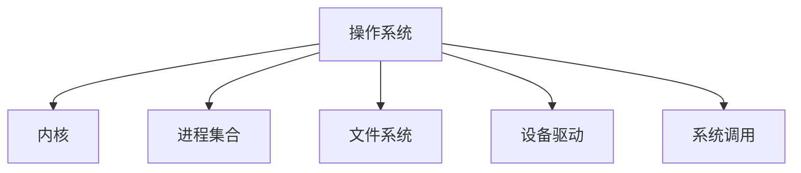
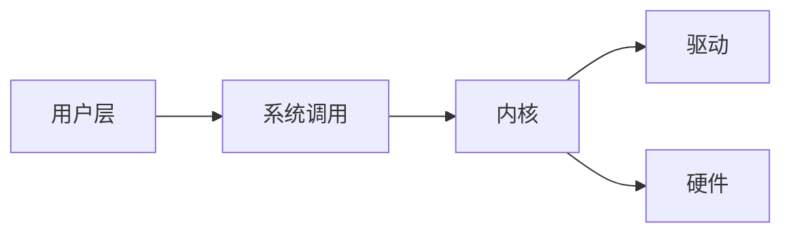

# 2.3.1 形式化定义

## 1. 集合论定义

- 操作系统OS可形式化为：
  OS = (K, P, F, D, S)
  - K：内核（Kernel）
  - P：进程集合（Processes）
  - F：文件系统（File System）
  - D：设备驱动（Device Drivers）
  - S：系统调用集合（System Calls）

## 2. 结构模型

- 操作系统的结构模型包括：
  - 层次结构模型（如内核层、用户层、驱动层）
  - 客户端-服务器模型（微内核架构）
  - 单体内核模型（Monolithic Kernel）

## 3. 符号表达

- OS = (K, P, F, D, S)
- K = (资源管理, 调度, 中断处理)
- P = {p1, p2, ..., pn}
- F = (目录, 文件, 权限)
- D = {d1, d2, ..., dm}
- S = {s1, s2, ..., sk}

## 4. 结构化表达

- **结构图**：

- **层次关系图**：

- **关联矩阵**：
| 组件 | 进程 | 文件系统 | 设备驱动 | 系统调用 |
|------|------|----------|----------|----------|
| 内核 | √    | √        | √        | √        |
| 用户 | √    | √        |          | √        |

## 5. 多表征

- 结构图、层次关系图、关联矩阵、符号化描述

## 6. 规范说明

- 内容需递归细化，支持多表征。
- 保留批判性分析、图表等。
- 如有遗漏，后续补全并说明。

> 本文件为递归细化与内容补全示范，后续可继续分解为2.3.1.1、2.3.1.2等子主题，支持持续递归完善。
