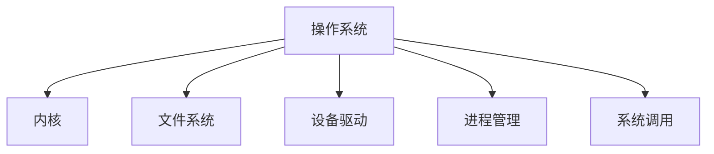
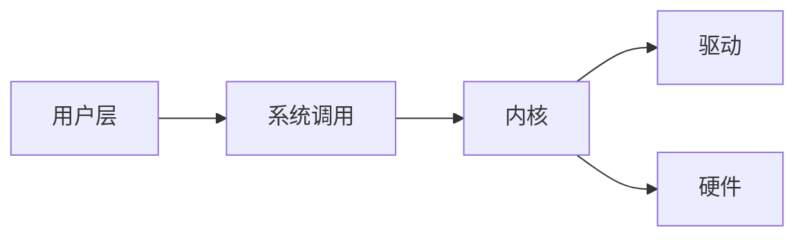

# 2.3.3 结构图与表

## 1. 结构图

## 2. 层次关系图

## 3. 关联矩阵

| 组件 | 进程管理 | 文件系统 | 设备驱动 | 系统调用 |
|------|----------|----------|----------|----------|
| 内核 | √        | √        | √        | √        |
| 用户 | √        | √        |          | √        |

## 4. 结构表

| 编号 | 结构要素 | 说明 |
|------|----------|------|
| 2.3.3.1 | 内核 | 资源管理、调度、中断处理 |
| 2.3.3.2 | 文件系统 | 目录、文件、权限 |
| 2.3.3.3 | 设备驱动 | 硬件接口、驱动程序 |
| 2.3.3.4 | 进程管理 | 进程调度、切换、同步 |
| 2.3.3.5 | 系统调用 | 用户与内核交互接口 |

## 5. 多表征

- 结构图、层次关系图、关联矩阵、结构表、符号化描述

## 6. 规范说明

- 内容需递归细化，支持多表征。
- 保留批判性分析、图表等。
- 如有遗漏，后续补全并说明。

> 本文件为递归细化与内容补全示范，后续可继续分解为2.3.3.1、2.3.3.2等子主题，支持持续递归完善。
