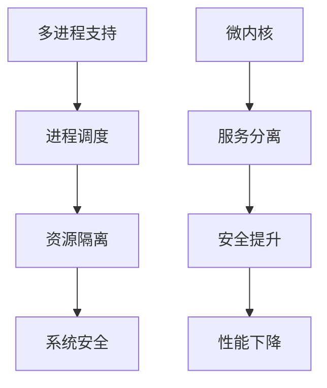

# 2.4.1 命题与定理

## 1. 主要命题

- 命题1：若操作系统支持多进程，则其内核必须实现进程调度与隔离。
- 命题2：微内核架构能提升系统安全性，但可能降低性能。
- 命题3：资源分配算法的公平性与效率存在权衡。
- 命题4：系统调用接口的设计影响操作系统的可扩展性。

## 2. 定理陈述

- 定理1：对于任意支持多用户的操作系统，若其进程调度算法满足优先级调度，则可实现实时性保障。
- 定理2：若操作系统采用分层结构，则各层之间的接口清晰可验证。

## 3. 结构化表达

- **推理链**：
  - 多进程 → 进程调度 → 资源隔离 → 系统安全
  - 微内核 → 服务分离 → 安全提升/性能下降

- **流程图**：

## 4. 多表征

- 推理链、流程图、定理表述、符号化描述

## 5. 规范说明

- 内容需递归细化，支持多表征。
- 保留批判性分析、图表等。
- 如有遗漏，后续补全并说明。

> 本文件为递归细化与内容补全示范，后续可继续分解为2.4.1.1、2.4.1.2等子主题，支持持续递归完善。
