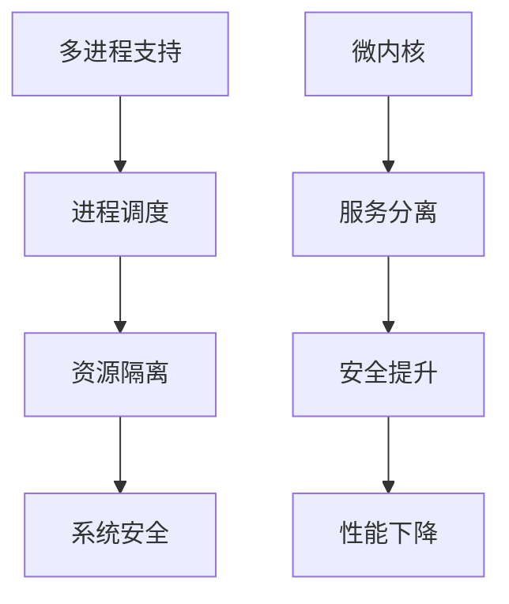

# 2.4.2 证明过程

## 1. 证明结构

- 证明命题1：若操作系统支持多进程，则其内核必须实现进程调度与隔离。
  - 依据：多进程需独立资源与调度，内核需支持进程切换与隔离。
  - 推理链：多进程 → 进程调度 → 资源隔离 → 系统安全。

- 证明命题2：微内核架构能提升系统安全性，但可能降低性能。
  - 依据：服务分离减少内核攻击面，但进程间通信增加开销。
  - 推理链：微内核 → 服务分离 → 安全提升/性能下降。

## 2. 推理链与流程图

- **推理链**：
  - 多进程 → 进程调度 → 资源隔离 → 系统安全
  - 微内核 → 服务分离 → 安全提升/性能下降

- **流程图**：

## 3. 多表征

- 推理链、流程图、证明结构、符号化描述

## 4. 规范说明

- 内容需递归细化，支持多表征。
- 保留批判性分析、图表等。
- 如有遗漏，后续补全并说明。

> 本文件为递归细化与内容补全示范，后续可继续分解为2.4.2.1、2.4.2.2等子主题，支持持续递归完善。
