# 2.5.1 概念图

## 概述

操作系统的概念图提供了系统结构、组件关系和功能层次的可视化表示，帮助理解操作系统的整体架构和内部机制。

## 操作系统整体架构概念图

### 系统层次结构图

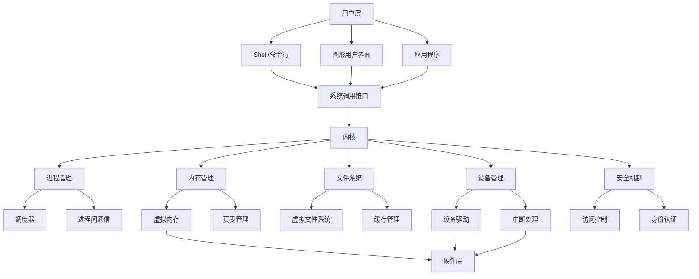

### 内核组件关系图

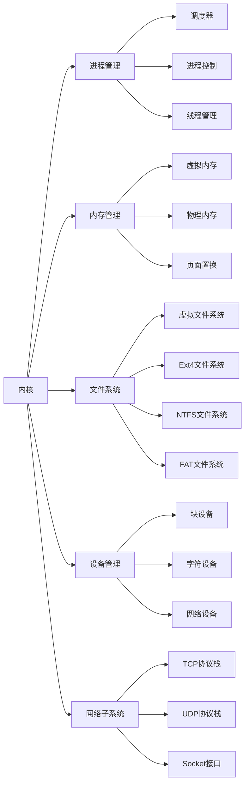

## 进程管理概念图

### 进程状态转换图

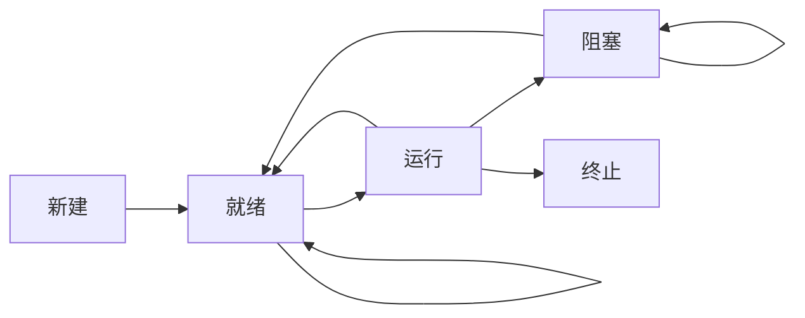

### 进程层次结构图

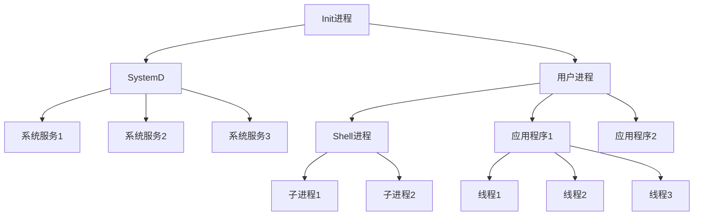

### 线程模型图

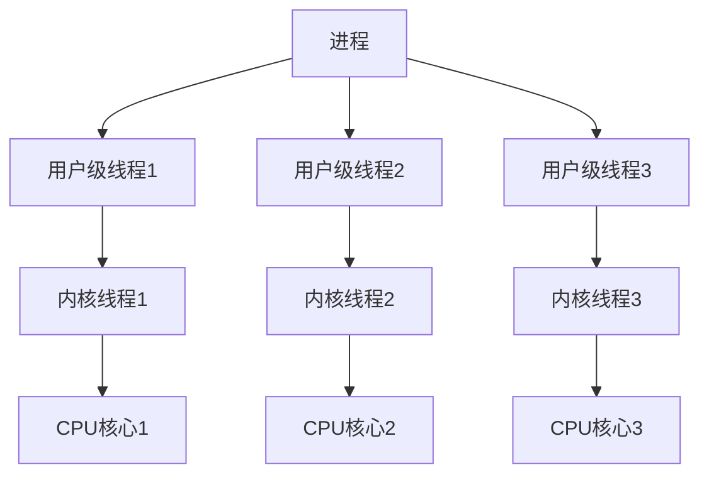

## 内存管理概念图

### 虚拟内存地址空间图

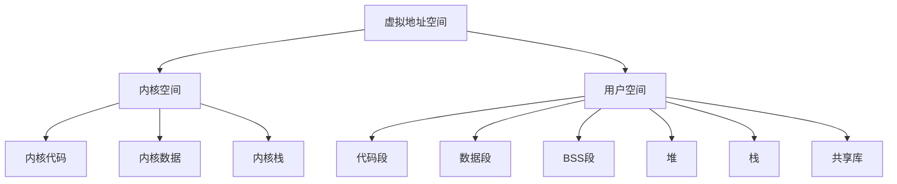

### 页面置换算法图

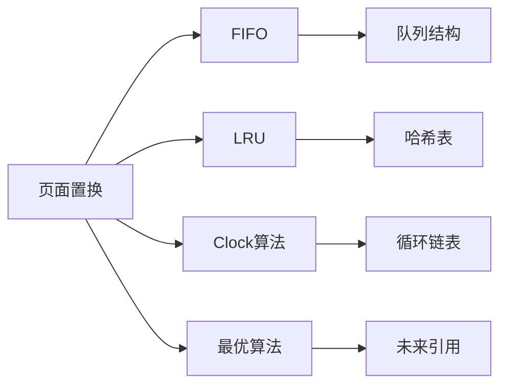

### 内存分配策略图

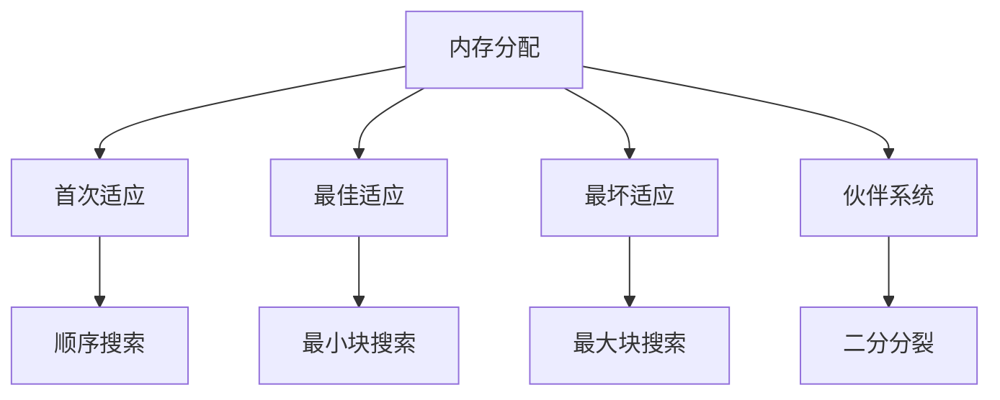

## 文件系统概念图

### 文件系统层次结构图

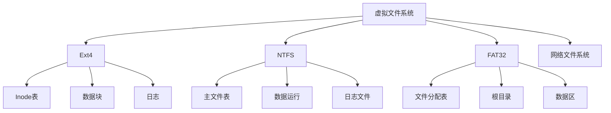

### 文件操作流程图

### 目录结构图

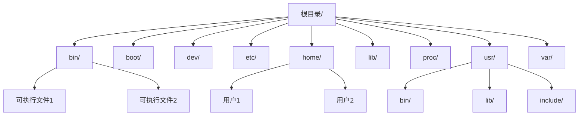

## 设备管理概念图

### 设备分类图

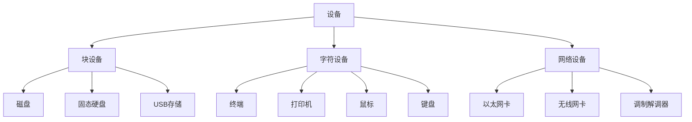

### 设备驱动层次图

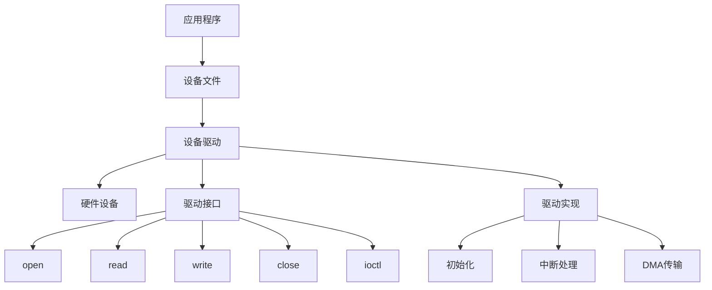

### 中断处理流程图

## 安全机制概念图

### 访问控制模型图

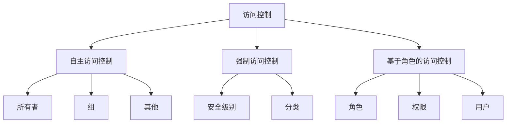

### 身份认证流程图

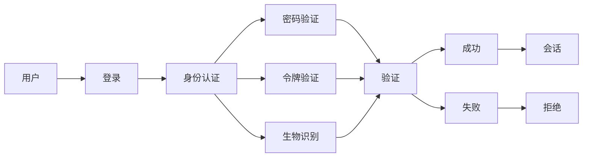

## 网络子系统概念图

### 网络协议栈图

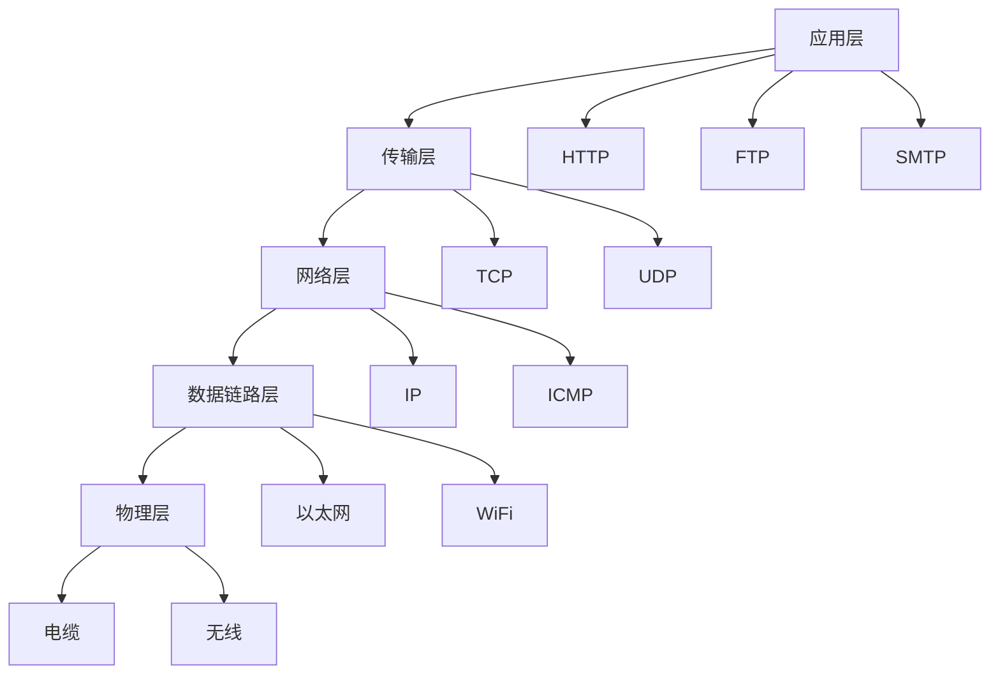

### Socket通信图

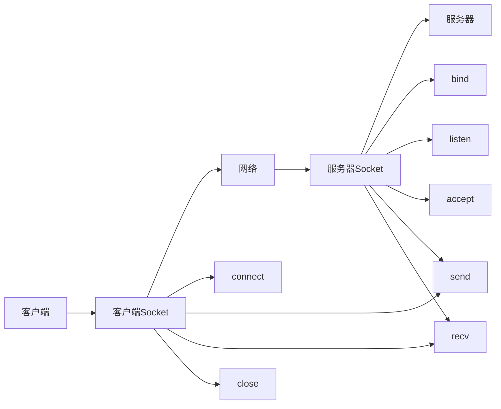

## 总结

操作系统的概念图提供了：

1. **整体架构图**: 系统层次结构和组件关系
2. **进程管理图**: 进程状态转换和线程模型
3. **内存管理图**: 虚拟内存地址空间和分配策略
4. **文件系统图**: 文件系统层次结构和操作流程
5. **设备管理图**: 设备分类和驱动层次
6. **安全机制图**: 访问控制模型和身份认证
7. **网络子系统图**: 协议栈和Socket通信

这些概念图为理解操作系统的复杂结构和内部机制提供了直观的可视化表示。
