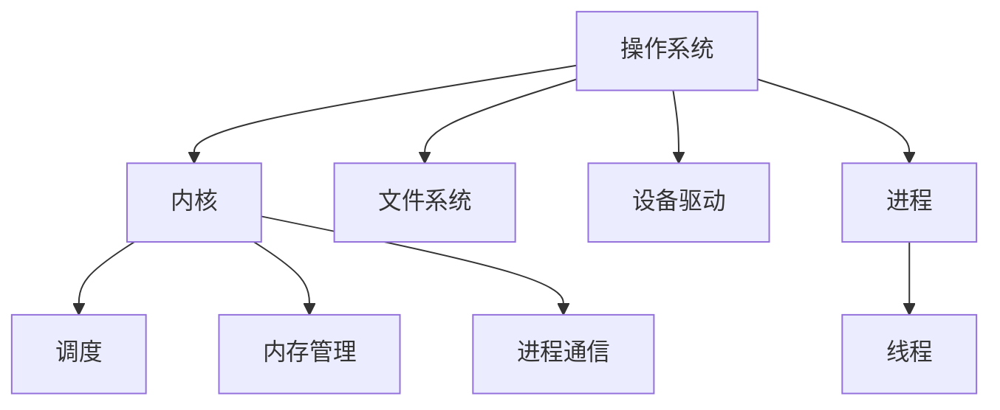
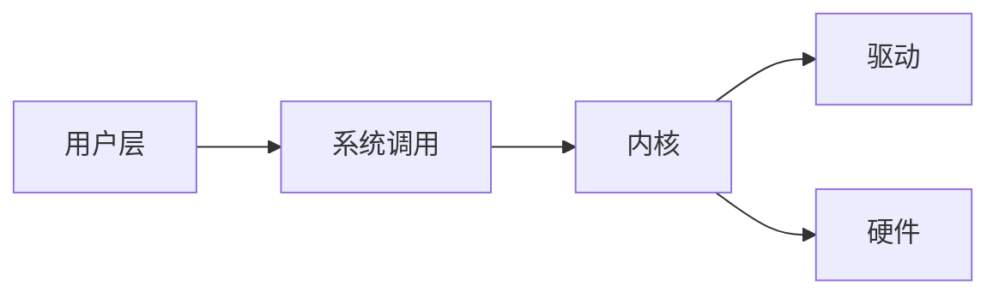

# 2.5.1 概念图

## 1. 操作系统核心概念图

```mermaid
graph TD;
  OS[操作系统] --> Kernel[内核];
  OS --> FS[文件系统];
  OS --> Driver[设备驱动];
  OS --> Process[进程];
  Process --> Thread[线程];
  Kernel --> Sched[调度];
  Kernel --> MM[内存管理];
  Kernel --> IPC[进程通信];
```

## 2. 层次关系图

```mermaid
graph LR;
  User[用户层] --> SysCall[系统调用];
  SysCall --> Kernel[内核];
  Kernel --> Driver[驱动];
  Kernel --> HW[硬件];
```

## 3. 多表征

- 概念图、层次关系图、符号化描述

## 4. 规范说明

- 内容需递归细化，支持多表征。
- 保留批判性分析、图表等。
- 如有遗漏，后续补全并说明。

> 本文件为递归细化与内容补全示范，后续可继续分解为2.5.1.1、2.5.1.2等子主题，支持持续递归完善。
