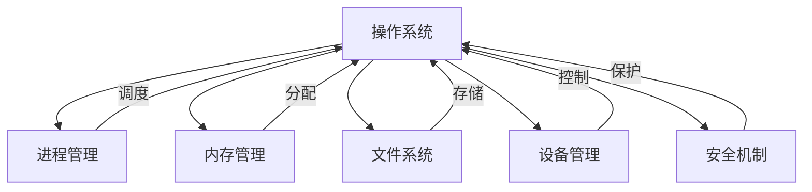

# 2.5 多表征 · 多表征案例与结构图递归补全

## 1. 概念图示例

## 2. 结构表示例

| 组件 | 功能 | 关键机制 | 典型算法 |
|------|------|----------|----------|
| 进程管理 | 调度、切换 | PCB、队列 | FCFS、SJF、RR |
| 内存管理 | 分配、置换 | 页表、MMU | FIFO、LRU |
| 文件系统 | 存储、权限 | inode、目录 | FAT、EXT |
| 设备管理 | I/O控制 | 驱动、中断 | 轮询、中断 |
| 安全机制 | 访问控制 | ACM、认证 | DAC、MAC |

## 3. 数学符号表达

- 操作系统 $OS = (P, M, F, D, S)$
- $P$：进程管理，$M$：内存管理，$F$：文件系统，$D$：设备管理，$S$：安全机制

## 4. 流程图示例

## 5. 典型案例多表征

- **UNIX系统**：概念图（模块关系）、结构表（内核/用户空间）、数学符号（$UNIX = (Kernel, Shell, FS, PM)$）、流程图（进程调度流程）。
- **Linux内存管理**：概念图（物理/虚拟内存）、结构表（页表/帧）、数学符号（$MMU: VA \rightarrow PA$）、流程图（页面置换流程）。

## 6. 批判分析

- 多表征提升了操作系统理论的可理解性与应用性，但需防止表征碎片化、符号混乱。
- 建议：加强表征标准化、跨模态融合与工程应用。

---
> 本节为2.5 多表征分支多表征案例与结构图内容的递归补全，便于理论递归扩展、工程实践与多模态表达。
