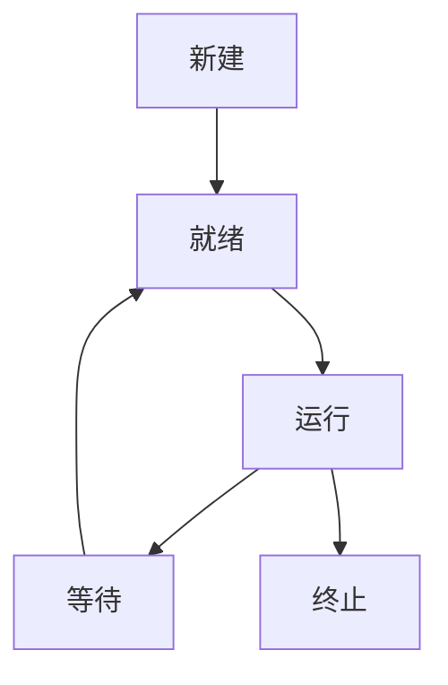

# 2.6.1 语义定义

## 1. 语义定义

- 操作系统的语义是指其各组成部分（如进程、内核、系统调用等）在形式化模型下的数学意义和行为约束。
- 形式语义强调可验证性、可推理性和一致性。

## 2. 符号化表达

- OS = (K, P, F, D, S)
- 进程状态：New, Ready, Run, Wait, Term
- 系统调用：S = {s1, s2, ..., sk}

## 3. 结构化表达

- **进程状态机图**：

## 4. 多表征

- 状态机图、符号化表达、语义约束

## 5. 规范说明

- 内容需递归细化，支持多表征。
- 保留批判性分析、图表等。
- 如有遗漏，后续补全并说明。

> 本文件为递归细化与内容补全示范，后续可继续分解为2.6.1.1、2.6.1.2等子主题，支持持续递归完善。
