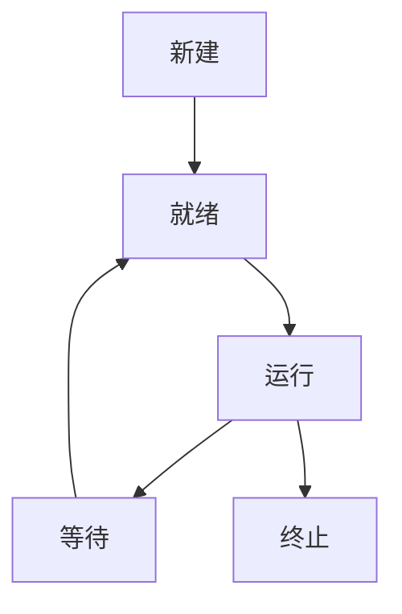

# 2.6.2 语义模型

## 1. 语义模型

- 进程状态机模型：描述进程生命周期的状态转换。
- 系统调用接口模型：形式化描述用户与内核的交互语义。
- 资源分配与调度模型：形式化表达资源分配、调度策略的语义。

## 2. 状态机表达

- **进程状态机图**：

## 3. 接口模型

- 用户空间 <-> 系统调用 <-> 内核空间
- 系统调用S = {s1, s2, ..., sk}

## 4. 多表征

- 状态机图、接口模型、符号化描述

## 5. 规范说明

- 内容需递归细化，支持多表征。
- 保留批判性分析、图表等。
- 如有遗漏，后续补全并说明。

> 本文件为递归细化与内容补全示范，后续可继续分解为2.6.2.1、2.6.2.2等子主题，支持持续递归完善。
