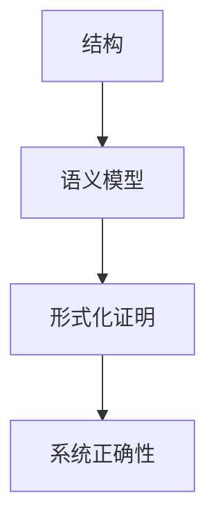

# 2.6.4 语义与结构-证明的关系

## 1. 语义与结构的关系

- 操作系统的结构决定其语义模型，语义模型反过来约束结构设计。
- 结构化的操作系统有助于语义的清晰表达与验证。

## 2. 语义与证明的关系

- 形式语义为操作系统的正确性证明提供基础。
- 语义模型可用于自动化推理与一致性验证。

## 3. 结构化表达

- **关系图**：

## 4. 多表征

- 关系图、符号化描述、案例分析

## 5. 规范说明

- 内容需递归细化，支持多表征。
- 保留批判性分析、图表等。
- 如有遗漏，后续补全并说明。

> 本文件为递归细化与内容补全示范，后续可继续分解为2.6.4.1、2.6.4.2等子主题，支持持续递归完善。
