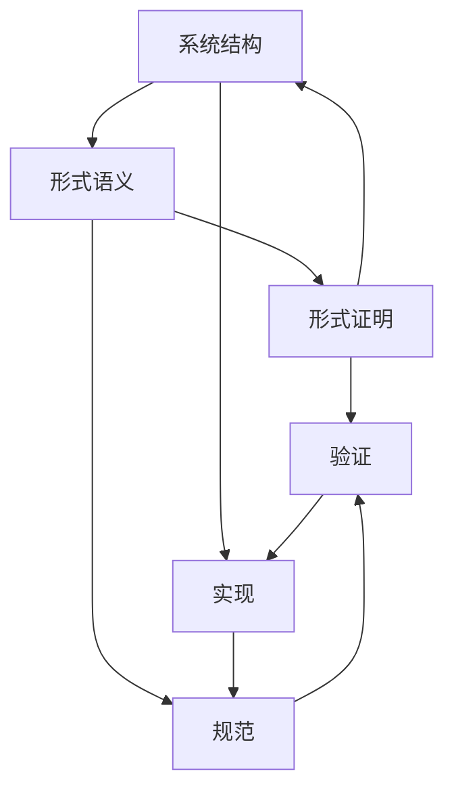

# 2.6.4 语义与结构-证明的关系

## 概述

操作系统的语义、结构和证明之间存在着密切的关系，三者相互支撑、相互验证，形成了完整的理论体系。语义为结构提供行为规范，结构为语义提供实现基础，证明为两者提供正确性保证。

## 语义与结构的关系

### 结构决定语义

**系统结构对语义的影响**:

- $Structure \rightarrow Semantics: \text{系统结构决定其语义模型}$
- $Architecture \rightarrow Behavior: \text{架构设计影响系统行为}$
- $Component \rightarrow Interface: \text{组件设计决定接口语义}$

**形式化表达**:

- $System\_Structure = (Components, Relations, Constraints)$
- $Semantic\_Model = (States, Transitions, Properties)$
- $Structure\_Semantics\_Mapping: Structure \rightarrow Semantics$

**具体映射关系**:

- 进程结构 → 进程语义：$Process\_Structure \rightarrow Process\_Semantics$
- 内存结构 → 内存语义：$Memory\_Structure \rightarrow Memory\_Semantics$
- 文件结构 → 文件语义：$File\_Structure \rightarrow File\_Semantics$

### 语义约束结构

**语义对结构设计的约束**:

- $Semantic\_Requirements \rightarrow Structural\_Design$
- $Behavioral\_Properties \rightarrow Component\_Interfaces$
- $Correctness\_Criteria \rightarrow Implementation\_Constraints$

**语义约束示例**:

- 进程隔离语义 → 内存保护结构
- 文件一致性语义 → 文件系统结构
- 设备抽象语义 → 设备驱动结构

## 语义与证明的关系

### 语义为证明提供基础

**语义模型作为证明基础**:

- $Semantic\_Model \rightarrow Proof\_Basis$
- $Formal\_Semantics \rightarrow Verification\_Framework$
- $Behavioral\_Specification \rightarrow Correctness\_Criteria$

**语义到证明的映射**:

- $State\_Semantics \rightarrow Invariant\_Proof$
- $Transition\_Semantics \rightarrow Safety\_Proof$
- $Property\_Semantics \rightarrow Liveness\_Proof$

### 证明验证语义

**证明对语义的验证**:

- $Proof \rightarrow Semantic\_Correctness$
- $Verification \rightarrow Behavioral\_Validation$
- $Theorem \rightarrow Property\_Guarantee$

**证明类型与语义关系**:

- 安全性证明 → 状态语义验证
- 活性证明 → 行为语义验证
- 一致性证明 → 关系语义验证

## 结构、语义、证明的三角关系

### 三角关系图

### 关系性质

**相互依赖关系**:

- $Structure \leftrightarrow Semantics: \text{结构语义相互影响}$
- $Semantics \leftrightarrow Proof: \text{语义证明相互支撑}$
- $Proof \leftrightarrow Structure: \text{证明结构相互验证}$

**一致性要求**:

- $Consistency(Structure, Semantics): \text{结构语义一致性}$
- $Consistency(Semantics, Proof): \text{语义证明一致性}$
- $Consistency(Proof, Structure): \text{证明结构一致性}$

## 具体应用实例

### 进程管理实例

**结构定义**:

- $Process\_Structure = (PCB, Stack, Heap, Code, Data)$
- $Scheduler\_Structure = (Ready\_Queue, Algorithm, Policy)$

**语义定义**:

- $Process\_Semantics = (State\_Transition, Resource\_Allocation, Scheduling)$
- $Scheduler\_Semantics = (Fairness, Efficiency, Responsiveness)$

**证明目标**:

- $Process\_Safety: \text{进程隔离和资源保护}$
- $Scheduler\_Correctness: \text{调度算法正确性}$
- $System\_Liveness: \text{系统响应性和进展性}$

### 内存管理实例

**结构定义**:

- $Memory\_Structure = (Physical\_Memory, Virtual\_Memory, Page\_Table)$
- $Allocator\_Structure = (Free\_List, Buddy\_System, Slab\_Allocator)$

**语义定义**:

- $Memory\_Semantics = (Address\_Translation, Protection, Sharing)$
- $Allocator\_Semantics = (Allocation\_Strategy, Fragmentation, Efficiency)$

**证明目标**:

- $Memory\_Safety: \text{内存访问安全和保护}$
- $Allocator\_Correctness: \text{分配算法正确性}$
- $Fragmentation\_Bound: \text{碎片化上界证明}$

### 文件系统实例

**结构定义**:

- $File\_Structure = (Inode, Data\_Blocks, Directory\_Tree)$
- $FS\_Structure = (Journal, Cache, Buffer)$

**语义定义**:

- $File\_Semantics = (Consistency, Durability, Atomicity)$
- $FS\_Semantics = (Performance, Reliability, Scalability)$

**证明目标**:

- $File\_Consistency: \text{文件系统一致性}$
- $Journal\_Correctness: \text{日志系统正确性}$
- $Cache\_Coherence: \text{缓存一致性}$

## 形式化关系模型

### 关系映射函数

**结构到语义的映射**:

- $Map\_Structure\_to\_Semantics: Structure \rightarrow Semantics$
- $Map\_Component\_to\_Behavior: Component \rightarrow Behavior$
- $Map\_Interface\_to\_Contract: Interface \rightarrow Contract$

**语义到证明的映射**:

- $Map\_Semantics\_to\_Proof: Semantics \rightarrow Proof\_Obligation$
- $Map\_Property\_to\_Theorem: Property \rightarrow Theorem$
- $Map\_Behavior\_to\_Invariant: Behavior \rightarrow Invariant$

**证明到结构的映射**:

- $Map\_Proof\_to\_Structure: Proof \rightarrow Structural\_Constraint$
- $Map\_Theorem\_to\_Implementation: Theorem \rightarrow Implementation\_Guide$
- $Map\_Invariant\_to\_Design: Invariant \rightarrow Design\_Principle$

### 一致性检查

**三元组一致性**:

- $Consistency\_Check: Structure \times Semantics \times Proof \rightarrow Boolean$
- $Consistency\_Check(s, m, p) = Valid(s) \land Valid(m) \land Valid(p) \land Compatible(s, m, p)$

**兼容性关系**:

- $Compatible: Structure \times Semantics \times Proof \rightarrow Boolean$
- $Compatible(s, m, p) = \forall x \in Structure, \forall y \in Semantics, \forall z \in Proof, Consistent(x, y, z)$

## 方法论框架

### 设计方法论

**自顶向下设计**:

1. 语义规范 → 结构设计 → 实现验证
2. $Semantic\_Specification \rightarrow Structural\_Design \rightarrow Implementation\_Verification$

**自底向上验证**:

1. 实现结构 → 语义提取 → 证明验证
2. $Implementation\_Structure \rightarrow Semantic\_Extraction \rightarrow Proof\_Verification$

**迭代优化**:

1. 结构设计 ↔ 语义规范 ↔ 证明验证
2. $Structural\_Design \leftrightarrow Semantic\_Specification \leftrightarrow Proof\_Verification$

### 验证方法论

**模型检查**:

- $Model\_Checking: Structure \times Semantics \times Property \rightarrow Boolean$
- $Model\_Checking(s, m, p) = \text{检查结构s在语义m下是否满足性质p}$

**定理证明**:

- $Theorem\_Proving: Semantics \times Property \rightarrow Proof$
- $Theorem\_Proving(m, p) = \text{基于语义m证明性质p}$

**仿真验证**:

- $Simulation\_Verification: Structure \times Semantics \times Scenario \rightarrow Result$
- $Simulation\_Verification(s, m, scenario) = \text{仿真验证结构s在语义m下的行为}$

## 工具支持

### 形式化工具

**语义建模工具**:

- Coq：形式化证明助手
- Isabelle：定理证明系统
- PVS：原型验证系统

**模型检查工具**:

- SPIN：并发系统模型检查
- NuSMV：符号模型检查
- UPPAAL：实时系统模型检查

**仿真验证工具**:

- Simulink：系统仿真
- Modelica：物理建模
- VHDL：硬件描述语言

### 集成开发环境

**统一框架**:

- 语义建模 + 结构设计 + 证明验证
- $Integrated\_Framework = (Semantic\_Modeling, Structural\_Design, Proof\_Verification)$

**工作流程**:

1. 语义规范定义
2. 结构设计实现
3. 证明验证检查
4. 迭代优化改进

## 挑战与展望

### 当前挑战

**复杂性挑战**:

- 系统规模增大导致语义复杂性
- 结构设计复杂导致证明困难
- 三者关系复杂导致验证困难

**技术挑战**:

- 语义建模的精确性
- 结构设计的可验证性
- 证明验证的自动化

**工具挑战**:

- 工具集成的困难
- 性能瓶颈的限制
- 用户友好的需求

### 未来展望

**技术发展趋势**:

- 自动化语义提取
- 智能结构设计
- 自动证明生成

**应用领域扩展**:

- 云计算系统
- 物联网系统
- 人工智能系统

**方法论创新**:

- 机器学习辅助
- 大数据分析
- 智能化验证

## 总结

操作系统的语义、结构和证明之间的关系构成了一个完整的理论体系：

1. **语义与结构的关系**: 结构决定语义，语义约束结构
2. **语义与证明的关系**: 语义为证明提供基础，证明验证语义
3. **三角关系**: 三者相互支撑、相互验证
4. **方法论**: 自顶向下设计、自底向上验证、迭代优化
5. **工具支持**: 形式化工具、集成开发环境
6. **挑战展望**: 复杂性、技术、工具挑战及未来发展趋势

这种关系为操作系统的设计、实现和验证提供了坚实的理论基础。
