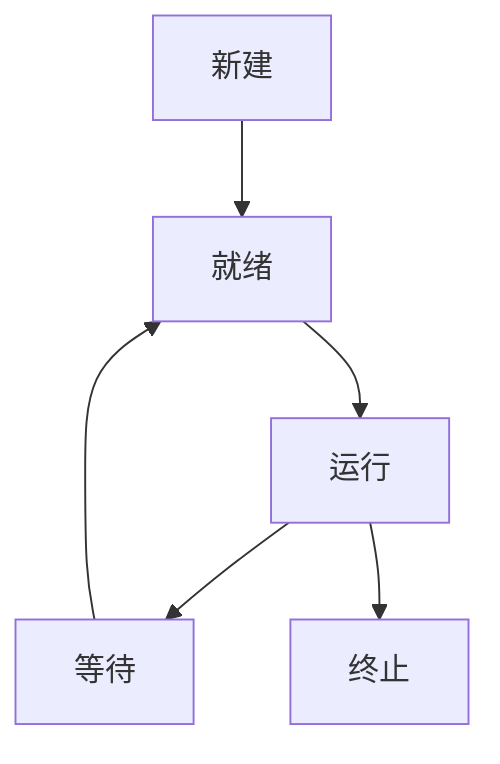

# 2.6 形式语义

## 1. 语义定义

- 操作系统的形式语义是指对其结构、行为、接口等进行严格数学化、符号化的语义描述，确保系统的可验证性与一致性。

## 2. 语义模型

- 进程状态机模型：描述进程生命周期的状态转换。
- 系统调用接口模型：形式化描述用户与内核的交互语义。
- 资源分配与调度模型：形式化表达资源分配、调度策略的语义。

## 3. 语义分析方法

- 一致性验证：确保系统各部分语义定义的一致性。
- 死锁检测：通过模型分析系统可能的死锁状态。
- 自动化推理：利用形式化工具对操作系统行为进行自动验证。

## 4. 结构化表达

- **进程状态机图**：

- **系统调用语义模型**：
  - 用户空间 <-> 系统调用 <-> 内核空间

## 5. 多表征

- 状态机图、语义模型、分析方法、符号化描述

## 6. 规范说明

- 内容需递归细化，支持多表征。
- 保留批判性分析、图表等。
- 如有遗漏，后续补全并说明。

> 本文件为递归细化与内容补全示范，后续可继续分解为2.6.1、2.6.2等子主题，支持持续递归完善。
