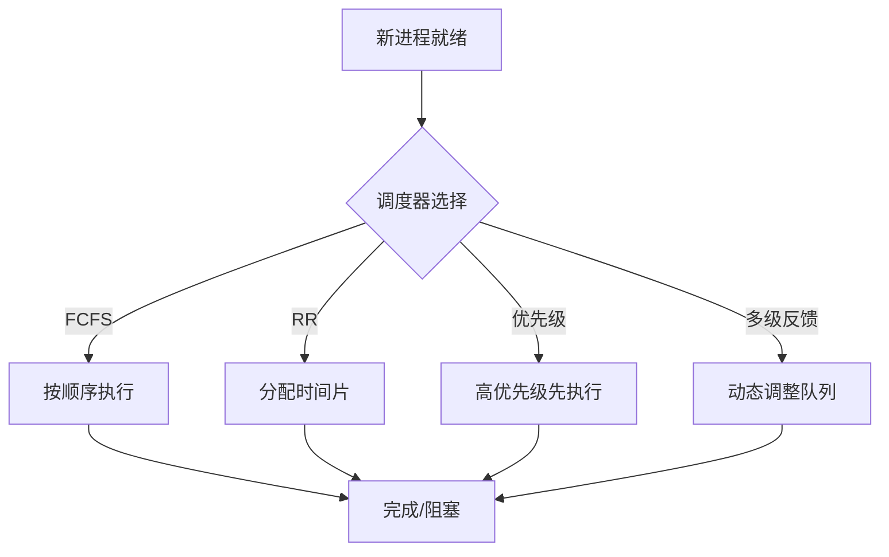

# 2.8.1 运行时行为与调度模型


<!-- TOC START -->

- [2.8.1 运行时行为与调度模型](#281-运行时行为与调度模型)
  - [1. 主题简介](#1-主题简介)
  - [2. 典型运行时行为](#2-典型运行时行为)
  - [3. 调度模型分类与对比](#3-调度模型分类与对比)
  - [4. Mermaid 调度流程示意图](#4-mermaid-调度流程示意图)
  - [5. 伪代码/公式](#5-伪代码公式)
  - [6. 工程案例](#6-工程案例)
  - [7. 未来展望](#7-未来展望)

<!-- TOC END -->

## 1. 主题简介

- 概述操作系统运行时行为的本质与调度模型的核心作用。
- 强调运行时语义对系统性能与可靠性的影响。

## 2. 典型运行时行为

- 进程/线程切换
- 中断处理
- 资源分配与回收
- 死锁与饥饿
- IO调度

## 3. 调度模型分类与对比

| 调度模型 | 主要特征 | 适用场景 | 优缺点 |
|---|---|---|---|
| 先来先服务(FCFS) | 简单、无优先级 | 批处理 | 实现简单，易饥饿 |
| 时间片轮转(RR) | 公平、响应快 | 分时系统 | 响应好，开销大 |
| 优先级调度 | 按优先级 | 实时/多任务 | 灵活，易饿死低优先级 |
| 多级反馈队列 | 动态调整 | 综合系统 | 兼顾公平与效率 |

## 4. Mermaid 调度流程示意图



## 5. 伪代码/公式

```pseudo
// 时间片轮转调度伪代码
while 就绪队列非空:
    取队首进程P
    运行P一个时间片
    若P未完成，放回队尾
```

## 6. 工程案例

- Linux CFS调度器
- Windows多级反馈队列

## 7. 未来展望

- AI驱动自适应调度
- 异构多核环境下的智能调度
