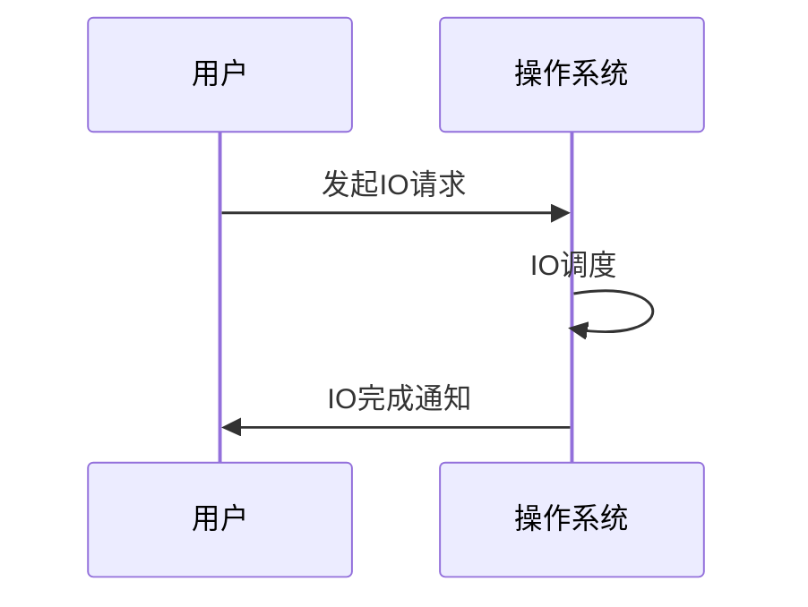
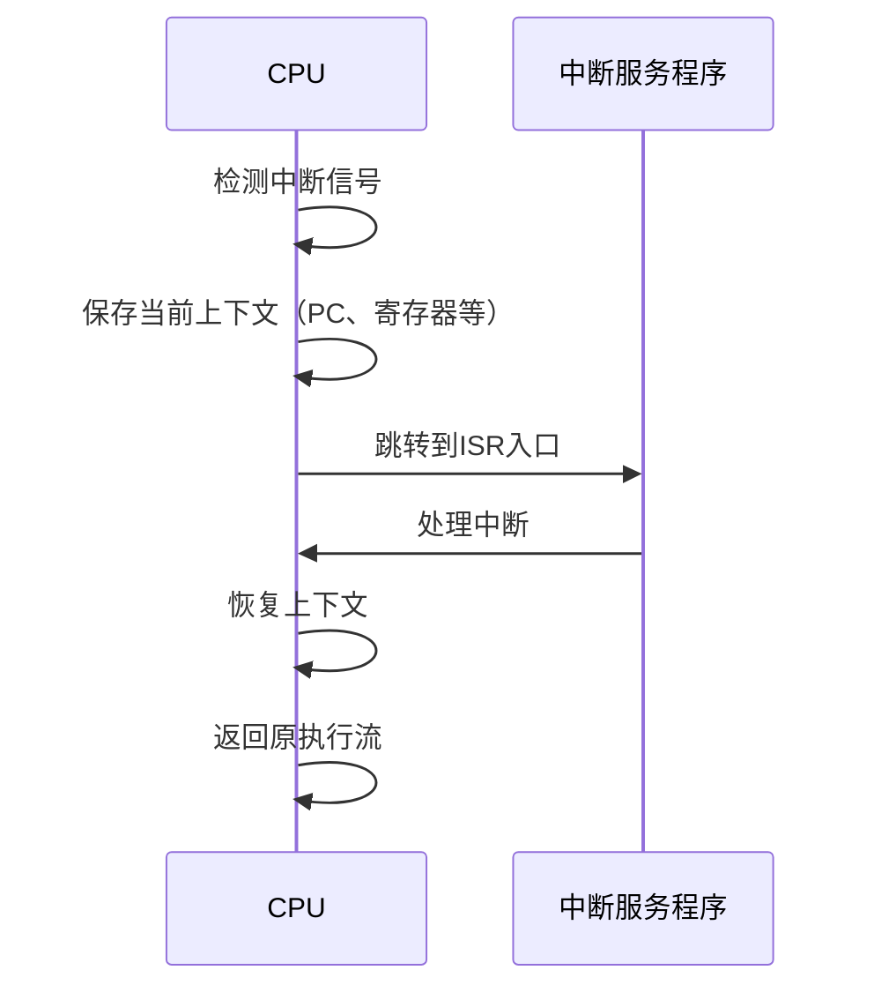

# 2.8.2 典型运行时机制分析

## 1. 主题简介

- 分析操作系统运行时的关键机制及其对系统行为的影响。

## 2. 典型机制分类

- 进程/线程管理
- 内存管理
- IO管理
- 同步与互斥
- 中断与异常处理

## 3. 关键机制流程

- 进程创建与销毁
- 线程同步与调度
- 内存分配与回收
- IO请求与完成

## 4. Mermaid 机制流程图



## 5. 伪代码/公式

```pseudo
// 简化的互斥锁获取伪代码
lock(mutex):
    if mutex.可用:
        mutex.占用 = true
    else:
        阻塞当前线程
```

## 6. 工程案例

- Linux内存管理机制
- Windows IO完成端口

## 7. 未来展望

- 智能化资源管理
- 异构硬件支持机制

## 2.8.2.x 中断上下文的起点

### 1. 概念与定义

- 中断上下文：CPU响应中断时，保存当前执行环境，切换到中断服务程序（ISR）的运行环境。
- 起点：中断信号到达，CPU自动完成现场保护（如PC、寄存器、PSW等），进入ISR前的第一条指令。

### 2. 结构化流程



### 3. 伪代码

```pseudo
on_interrupt():
    Save_Context()
    Jump_To_ISR()
    ISR_Handler()
    Restore_Context()
    Return_From_Interrupt()
```

### 4. 关键数据结构

- 中断向量表（IVT）：`IVT[IRQ] = Handler_Address`
- 上下文结构体：`Context = {PC, SP, Registers, Flags}`

### 5. 形式化描述

- $Interrupt\_Event \rightarrow Save\_Context \rightarrow ISR\_Entry$
- LTL公式：`G (interrupt -> F isr_entry)`

### 6. 工程案例1

- Linux：`arch/xxx/entry.S`中的`SAVE_ALL`宏
- ARM Cortex-M：自动堆栈入栈，`vector table`跳转

### 7. 未来展望1

- 嵌套中断、虚拟化中断上下文隔离、硬实时场景下的极致优化
