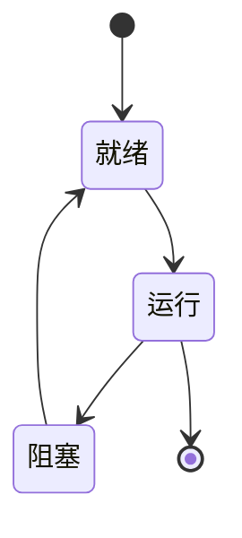

# 2.8.3 运行时语义建模与形式化验证

## 1. 主题简介

- 探讨操作系统运行时语义的建模方法与形式化验证手段。

## 2. 运行时语义建模方法

- 状态机建模
- Petri网建模
- 进程代数

## 3. 形式化验证技术

- LTL/CTL时序逻辑
- 模型检测（Model Checking）
- 定理证明

## 4. Mermaid 状态机示意图

## 5. LTL/CTL公式示例

- 死锁不可达：AG !deadlock
- 响应性：AG(request -> AF response)

## 6. 工程案例

- SPIN模型检测工具
- Linux调度器LTL验证

## 7. 未来展望

- 自动化形式化验证
- 复杂系统的可扩展建模
