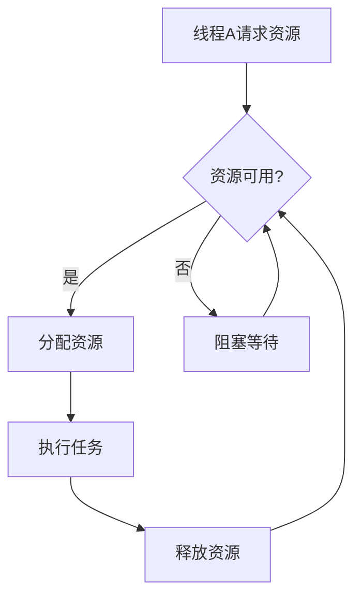

# 2.8.4 多进程/多线程协同与动态调度

## 1. 主题简介

- 探讨操作系统中多进程/多线程的协同机制与动态调度策略。

## 2. 多进程/多线程协同机制

- 共享内存与消息传递
- 互斥锁与信号量
- 条件变量与事件

## 3. 动态调度策略

- 优先级动态调整
- 负载均衡
- NUMA感知调度

## 4. Mermaid 协同与调度流程图



## 5. 伪代码/公式

```pseudo
// 动态优先级调整伪代码
if 线程长时间未被调度:
    提高其优先级
```

## 6. 工程案例

- Linux CFS多核调度
- Windows线程池动态调度

## 7. 未来展望

- AI驱动的自适应协同调度
- 异构多核与分布式环境下的高效协同
