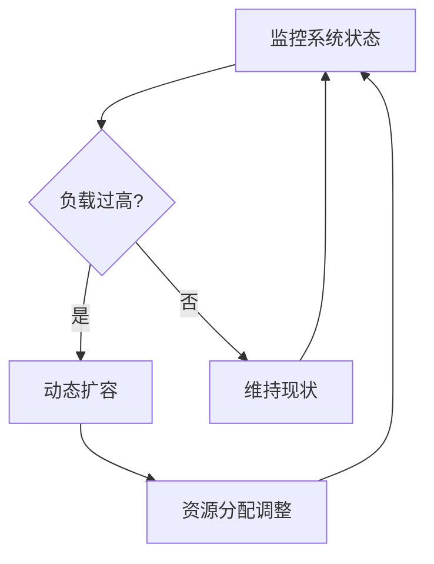

# 2.8.5 自适应与弹性运行机制

## 1. 主题简介

- 介绍操作系统自适应与弹性运行机制的基本原理与重要性。

## 2. 自适应机制分类

- 负载感知自适应
- 能耗感知自适应
- 故障自愈机制

## 3. 弹性运行策略

- 动态资源分配
- 容错与恢复
- 热插拔与在线升级

## 4. Mermaid 弹性机制流程图



## 5. 伪代码/公式

```pseudo
// 动态扩容伪代码
if 当前负载 > 阈值:
    增加可用资源
```

## 6. 工程案例

- Kubernetes弹性伸缩
- Linux热插拔机制

## 7. 未来展望

- 智能化自愈与弹性调度
- 跨域自适应资源管理
