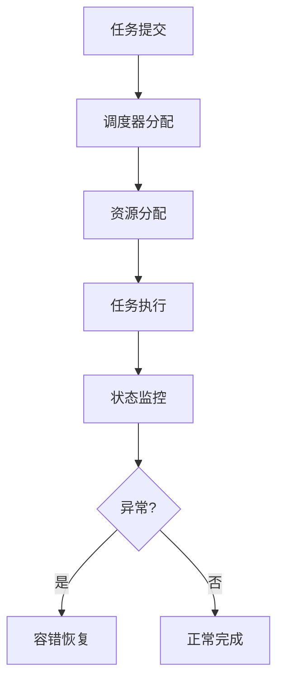

# 2.8.6 工程案例与实践

## 1. 主题简介

- 汇总操作系统运行时语义相关的工程实践与典型案例。

## 2. 典型案例汇总

- Linux CFS调度器
- Windows IO完成端口
- Kubernetes弹性伸缩

## 3. 关键技术剖析

- 动态调度算法
- 资源感知机制
- 容错与恢复技术

## 4. Mermaid 案例流程图



## 5. 伪代码/公式

```pseudo
// 简化的容错恢复伪代码
if 任务执行失败:
    启动恢复流程
```

## 6. 案例对比分析

| 案例 | 关键机制 | 优势 | 挑战 |
|---|---|---|---|
| Linux CFS | 公平调度 | 响应快 | 复杂度高 |
| Windows IOCP | 高并发IO | 性能优 | 编程复杂 |
| K8s弹性 | 动态扩缩容 | 灵活 | 管理难度 |

## 7. 未来展望

- 跨平台运行时优化
- 智能化工程实践
