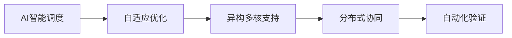

# 2.8.7 未来发展与挑战

## 1. 主题简介

- 展望操作系统运行时语义领域的未来发展与面临的挑战。

## 2. 未来发展趋势

- AI驱动的智能调度与自适应
- 异构多核与分布式环境支持
- 自动化形式化验证

## 3. 主要挑战

- 复杂性与可扩展性
- 实时性与可靠性
- 跨域资源协同

## 4. Mermaid 未来趋势图

## 5. 关键技术展望

- 强化学习调度
- 智能容错与自愈
- 跨域资源管理

## 6. 工程与理论结合

- 理论创新驱动工程实践
- 工程需求反哺理论发展

## 7. 结语

- 运行时语义将持续推动操作系统智能化、弹性化发展。
