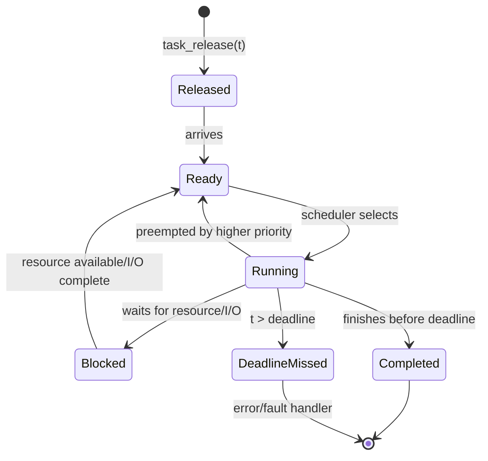
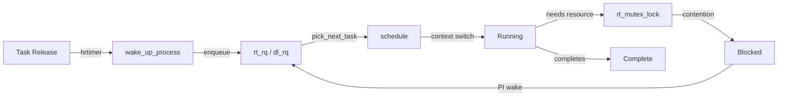
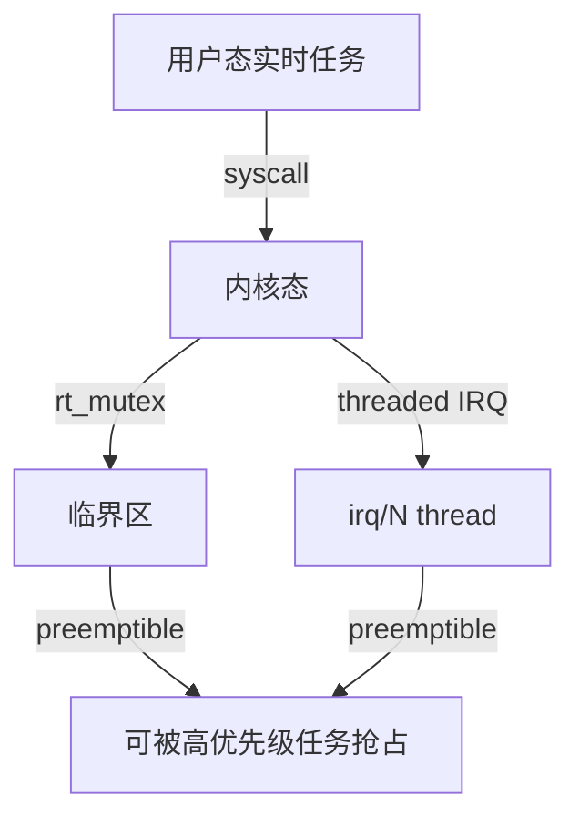

# 实时运行时语义（Real-Time Runtime Semantics）

<!-- TOC START -->

- [实时运行时语义（Real-Time Runtime Semantics）](#实时运行时语义real-time-runtime-semantics)
  - [1. 实时运行时状态机](#1-实时运行时状态机)
  - [2. Linux 实时任务运行时路径](#2-linux-实时任务运行时路径)
    - [2.1 SCHED\_FIFO / SCHED\_RR 运行时](#21-sched_fifo--sched_rr-运行时)
    - [2.2 SCHED\_DEADLINE 运行时](#22-sched_deadline-运行时)
  - [3. PREEMPT\_RT 运行时行为](#3-preempt_rt-运行时行为)
  - [4. RTOS 运行时行为对比](#4-rtos-运行时行为对比)
  - [5. 最坏情况分析](#5-最坏情况分析)
    - [5.1 调度延迟 worst-case](#51-调度延迟-worst-case)
    - [5.2 中断延迟 worst-case](#52-中断延迟-worst-case)
  - [6. 运行时观测指标](#6-运行时观测指标)
    - [cyclictest 示例](#cyclictest-示例)
  - [7. 国际来源映射](#7-国际来源映射)
  - [8. 相关文件](#8-相关文件)

<!-- TOC END -->

> **权威来源**：POSIX.1-2024 §17, Linux Kernel Documentation, PREEMPT_RT wiki, Buttazzo *Hard Real-Time Computing Systems*, FreeRTOS/Zephyr/QNX Documentation。
>
> **目标**：描述实时任务在 Linux/PREEMPT_RT/RTOS 中的运行时状态转换、延迟来源与最坏情况分析。

---

## 1. 实时运行时状态机



**关键时序参数**：

| 参数 | 符号 | 说明 |
|------|------|------|
| 释放抖动 | J_i | 任务实际释放时间与预期释放时间的偏差 |
| 调度延迟 | L_sched | 从释放/事件到开始执行的延迟 |
| 执行时间 | C_i | 实际 CPU 执行时间 |
| 阻塞时间 | B_i | 由于资源竞争或中断阻塞的时间 |
| 响应时间 | R_i = J_i + L_sched + C_i + B_i | 从释放到完成的总时间 |
| 截止时间 | D_i | 必须完成的期限 |

---

## 2. Linux 实时任务运行时路径



### 2.1 SCHED_FIFO / SCHED_RR 运行时

| 阶段 | 函数/结构 | 说明 |
|------|-----------|------|
| 任务唤醒 | `wake_up_process()` / `try_to_wake_up()` | 设置状态为 TASK_RUNNING，加入运行队列 |
| 入队 | `enqueue_task_rt()` | 插入 `rt_rq` 优先级队列 |
| 调度点 | `schedule()` | 在系统调用返回、中断返回、显式调用时触发 |
| 上下文切换 | `__switch_to()` | 保存/恢复寄存器，切换 mm/files 等 |
| 锁竞争 | `rt_mutex_lock()` | 支持优先级继承 |
| 时间片到期 | `task_tick_rt()` | SCHED_RR 递减时间片 |

### 2.2 SCHED_DEADLINE 运行时

| 阶段 | 函数/结构 | 说明 |
|------|-----------|------|
| 参数设置 | `sched_setattr()` | 设置 runtime/deadline/period |
| CBS 服务器 | `dl_task` / `dl_bw` | Constant Bandwidth Server 调度实体 |
| 预算管理 | `dl_entity.runtime` | 每个周期内的剩余运行时间 |
| 预算耗尽 | `dl_task_timer` | 任务被节流（throttled）直到下一个周期 |
| EDF 选择 | `pick_next_task_dl()` | 选择绝对截止时间最早的任务 |

---

## 3. PREEMPT_RT 运行时行为

PREEMPT_RT 将 Linux 的不可抢占区域最小化：



| 机制 | 标准 Linux | PREEMPT_RT |
|------|------------|------------|
| spinlock | 关中断/抢占 | 替换为 `rt_mutex`，可睡眠 |
| raw_spinlock | 保留原语义 | 保留原语义（仅少量核心路径） |
| 中断处理 | 硬中断上下文 | 大部分线程化为 `irq/N` |
| 定时器 | tick-based + hrtimer | hrtimer 主导，微秒级精度 |
| 调度延迟 | 数十 us~ms | 典型 < 100us |
| 优先级倒置 | futex PI | rt_mutex 自动 PI |

---

## 4. RTOS 运行时行为对比

| 运行时行为 | FreeRTOS | Zephyr | QNX | RTEMS |
|------------|----------|--------|-----|-------|
| 任务切换 | PendSV 异常 | `z_swap()` | 内核调度器 | 上下文切换例程 |
| 调度触发 | tick + yield | tick + yield | 事件/时间片 | tick + yield |
| 中断延迟 | < 1us~数 us | < 1us~数 us | < 1us | 数 us |
| 任务切换时间 | < 1us | < 1us | < 1us | 数 us |
| 同步 | mutex/semaphore/queue | mutex/semaphore/futex | message passing | semaphore/message |
| 实时扩展 | FreeRTOS-Plus-RT | 原生 | 原生 | POSIX + Classic |
| 低功耗 | tickless idle | tickless + PM framework | 电源管理 | tickless |

---

## 5. 最坏情况分析

### 5.1 调度延迟 worst-case

```
L_sched_max = 最大关中断时间
            + 最长不可抢占区段
            + 调度器执行时间
            + 上下文切换时间
```

在 PREEMPT_RT 中：

- 最大关中断时间 ≈ 少量汇编指令
- 最长不可抢占区段 ≈ raw_spinlock 持有时间
- 调度器执行时间 ≈ O(log n) 红黑树操作
- 上下文切换时间 ≈ 架构相关，通常 < 1us

### 5.2 中断延迟 worst-case

```
L_irq_max = 中断屏蔽时间 + 上下文保存时间 + ISR 入口时间
```

RTOS 通常通过缩短中断屏蔽窗口和优先处理关键中断来降低该值。

---

## 6. 运行时观测指标

| 指标 | 工具 | 说明 |
|------|------|------|
| 调度延迟 | `cyclictest` | PREEMPT_RT 标准测试工具 |
| 中断延迟 | `ftrace irqsoff` | 追踪最大关中断时间 |
| 任务切换时间 | `ftrace sched_switch` | 上下文切换时间 |
| 截止时间满足率 | 应用日志 / `perf` | 统计 deadline miss |
| CPU 隔离效果 | `taskset` / `isolcpus` | 验证实时任务独占 CPU |
| 优先级倒置事件 | `ftrace rt_mutex` | 追踪 PI chain |

### cyclictest 示例

```bash
# 测试 100us 周期，运行 1 小时
cyclictest -m -S -p 80 -i 100 -h 1000 -D 1h
```

---

## 7. 国际来源映射

| 概念 | 来源类型 | 来源 | 位置 |
|------|----------|------|------|
| POSIX 实时 | Standard | POSIX.1-2024 | §17 |
| Linux PREEMPT_RT | Project | Linux Foundation | Real-Time Linux Wiki |
| cyclictest | Tool | Thomas Gleixner / rt-tests | <https://wiki.linuxfoundation.org/realtime/documentation/howto/tools/rt-tests> |
| RTOS 运行时 | Documentation | FreeRTOS / Zephyr / QNX / RTEMS | 官方文档 |
| 实时调度理论 | Textbook | Buttazzo | *Hard Real-Time Computing Systems* |

---

## 8. 相关文件

- [实时调度](../02-operating-systems/01-process-management/03-real-time-scheduling.md)
- [Linux 进程调度](../02-operating-systems/05-linux-kernel/process-scheduling-linux.md)
- [POSIX 与 Linux 实现映射](../02-operating-systems/08-interfaces/posix-mapping.md)
- [运行时行为与调度模型](2.8.1%20运行时行为与调度模型.md)
