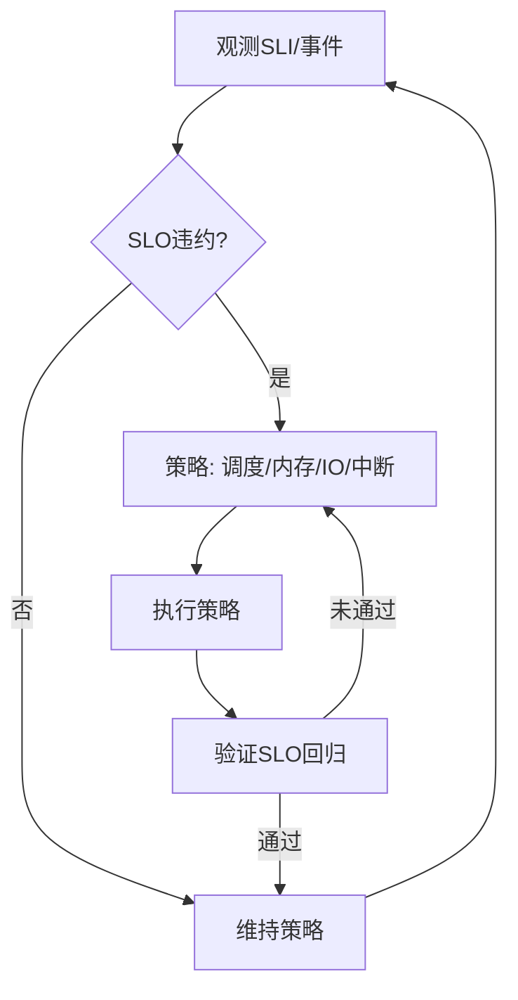

# 操作系统系统运行时语义

## 概述

操作系统系统运行时语义研究操作系统内核在运行过程中的行为特征、状态转换、资源调度和动态特性，为操作系统的运行时行为分析和优化提供理论基础。

## 目录结构

- **2.8.1 运行时行为与调度模型** - 操作系统的运行时行为模型和调度机制
- **2.8.2 典型运行时机制分析** - 常见操作系统运行时机制的分析
- **2.8.3 运行时语义建模与形式化验证** - 运行时语义的形式化建模和验证
- **2.8.4 多进程** - 多进程系统的协同运行和调度
- **2.8.5 自适应与弹性运行机制** - 系统的自适应和弹性运行特性
- **2.8.6 工程案例与实践** - 实际工程中的运行时语义应用
- **2.8.7 未来发展与挑战** - 运行时语义领域的发展趋势和挑战

## 核心概念

### 运行时行为

- **进程状态**：进程在不同状态间的转换规律
- **内存管理**：内存的动态分配和回收机制
- **文件系统**：文件操作的运行时行为
- **设备管理**：设备驱动的运行时机制

### 调度模型

- **进程调度**：进程的调度策略和算法
- **内存调度**：内存页面的调度和置换
- **I/O调度**：I/O操作的调度优化
- **中断处理**：中断的响应和处理机制

### 语义建模

- **进程语义**：进程操作的语义定义
- **内存语义**：内存管理的语义描述
- **文件语义**：文件操作的语义建模
- **设备语义**：设备操作的语义定义

## SLO/SLI 驱动的运行时闭环

- SLI：上下文切换率、P99 系统调用延迟、缺页中断率、I/O 队列长度、调度延迟、错误预算消耗率。
- SLO：如 P99 系统调用延迟 < 200μs、上下文切换开销 < 阈值、实时任务截止期满足率 > 99.9%。
- 闭环：观测 → 诊断 → 策略选择（调度/内存/IO/中断）→ 执行 → 验证 → 回滚/巩固。

## Mermaid 运行时治理闭环



## 伪代码示例

```pseudo
// CFS 动态权重调整（简化）
if P99_sched_latency > 目标:
    提高交互型任务权重
    降低CPU密集任务权重

// 内存压力与页面回收
if 缺页率上升 且 可回收页不足:
    提高回收强度
    调整冷热页阈值

// I/O 短队优先 + 限流
if IO队列过长:
    启用短队优先调度
    对突发进程限流
```

## 策略选择矩阵（示例）

| 场景 | 首选策略 | 备选 | 权衡 |
|---|---|---|---|
| 交互卡顿 | 调度权重提升/最小粒度调整 | 限制后台任务 | 吞吐 vs. 响应 |
| 内存抖动 | 页回收+HugePage 调整 | NUMA 绑定 | 命中率 vs. 迁移成本 |
| I/O 堵塞 | 队列优化+合并 | 限流/优先级提升 | 吞吐 vs. 尾延迟 |
| 中断风暴 | 中断合并/亲和 | NAPI 调整 | 时延 vs. 吞吐 |

## 学习目标

1. **理解操作系统运行时语义的基本概念**
2. **掌握操作系统的运行时行为建模方法**
3. **学会分析和设计操作系统调度算法**
4. **了解形式化验证技术在操作系统中的应用**
5. **掌握多进程系统的协同运行机制**
6. **理解操作系统的自适应和弹性运行**

## 应用领域

- **操作系统内核开发**
- **系统性能优化**
- **实时系统设计**
- **嵌入式操作系统**
- **虚拟化技术**
- **系统安全**

## 相关资源

- **经典文献**：《Operating System Concepts》、《Modern Operating Systems》
- **学术期刊**：ACM Transactions on Computer Systems、IEEE Transactions on Software Engineering
- **会议论文**：SOSP、OSDI、USENIX等顶级会议
- **在线资源**：Linux内核文档、操作系统教程

## 实践项目

1. **调度器实现**：实现基本的进程调度算法
2. **内存管理系统**：设计内存分配和回收机制
3. **文件系统优化**：优化文件系统的性能
4. **设备驱动开发**：开发设备驱动程序
