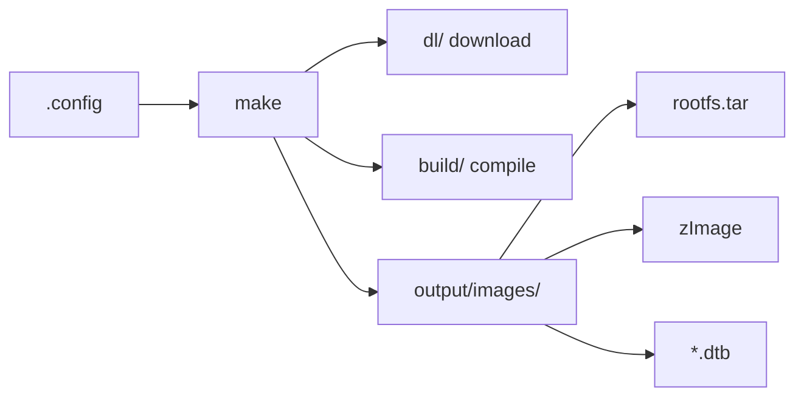
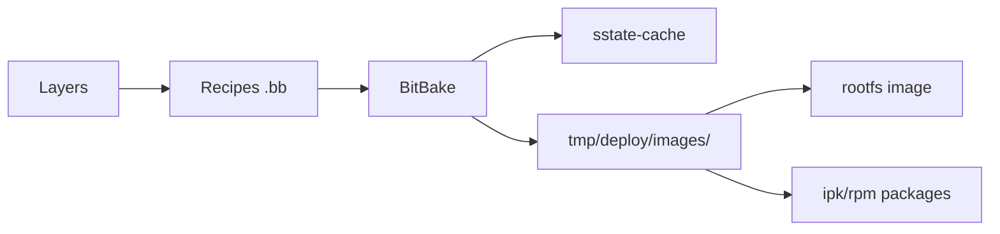
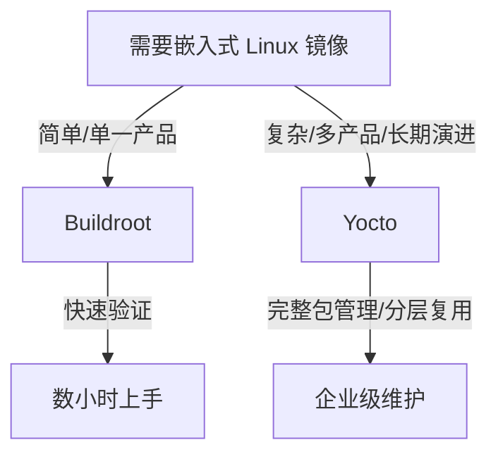

# Buildroot 与 Yocto 构建系统映射

<!-- TOC START -->

- [Buildroot 与 Yocto 构建系统映射](#buildroot-与-yocto-构建系统映射)
  - [1. 总体对比](#1-总体对比)
  - [2. Buildroot 核心流程](#2-buildroot-核心流程)
    - [2.1 关键目录](#21-关键目录)
  - [3. Yocto 核心流程](#3-yocto-核心流程)
    - [3.1 关键概念](#31-关键概念)
  - [4. 选择决策树](#4-选择决策树)
  - [5. 场景选择](#5-场景选择)
  - [6. 相关文件](#6-相关文件)
  - [国际权威来源链接 | International Authoritative Sources](#国际权威来源链接--international-authoritative-sources)

<!-- TOC END -->

> **目标**：对比 Buildroot 与 Yocto 两种嵌入式 Linux 构建系统的设计理念、架构与适用场景。

---

## 1. 总体对比

| 特性 | Buildroot | Yocto Project |
|------|-----------|---------------|
| 定位 | 快速生成完整根文件系统与镜像 | 可定制、可扩展的嵌入式 Linux 发行版构建 |
| 配置 | `Kconfig` (`make menuconfig`) | `BitBake` + `metadata layer` |
| 包系统 | 约 3000+ packages via Config.in | OpenEmbedded recipes |
| 根文件系统 | 直接生成 | 通过 image recipe 生成 |
| SDK | 可生成 SDK | 提供 ADT / eSDK |
| 包管理 | 通常无包管理器 | 可选 rpm/opkg/ipk |
| 维护成本 | 低 | 高 |
| 学习曲线 | 平缓 | 陡峭 |
| 典型场景 | 小型固定功能设备 | 复杂产品系列、多平台 |

---

## 2. Buildroot 核心流程

### 2.1 关键目录

| 目录 | 内容 |
|------|------|
| `package/` | 软件包 recipes |
| `board/` | 板级配置与 overlay |
| `configs/` | 默认 defconfig |
| `output/build/` | 编译中间产物 |
| `output/images/` | 最终镜像 |

---

## 3. Yocto 核心流程

### 3.1 关键概念

| 概念 | 说明 |
|------|------|
| Layer | 元数据集合，如 meta-openembedded |
| Recipe | `.bb` 文件，定义如何构建软件包 |
| BitBake | 任务调度与执行引擎 |
| Image Recipe | 定义最终根文件系统内容 |
| Machine | 目标硬件配置 |
| Distro | 发行版策略 |

---

## 4. 选择决策树

---

## 5. 场景选择

| 场景 | 推荐 | 原因 |
|------|------|------|
| 单功能工业网关 | Buildroot | 精简、快速 |
| 多 SKU 消费电子产品 | Yocto | 分层、可复用 |
| 长期维护、安全更新 | Yocto | 包管理、可追溯 |
| 教学/原型验证 | Buildroot | 简单直接 |

---

## 6. 相关文件

- [嵌入式 Linux 启动流程](./embedded-linux-bootflow.md)
- [Device Tree 与 U-Boot](./device-tree-and-uboot.md)

## 国际权威来源链接 | International Authoritative Sources

- [Buildroot Manual](https://buildroot.org/downloads/manual/manual.html)
- [Yocto Project Documentation](https://docs.yoctoproject.org/)
- [OpenEmbedded Layer Index](https://layers.openembedded.org/)
- [Linux Standard Base (LSB) — ISO/IEC 23360](https://webstore.iec.ch/en/publication/71478)
- [项目国际化权威标准基线 — 3. 物联网嵌入式系统](../../../docs/international-baseline.md)
