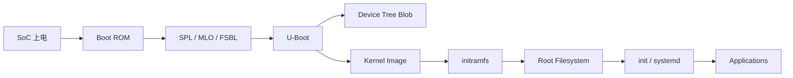
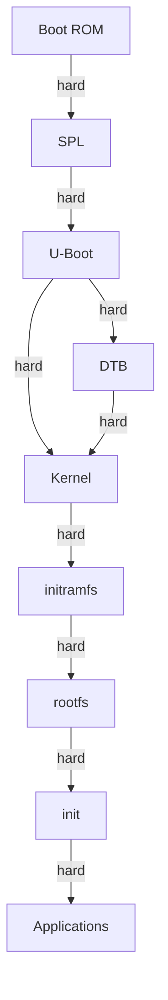

# 嵌入式 Linux 启动流程


<!-- TOC START -->

- [嵌入式 Linux 启动流程](#嵌入式-linux-启动流程)
  - [1. 启动流程全景](#1-启动流程全景)
  - [2. 各阶段详解](#2-各阶段详解)
    - [2.1 Boot ROM](#21-boot-rom)
    - [2.2 SPL（Secondary Program Loader）](#22-splsecondary-program-loader)
    - [2.3 U-Boot](#23-u-boot)
    - [2.4 设备树传递](#24-设备树传递)
    - [2.5 Linux 内核启动](#25-linux-内核启动)
    - [2.6 initramfs](#26-initramfs)
    - [2.7 根文件系统](#27-根文件系统)
  - [3. 启动参数（bootargs）](#3-启动参数bootargs)
  - [4. 依赖树](#4-依赖树)
  - [5. 构建系统对比](#5-构建系统对比)
  - [6. 调试手段](#6-调试手段)
  - [7. 术语表](#7-术语表)
  - [8. 国际来源映射](#8-国际来源映射)
  - [9. 相关文件](#9-相关文件)
  - [国际权威来源链接 | International Authoritative Sources](#国际权威来源链接--international-authoritative-sources)

<!-- TOC END -->

> **权威来源**：U-Boot Docs, Linux Kernel Development, ARM Devicetree Specification, Buildroot/Yocto Docs。
>
> **目标**：系统讲解从 SoC 上电到用户应用运行的完整嵌入式 Linux 启动链，包括 Bootloader、设备树、内核、initramfs、根文件系统。

---

## 1. 启动流程全景



---

## 2. 各阶段详解

### 2.1 Boot ROM

| 特性 | 说明 |
|------|------|
| 位置 | SoC 内部 ROM，不可修改 |
| 作用 | 初始化最小硬件，加载下一阶段 bootloader |
| 加载源 | SPI NOR、NAND、eMMC、SD、UART、USB、网络 |
| 选择逻辑 | 引脚 strap / eFuse / 顺序尝试 |

### 2.2 SPL（Secondary Program Loader）

| 别名 | 平台 |
|------|------|
| SPL | U-Boot 通用 |
| MLO | TI OMAP/AM335x |
| FSBL | Xilinx Zynq |

**作用**：

- 初始化 DDR 内存
- 加载完整 U-Boot 到 DDR
- 可能初始化串口、MMC、NAND

### 2.3 U-Boot

| 功能 | 说明 |
|------|------|
| 命令行 | 交互式环境，用于调试与烧录 |
| 驱动 | MMC、NAND、Ethernet、USB、SPI |
| 启动脚本 | `bootcmd` 自动加载内核 |
| 环境变量 | `bootargs`, `fdtfile`, `kernel_addr_r` |

**典型启动命令**：

```bash
load mmc 0:1 ${kernel_addr_r} zImage
load mmc 0:1 ${fdt_addr_r} ${board}.dtb
setenv bootargs console=ttyS0,115200 root=/dev/mmcblk0p2 rw
bootz ${kernel_addr_r} - ${fdt_addr_r}
```

### 2.4 设备树传递

- U-Boot 将 DTB 加载到内存。
- 启动内核时通过寄存器或 boot info 传递 DTB 地址。
- 内核 `setup_arch()` 解析 DTB，创建设备节点。

### 2.5 Linux 内核启动

```
_start / head.S
  ↓ setup_arch()           # 架构相关初始化
  ↓ mm_init()              # 内存管理初始化
  ↓ sched_init()           # 调度器初始化
  ↓ vfs_caches_init()      # VFS 初始化
  ↓ rest_init()
    ↓ kernel_init()        # 启动 init 进程
      ↓ 执行 /init (initramfs) 或 /sbin/init
```

### 2.6 initramfs

| 特性 | 说明 |
|------|------|
| 作用 | 早期用户态，加载真实根文件系统驱动 |
| 内容 | 精简 shell、驱动模块、mount 工具 |
| 类型 | 内嵌 initramfs（cpio）/ 外部 initrd |
| 切换 | `switch_root` 切换到真实 rootfs |

### 2.7 根文件系统

| 类型 | 说明 | 例子 |
|------|------|------|
| 只读根文件系统 | 安全、可靠 | squashfs |
| 可读写覆盖层 | 持久化 + 只读基础 | overlayfs |
| 网络根文件系统 | 无本地存储 | NFS |
| 标准可写根文件系统 | 开发调试 | ext4 |

---

## 3. 启动参数（bootargs）

| 参数 | 说明 | 例子 |
|------|------|------|
| `console` | 控制台串口 | `console=ttyS0,115200` |
| `root` | 根设备 | `root=/dev/mmcblk0p2` |
| `rootfstype` | 根文件系统类型 | `rootfstype=ext4` |
| `rootwait` | 等待根设备就绪 | - |
| `init` | 指定 init | `init=/sbin/init` |
| `quiet` | 减少启动日志 | - |
| `rdinit` | initramfs 中的 init | `rdinit=/init` |
| `earlycon` | 早期串口输出 | `earlycon=uart8250,mmio32,0x12340000` |

---

## 4. 依赖树



---

## 5. 构建系统对比

| 特性 | Buildroot | Yocto |
|------|-----------|-------|
| 复杂度 | 低 | 高 |
| 定制性 | 中 | 极高 |
| 包管理 | 静态 | 动态 layer/recipe |
| 适用 | 小中型项目 | 大型商业产品 |
| 学习曲线 | 平缓 | 陡峭 |
| 输出 | rootfs、kernel、bootloader | 完整发行版 |

---

## 6. 调试手段

| 工具 | 用途 |
|------|------|
| 串口 | 查看启动日志 |
| JTAG | 底层调试 Boot ROM/SPL/U-Boot/Kernel |
| `earlycon` | 内核早期串口输出 |
| `initcall_debug` | 打印 initcall 耗时 |
| `ftrace` | 内核函数跟踪 |
| `kgdb` | 内核 GDB 调试 |

---

## 7. 术语表

| 中文 | 英文 | 一句话定义 |
|------|------|------------|
| Boot ROM | Boot ROM | SoC 内部固化代码，负责加载第一阶段 bootloader |
| SPL | Secondary Program Loader | 第二阶段加载器，初始化 DDR 后加载完整 U-Boot |
| U-Boot | Universal Boot Loader | 主流开源 bootloader |
| DTB | Device Tree Blob | 编译后的设备树二进制 |
| initramfs | Initial RAM Filesystem | 早期用户态根文件系统 |
| rootfs | Root Filesystem | 系统主根文件系统 |
| Buildroot | Buildroot | 嵌入式 Linux 构建系统 |
| Yocto | Yocto Project | 企业级 Linux 发行版构建框架 |

---

## 8. 国际来源映射

| 概念 | 来源类型 | 来源 | 位置 |
|------|----------|------|------|
| U-Boot | Docs | U-Boot Project | U-Boot User Manual |
| Linux 启动 | SourceCode | Linux Kernel | init/main.c, arch/arm/ |
| Device Tree | Standard | ARM Devicetree Spec | Release 0.3 |
| Buildroot | Docs | Buildroot | Buildroot Manual |
| Yocto | Docs | Yocto Project | Yocto Project Reference Manual |

---

## 9. 相关文件

- [设备树与 U-Boot](./device-tree-and-uboot.md)
- [PREEMPT_RT](./preempt-rt-linux.md)
- [HAL/BSP/设备树](../../2.操作系统/02-operating-systems/08-interfaces/hal-bsp-device-tree.md)

## 国际权威来源链接 | International Authoritative Sources

- [U-Boot Documentation](https://u-boot.readthedocs.io/en/latest/)
- [Devicetree Specification](https://devicetree-specification.readthedocs.io/en/stable/)
- [Linux Kernel Documentation](https://docs.kernel.org/)
- [Buildroot Manual](https://buildroot.org/downloads/manual/manual.html)
- [Yocto Project Documentation](https://docs.yoctoproject.org/)
- [Intel 64 and IA-32 Architectures Software Developer's Manual, Vol. 3A](https://www.intel.com/content/www/us/en/developer/articles/technical/intel-sdm.html)
- [ARM Architecture Reference Manual](https://developer.arm.com/documentation)
- [RISC-V Privileged Spec](https://riscv.org/technical/specifications/)
- [项目国际化权威标准基线 — 3. 物联网嵌入式系统](../../../docs/international-baseline.md)
