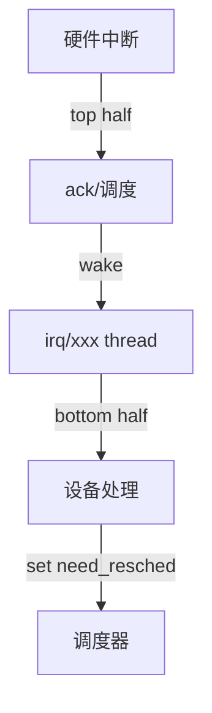

# Linux PREEMPT_RT 实时性映射

<!-- TOC START -->

- [Linux PREEMPT_RT 实时性映射](#linux-preempt_rt-实时性映射)
  - [1. PREEMPT_RT 核心修改](#1-preempt_rt-核心修改)
  - [2. 中断线程化](#2-中断线程化)
  - [3. 调度策略对比](#3-调度策略对比)
  - [4. 实时性指标](#4-实时性指标)
  - [5. 与 RTOS 对比](#5-与-rtos-对比)
  - [6. 配置检查清单](#6-配置检查清单)
  - [7. 相关文件](#7-相关文件)
  - [国际权威来源链接 | International Authoritative Sources](#国际权威来源链接--international-authoritative-sources)

<!-- TOC END -->

> **目标**：说明 Linux PREEMPT_RT 补丁如何让通用 Linux 具备硬实时能力，以及与 RTOS 的差异。

---

## 1. PREEMPT_RT 核心修改

| 修改项 | 说明 |
|--------|------|
| 线程化中断 | 大部分中断处理在可抢占线程中运行 |
| 可抢占自旋锁 | `spinlock_t` 改为可抢占 |
| 高精度定时器 | hrtimer 成为调度时钟基础 |
| 优先级继承 | PI-futex 优先级继承 |
| RCU 可抢占 | Preemptible RCU |
| 调度策略 | SCHED_FIFO / SCHED_RR / SCHED_DEADLINE |

---

## 2. 中断线程化

---

## 3. 调度策略对比

| 策略 | 优先级 | 抢占 | 适用 |
|------|--------|------|------|
| SCHED_FIFO | 1~99 | 同优先级不时间片 | 硬实时 |
| SCHED_RR | 1~99 | 同优先级时间片轮转 | 实时 |
| SCHED_DEADLINE | deadline-based | EDF | 截止期任务 |
| SCHED_OTHER | 0 | CFS | 普通任务 |

---

## 4. 实时性指标

| 指标 | 典型值 | 说明 |
|------|--------|------|
| 中断延迟 | 10~50 µs | 取决于硬件与配置 |
| 调度延迟 | 10~100 µs | PREEMPT_RT 典型值 |
| 上下文切换 | < 5 µs | 现代 x86/ARM |

---

## 5. 与 RTOS 对比

| 特性 | Linux PREEMPT_RT | RTOS |
|------|------------------|------|
| 最坏延迟 | 数十 µs | 数 µs ~ 数十 µs |
| 功能丰富度 | 极高 | 较低 |
| 驱动生态 | 丰富 | 有限 |
| 认证 | 难 | 易（部分） |
| 开发成本 | 低 | 中等 |
| 适用场景 | 软实时 + 复杂系统 | 硬实时 + 简单系统 |

---

## 6. 配置检查清单

- [ ] 启用 `CONFIG_PREEMPT_RT`
- [ ] 启用 `CONFIG_HIGH_RES_TIMERS`
- [ ] 启用 `CONFIG_RT_GROUP_SCHED`
- [ ] 使用 isolcpus 或 cpuset 隔离 CPU
- [ ] 绑定实时任务到隔离 CPU
- [ ] 禁用不必要的中断与后台服务
- [ ] 使用 cyclictest 验证延迟

---

## 7. 相关文件

- [Linux vs RTOS 决策树](../06-decision-trees/linux-vs-rtos.md)
- [实时调度可调度性](../04-rtos-concepts/real-time-schedulability.md)

## 国际权威来源链接 | International Authoritative Sources

- [Linux PREEMPT_RT Wiki](https://wiki.linuxfoundation.org/realtime/start)
- [Linux Kernel Documentation — Real-Time](https://docs.kernel.org/admin-guide/real-time.html)
- [POSIX.1 / IEEE Std 1003.1 — Real-Time Extensions](https://pubs.opengroup.org/onlinepubs/9799919799/)
- [Liu & Layland, "Scheduling Algorithms for Multiprogramming in a Hard-Real-Time Environment", JACM 1973](https://doi.org/10.1145/321738.321743)
- [Buttazzo, *Hard Real-Time Computing Systems* (Springer)](https://link.springer.com/book/10.1007/978-3-031-04138-0)
- [cyclictest — RT-Tests](https://wiki.linuxfoundation.org/realtime/documentation/howto/tools/cyclictest)
- [项目国际化权威标准基线 — 3. 物联网嵌入式系统](../../../docs/international-baseline.md)
