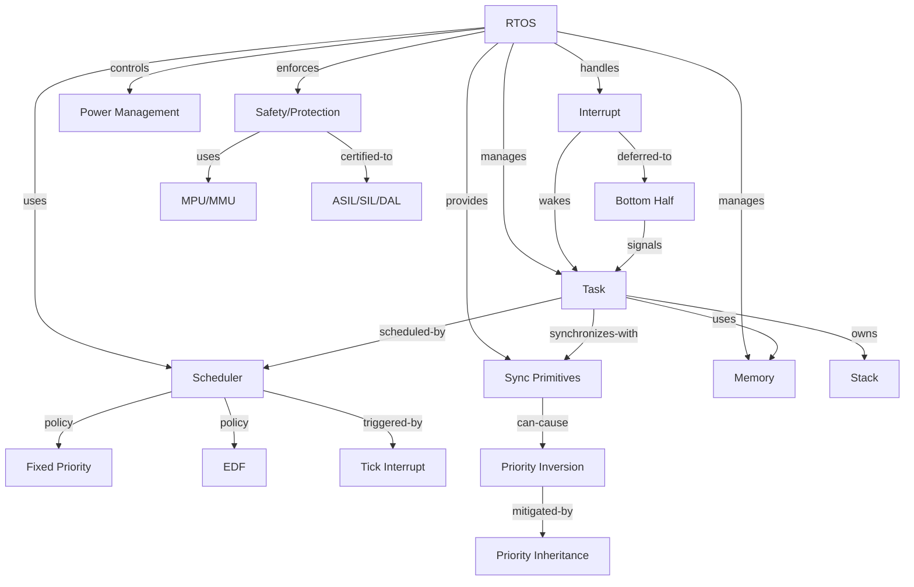

<!-- 创建理由：RTOS 需要独立的属性-关系映射文件，符合项目概念分析六类模板要求，并覆盖 FreeRTOS/Zephyr/QNX/RTEMS 的任务/调度/同步/中断/内存/电源/安全属性。 -->

# RTOS 属性-关系映射（RTOS Attribute-Relationship Mapping）

<!-- TOC START -->

- [RTOS 属性-关系映射（RTOS Attribute-Relationship Mapping）](#rtos-属性-关系映射rtos-attribute-relationship-mapping)
  - [1. 任务（Task / Thread）](#1-任务task--thread)
  - [2. 调度（Scheduling）](#2-调度scheduling)
  - [3. 同步原语（Synchronization）](#3-同步原语synchronization)
  - [4. 中断（Interrupt）](#4-中断interrupt)
  - [5. 内存管理（Memory Management）](#5-内存管理memory-management)
  - [6. 电源管理（Power Management）](#6-电源管理power-management)
  - [7. 安全与保护（Safety \& Protection）](#7-安全与保护safety--protection)
  - [8. 关系总图](#8-关系总图)
  - [9. 国际来源映射](#9-国际来源映射)
  - [10. 相关文件](#10-相关文件)

<!-- TOC END -->

> **权威来源**：FreeRTOS Documentation, Zephyr Project Documentation, RTEMS Documentation, QNX Neutrino Documentation, Buttazzo *Hard Real-Time Computing Systems*, Liu & Layland 1973。
>
> **目标**：为 RTOS 核心概念建立可检索的属性集、关系集与约束，支撑实时系统的形式化定义与跨平台映射。

---

## 1. 任务（Task / Thread）

| 概念 | 属性/关系 | 类型/取值 | 说明与约束 |
|------|-----------|-----------|------------|
| Task | name | String | 任务名，调试用 |
| Task | priority | ℕ | 数值越小优先级越高（FreeRTOS/Zephyr/RTEMS）；QNX 默认数值越大优先级越高 |
| Task | state | {Running, Ready, Blocked, Suspended, Terminated} | 任务生命周期状态 |
| Task | entry_function | Function | 任务入口函数 |
| Task | stack | MemoryRegion | 私有栈区 |
| Task | stack_size | ℕ | 栈大小，通常需手动配置 |
| Task | period | Time | 周期性任务周期 |
| Task | deadline | Time | 相对或绝对截止时间 |
| Task | wcet | Time | 最坏执行时间 |
| Task | utilization | [0, 1] | WCET / Period |
| Task | autostart | Boolean | 启动时是否自动运行 |
| Task | task_control_block | TCB | FreeRTOS TCB / Zephyr k_thread / RTEMS Thread_Control |
| Task | belongs_to | Application | 任务所属应用 |

---

## 2. 调度（Scheduling）

| 概念 | 属性/关系 | 类型/取值 | 说明与约束 |
|------|-----------|-----------|------------|
| Scheduler | policy | {FixedPriority, RoundRobin, EDF, RMS} | 调度策略 |
| Scheduler | preemptive | Boolean | 是否支持抢占 |
| Scheduler | tick_rate | Frequency | 系统节拍频率，如 1000 Hz |
| Scheduler | context_switch_time | Time | 上下文切换时间 |
| Scheduler | scheduling_latency | Time | 调度延迟（关键实时指标） |
| FixedPriorityTask | priority | ℕ | 固定优先级 |
| RateMonotonicTask | priority_order | ascending by period | 周期越短优先级越高 |
| EDFTask | deadline | Time | 最早截止时间优先 |
| Scheduler | schedulability_test | {RMA_Utilization, ResponseTimeAnalysis, EDF_Density} | 可调度性分析方法 |

---

## 3. 同步原语（Synchronization）

| 概念 | 属性/关系 | 类型/取值 | 说明与约束 |
|------|-----------|-----------|------------|
| Mutex | owner | Task | 当前持有者 |
| Mutex | priority_inheritance | Boolean | 是否支持优先级继承 |
| Mutex | ceiling_priority | ℕ | 优先级天花板 |
| Mutex | recursion | Boolean | 是否支持递归持有 |
| Semaphore | count | ℕ | 当前计数值 |
| Semaphore | max_count | ℕ | 最大计数值 |
| Semaphore | type | {Binary, Counting, Mutex} | 信号量类型 |
| Queue | length | ℕ | 队列长度 |
| Queue | item_size | ℕ | 每个消息大小 |
| Queue | send_timeout | Time | 发送超时 |
| Queue | receive_timeout | Time | 接收超时 |
| EventGroup | bits | Bitmask | 事件位图 |
| EventGroup | wait_bits | Bitmask | 等待位掩码 |
| PriorityInversion | cause | Mutex + preemptive scheduling | 低优先级任务阻塞高优先级任务 |

---

## 4. 中断（Interrupt）

| 概念 | 属性/关系 | 类型/取值 | 说明与约束 |
|------|-----------|-----------|------------|
| Interrupt | vector | ℕ | 中断向量号 |
| Interrupt | priority | ℕ | 中断优先级（NVIC/GIC/PLIC） |
| Interrupt | handler | ISR | 中断服务函数 |
| Interrupt | latency | Time | 中断延迟 |
| Interrupt | nesting | Boolean | 是否支持嵌套 |
| ISR | execution_time | Time | ISR 执行时间，应尽可能短 |
| ISR | safe_from | {FromISR APIs} | 可调用 API 集合 |
| BottomHalf | type | {DeferredProcedureCall, Tasklet, Workqueue, ThreadedIRQ} | 底半部机制 |
| TickInterrupt | frequency | Frequency | 节拍频率 |
| TickInterrupt | handler | tick_handler | 更新系统节拍计数 |

---

## 5. 内存管理（Memory Management）

| 概念 | 属性/关系 | 类型/取值 | 说明与约束 |
|------|-----------|-----------|------------|
| MemoryAllocator | type | {Static, Heap, Pool} | 分配器类型 |
| StaticMemory | section | {.bss, .data, custom} | 静态分配区域 |
| Heap | total_size | ℕ | 堆总大小 |
| Heap | free_size | ℕ | 剩余空间 |
| Heap | fragmentation | [0, 1] | 碎片率 |
| MemoryPool | block_size | ℕ | 固定块大小 |
| MemoryPool | block_count | ℕ | 块数量 |
| MemoryPool | free_blocks | ℕ | 空闲块数量 |
| MPU | region_count | ℕ | 内存保护区域数 |
| MPU | region | (Base, Size, Permissions) | 区域属性 |
| StackGuard | canary | Value | 栈溢出检测值 |

---

## 6. 电源管理（Power Management）

| 概念 | 属性/关系 | 类型/取值 | 说明与约束 |
|------|-----------|-----------|------------|
| PowerMode | state | {Run, Sleep, DeepSleep, Stop} | 功耗模式 |
| Tickless | enabled | Boolean | 是否启用 tickless |
| Tickless | expected_idle_time | Time | 预期空闲时间 |
| WakeupSource | source | {Interrupt, RTC, GPIO} | 唤醒源 |
| WakeupSource | latency | Time | 唤醒延迟 |
| CPUFrequency | governor | {Performance, Powersave, Adaptive} | 调频策略 |

---

## 7. 安全与保护（Safety & Protection）

| 概念 | 属性/关系 | 类型/取值 | 说明与约束 |
|------|-----------|-----------|------------|
| SafetyLevel | level | {QM, ASIL-A, ASIL-B, ASIL-C, ASIL-D} 或 {SIL1~SIL4} 或 {DAL A~E} | 安全完整性等级 |
| Partition | id | ℕ | 分区标识 |
| Partition | budget | Time | 时间预算 |
| Partition | period | Time | 分区周期 |
| MemoryProtection | mechanism | {MPU, MMU, TrustZone} | 内存保护机制 |
| StackProtection | method | {Canary, MPU region} | 栈保护方法 |
| Certification | standard | {IEC 61508, ISO 26262, DO-178C, IEC 62304} | 认证标准 |

---

## 8. 关系总图

---

## 9. 国际来源映射

| 概念 | 来源类型 | 来源 | 位置 | 状态 |
|------|----------|------|------|------|
| Task / Scheduler | Documentation | FreeRTOS | Mastering the FreeRTOS Kernel, Ch. 1~3 | 已覆盖 |
| Task / Scheduler | Documentation | Zephyr | Kernel Services / Threads / Scheduling | 已覆盖 |
| Rate Monotonic / EDF | Paper | Liu & Layland 1973 | JACM | 已覆盖 |
| Real-Time Systems | Textbook | Buttazzo | *Hard Real-Time Computing Systems* 4e | 已覆盖 |
| QNX Scheduling | Documentation | QNX | QNX Neutrino RTOS Programmer's Guide | 已覆盖 |
| RTEMS API | Documentation | RTEMS | Classic API Guide, POSIX API Guide | 已覆盖 |
| Functional Safety | Standard | ISO 26262 / IEC 61508 / DO-178C | 官方标准 | 已规划 |

---

## 10. 相关文件

- [RTOS 概念树](./rtos-concept-tree.md)
- [RTOS 机制组合树](./rtos-mechanism-composition-tree.md)
- [RTOS 依赖树](./rtos-dependency-tree.md)
- [RTOS 场景分析树](./rtos-scenario-analysis-tree.md)
- [RTOS 国际来源映射](./rtos-source-mapping.md)
- [FreeRTOS/Zephyr/RTEMS/VxWorks 对比](./freertos-zephyr-rtems-vxworks-map.md)
