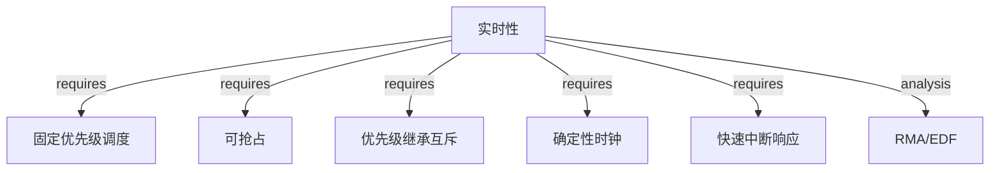

# RTOS 概念树

<!-- TOC START -->

- [RTOS 概念树](#rtos-概念树)
  - [1. RTOS 全局概念树](#1-rtos-全局概念树)
  - [2. RTOS 与通用 OS 概念对照](#2-rtos-与通用-os-概念对照)
  - [3. 属性-关系映射](#3-属性-关系映射)
  - [4. 机制组合树](#4-机制组合树)
  - [5. 实时性分类](#5-实时性分类)
  - [6. 术语表](#6-术语表)
  - [7. 相关文件](#7-相关文件)
  - [国际权威来源链接 | International Authoritative Sources](#国际权威来源链接--international-authoritative-sources)

<!-- TOC END -->

> **权威来源**：FreeRTOS Docs, Zephyr Docs, RTEMS Docs, VxWorks Docs, Buttazzo *Hard Real-Time Computing Systems*。
>
> **目标**：建立实时操作系统 RTOS 的完整概念树，并与通用 OS/Linux 概念对齐。

---

## 1. RTOS 全局概念树

```mermaid
graph TD
    RTOS[RTOS] -->|is-a| OS[Operating System]
    RTOS -->|part-of| TASK[Task / Thread]
    RTOS -->|part-of| SCHED[Scheduler]
    RTOS -->|part-of| SYNC[Synchronization]
    RTOS -->|part-of| IRQ[Interrupt]
    RTOS -->|part-of| MEM[Memory Management]
    RTOS -->|part-of| PM[Power Management]
    RTOS -->|part-of| HAL[HAL]

    TASK -->|state| READY[Ready]
    TASK -->|state| RUNNING[Running]
    TASK -->|state| BLOCKED[Blocked]
    TASK -->|state| SUSPENDED[Suspended]

    SCHED -->|policy| FP[Fixed Priority]
    SCHED -->|policy| RR[Round Robin]
    SCHED -->|policy| EDF[Earliest Deadline First]
    SCHED -->|policy| RMS[Rate Monotonic]

    SYNC -->|primitive| MUTEX[Mutex]
    SYNC -->|primitive| SEM[Semaphore]
    SYNC -->|primitive| QUEUE[Queue]
    SYNC -->|primitive| EVENT[Event Group]
    SYNC -->|problem| PI[Priority Inversion]

    IRQ -->|type| TOP[Top Half]
    IRQ -->|type| BOTTOM[Bottom Half]
    IRQ -->|controller| NVIC[NVIC]
    IRQ -->|controller| GIC[ARM GIC]

    MEM -->|allocator| STATIC[Static]
    MEM -->|allocator| HEAP[Heap]
    MEM -->|allocator| POOL[Memory Pool]

    PM -->|mode| RUN[Run]
    PM -->|mode| SLEEP[Sleep]
    PM -->|mode| DEEP[Deep Sleep]
    PM -->|mode| STOP[Stop]

    HAL -->|abstracts| GPIO[GPIO]
    HAL -->|abstracts| UART[UART]
    HAL -->|abstracts| I2C[I2C]
    HAL -->|abstracts| SPI[SPI]
    HAL -->|abstracts| TIMER[Timer]
```

---

## 2. RTOS 与通用 OS 概念对照

| RTOS 概念 | 通用 OS / Linux 对应 | 说明 |
|-----------|----------------------|------|
| Task | Process / Thread | RTOS 中通常 task = thread |
| Scheduler | Scheduler | RTOS 强调确定性 |
| Mutex | Mutex / futex | 支持优先级继承 |
| Semaphore | Semaphore | 信号量 |
| Queue | Message Queue | 任务间通信 |
| Event Group | Condition Variable / futex | 事件同步 |
| ISR | Interrupt Handler | 中断服务 |
| Tick | Timer Interrupt | 系统节拍 |
| Hook | Kernel Callback | 钩子函数 |

---

## 3. 属性-关系映射

| 概念 | 属性 | 类型/取值 | 说明 |
|------|------|-----------|------|
| Task | priority | ℕ | 数值越小优先级越高 |
| Task | stack_size | ℕ | 栈大小 |
| Task | period | Time | 周期（周期性任务） |
| Task | deadline | Time | 截止时间 |
| Task | WCET | Time | 最坏执行时间 |
| Mutex | owner | Task | 持有者 |
| Mutex | priority_ceiling | ℕ | 优先级天花板 |
| Scheduler | tick_period | Time | 系统节拍周期 |
| ISR | latency | Time | 中断响应延迟 |

---

## 4. 机制组合树

---

## 5. 实时性分类

| 类型 | 说明 | 例子 |
|------|------|------|
| 硬实时 | 截止时间必须满足 | 飞控、刹车系统 |
| 软实时 | 偶尔超时可接受 | 视频流、语音 |
| 强实时 | 严格确定性 | 工业控制 |
| 弱实时 | 尽量满足 | 网络 QoS |

---

## 6. 术语表

| 中文 | 英文 | 一句话定义 |
|------|------|------------|
| RTOS | Real-Time Operating System | 实时操作系统 |
| Task | 任务 | RTOS 中的执行单元 |
| Tick | 系统节拍 | RTOS 调度的时间基准 |
| Priority Inversion | 优先级倒置 | 低优先级任务阻塞高优先级任务 |
| Priority Inheritance | 优先级继承 | 解决优先级倒置的机制 |
| WCET | Worst-Case Execution Time | 最坏执行时间 |
| RMA | Rate Monotonic Analysis | 速率单调分析 |
| EDF | Earliest Deadline First | 最早截止期限优先 |

---

## 7. 相关文件

- [RTOS 属性-关系映射](./rtos-attribute-relationship-map.md)
- [RTOS 机制组合树](./rtos-mechanism-composition-tree.md)
- [RTOS 依赖树](./rtos-dependency-tree.md)
- [RTOS 场景分析树](./rtos-scenario-analysis-tree.md)
- [RTOS 国际来源映射](./rtos-source-mapping.md)
- [RTOS 对比映射](./freertos-zephyr-rtems-vxworks-map.md)
- [Linux vs RTOS 决策树](../06-decision-trees/linux-vs-rtos.md)
- [操作系统机制组合树](../../2.操作系统/02-operating-systems/00-concept-atlas/mechanism-composition-tree-os.md)

## 国际权威来源链接 | International Authoritative Sources

- [FreeRTOS Documentation](https://www.freertos.org/Documentation/RTOS-book)
- [Zephyr Project Documentation](https://docs.zephyrproject.org/)
- [RTEMS Documentation](https://docs.rtems.org/)
- [Liu & Layland, "Scheduling Algorithms for Multiprogramming in a Hard-Real-Time Environment", JACM 1973](https://doi.org/10.1145/321738.321743)
- [Buttazzo, *Hard Real-Time Computing Systems* (Springer)](https://link.springer.com/book/10.1007/978-3-031-04138-0)
- [ARM Architecture Reference Manual](https://developer.arm.com/documentation)
- [RISC-V Privileged Spec](https://riscv.org/technical/specifications/)
- [项目国际化权威标准基线 — 3. 物联网嵌入式系统](../../../docs/international-baseline.md)
