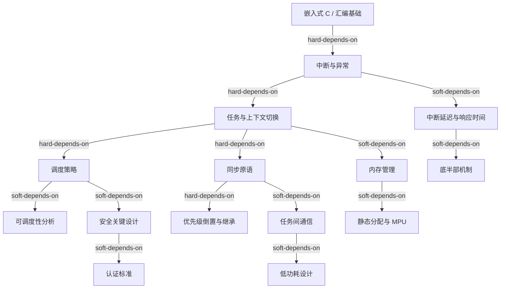
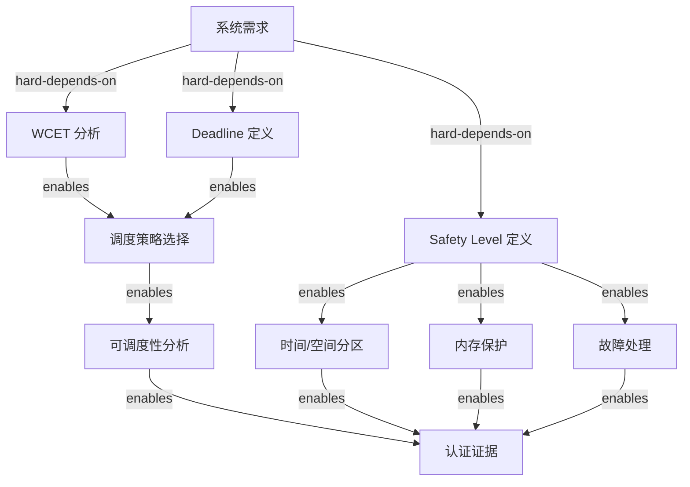
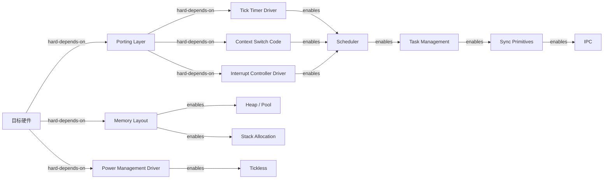
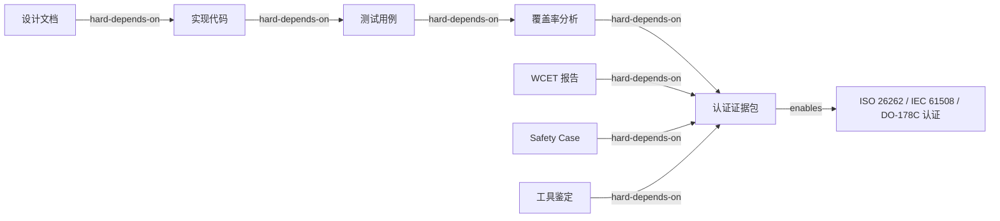

<!-- 创建理由：RTOS 需要独立的依赖树文件，描述学习、设计、实现、部署和认证的前置-后置关系。 -->

# RTOS 依赖树（RTOS Dependency Tree）

<!-- TOC START -->

- [RTOS 依赖树（RTOS Dependency Tree）](#rtos-依赖树rtos-dependency-tree)
  - [1. 学习依赖树](#1-学习依赖树)
  - [2. 设计依赖树](#2-设计依赖树)
  - [3. 实现与移植依赖树](#3-实现与移植依赖树)
  - [4. 部署与认证依赖树](#4-部署与认证依赖树)
  - [5. 关键依赖说明](#5-关键依赖说明)
  - [6. 学习路径建议](#6-学习路径建议)
    - [6.1 初学者路径](#61-初学者路径)
    - [6.2 安全关键工程师路径](#62-安全关键工程师路径)
  - [7. 国际来源映射](#7-国际来源映射)
  - [8. 相关文件](#8-相关文件)

<!-- TOC END -->

> **权威来源**：FreeRTOS Documentation, Zephyr Documentation, RTEMS Documentation, Buttazzo *Hard Real-Time Computing Systems*, ISO 26262 / IEC 61508 / DO-178C。
>
> **目标**：明确 RTOS 概念学习、系统设计、实现移植、部署认证之间的前置-后置关系。
>
> **边类型**：
>
> - `hard-depends-on`：没有前者无法实现后者
> - `soft-depends-on`：建议先理解前者
> - `enables`：前者使后者成为可能

---

## 1. 学习依赖树

---

## 2. 设计依赖树

---

## 3. 实现与移植依赖树

---

## 4. 部署与认证依赖树

---

## 5. 关键依赖说明

| 依赖关系 | 类型 | 说明 |
|----------|------|------|
| 中断 → 调度器 | hard | 调度器依赖时钟中断驱动 tick |
| 调度策略 → 可调度性分析 | hard | 选择策略后必须验证任务集可调度 |
| 同步原语 → 优先级倒置分析 | hard | 使用 mutex 必须分析优先级倒置风险 |
| 安全等级 → 内存保护 | hard | ASIL-D / SIL3 通常要求 MPU/MMU 隔离 |
| WCET → 认证证据 | hard | 安全关键系统必须提供 WCET 证据 |
| 任务 → 任务间通信 | soft | 多任务系统建议使用 IPC，但非强制 |
| 低功耗 → Tickless | soft | Tickless 是实现低功耗的常见手段 |

---

## 6. 学习路径建议

### 6.1 初学者路径

1. 嵌入式 C + 目标 MCU 架构
2. 中断与异常机制
3. RTOS 任务与状态机
4. 固定优先级调度与抢占
5. Mutex/Semaphore/Queue 使用
6. 静态内存分配与栈溢出检测
7. 低功耗基础

### 6.2 安全关键工程师路径

1. 初学者路径全部内容
2. WCET 分析与测量
3. RMA/EDF 可调度性分析
4. 优先级倒置与天花板协议
5. MPU/MMU 与内存保护
6. 时间分区与空间分区
7. ISO 26262 / IEC 61508 / DO-178C 认证流程

---

## 7. 国际来源映射

| 依赖主题 | 来源类型 | 来源 | 位置 |
|----------|----------|------|------|
| 学习路径 | Documentation | FreeRTOS / Zephyr / RTEMS | Getting Started, Kernel Primer |
| 调度理论 | Textbook | Buttazzo | *Hard Real-Time Computing Systems* |
| 移植层 | Documentation | FreeRTOS / Zephyr | Porting Guides |
| 安全认证 | Standard | ISO 26262 / IEC 61508 / DO-178C | 官方标准 |
| WCET 分析 | Tool/Standard | aiT / Bound-T / ISO 26262 Part 6 | 工具文档 |

---

## 8. 相关文件

- [RTOS 概念树](./rtos-concept-tree.md)
- [RTOS 属性-关系映射](./rtos-attribute-relationship-map.md)
- [RTOS 机制组合树](./rtos-mechanism-composition-tree.md)
- [RTOS 场景分析树](./rtos-scenario-analysis-tree.md)
- [RTOS 国际来源映射](./rtos-source-mapping.md)
- [Linux vs RTOS 决策树](../06-decision-trees/linux-vs-rtos.md)
