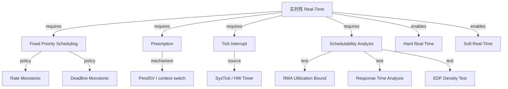
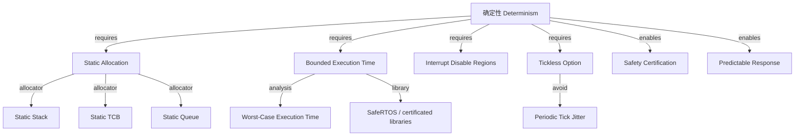
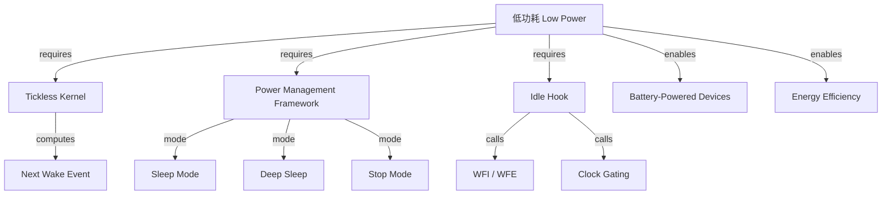
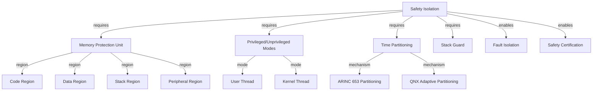
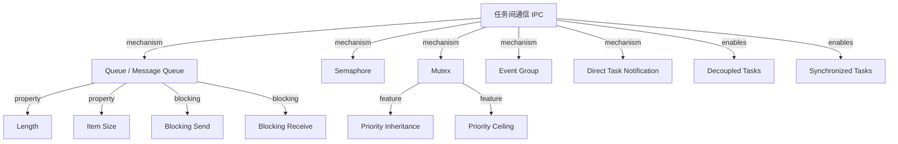

<!-- 创建理由：RTOS 需要独立的机制组合树文件，解释实时性、确定性、低功耗、安全隔离等能力如何通过底层机制组合而成。 -->

# RTOS 机制组合树（RTOS Mechanism Composition Tree）

<!-- TOC START -->

- [RTOS 机制组合树（RTOS Mechanism Composition Tree）](#rtos-机制组合树rtos-mechanism-composition-tree)
  - [1. 实时性（Real-Time）](#1-实时性real-time)
  - [2. 确定性（Determinism）](#2-确定性determinism)
  - [3. 低功耗（Low Power）](#3-低功耗low-power)
  - [4. 安全隔离（Safety Isolation）](#4-安全隔离safety-isolation)
  - [5. 任务间通信（IPC）](#5-任务间通信ipc)
  - [6. 国际来源映射](#6-国际来源映射)
  - [7. 相关文件](#7-相关文件)

<!-- TOC END -->

> **权威来源**：FreeRTOS Documentation, Zephyr Documentation, RTEMS Documentation, QNX Documentation, Buttazzo *Hard Real-Time Computing Systems*。
>
> **目标**：解释 RTOS 底层机制如何组合成实时性、确定性、低功耗、安全隔离等系统能力。

---

## 1. 实时性（Real-Time）

**组合语义**：

- 固定优先级调度 + 抢占 → 高优先级任务立即获得 CPU
- 系统节拍 → 周期性任务唤醒与超时检测
- RMA/RTA/EDF → 设计时验证任务集是否可调度

---

## 2. 确定性（Determinism）

**组合语义**：

- 静态分配消除堆分配非确定性
- 禁用中断区段明确临界区边界
- Tickless 避免周期性时钟抖动

---

## 3. 低功耗（Low Power）

**组合语义**：

- Tickless 计算下一次唤醒时间，避免不必要节拍中断
- Idle Hook 进入 WFI/WFE 降低 CPU 功耗
- 电源管理框架在空闲时切换到低功耗模式

---

## 4. 安全隔离（Safety Isolation）

**组合语义**：

- MPU/MMU 限制任务可访问内存区域
- 特权级分离保护内核关键数据
- 时间分区确保关键任务的时间预算不被低优先级任务侵占

---

## 5. 任务间通信（IPC）

**组合语义**：

- Queue 传递结构化消息，支持阻塞/非阻塞
- Mutex 保护共享资源，优先级继承避免倒置
- Direct Task Notification 提供轻量级一对一同步

---

## 6. 国际来源映射

| 系统能力 | 关键机制 | 来源类型 | 来源 | 位置 |
|----------|----------|----------|------|------|
| 实时性 | 固定优先级 / RMS / EDF | Paper/Textbook | Liu & Layland 1973; Buttazzo | JACM; *Hard Real-Time Computing Systems* |
| 确定性 | 静态分配 / WCET | Documentation | FreeRTOS / SafeRTOS | Static allocation, heap models |
| 低功耗 | Tickless / Idle Hook | Documentation | Zephyr / FreeRTOS | PM subsystems |
| 安全隔离 | MPU / Privileged mode | Documentation | ARMv8-M / Zephyr / QNX | MPU, user mode |
| 时间分区 | ARINC 653 / Adaptive Partitioning | Standard/Documentation | ARINC 653 / QNX | Partitioning docs |

---

## 7. 相关文件

- [RTOS 概念树](./rtos-concept-tree.md)
- [RTOS 属性-关系映射](./rtos-attribute-relationship-map.md)
- [RTOS 依赖树](./rtos-dependency-tree.md)
- [RTOS 场景分析树](./rtos-scenario-analysis-tree.md)
- [RTOS 国际来源映射](./rtos-source-mapping.md)
