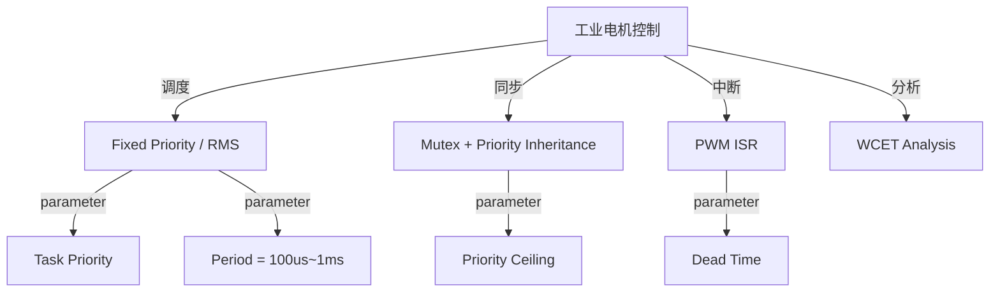
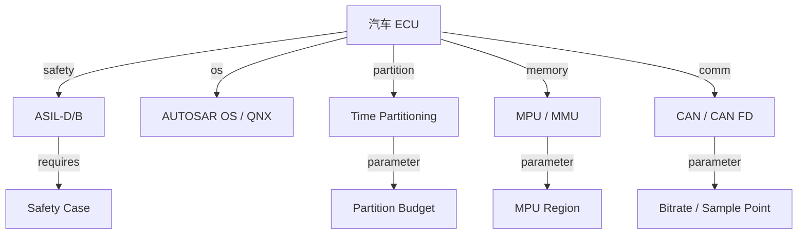
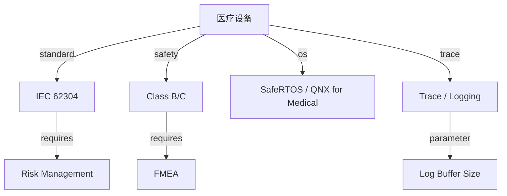
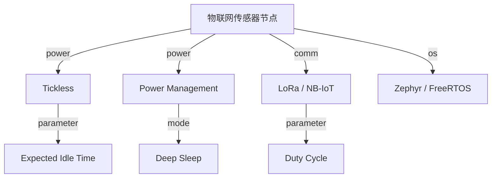
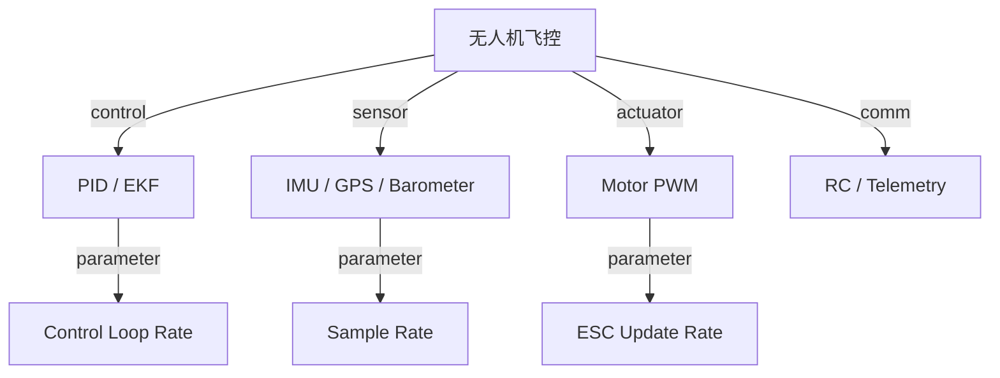
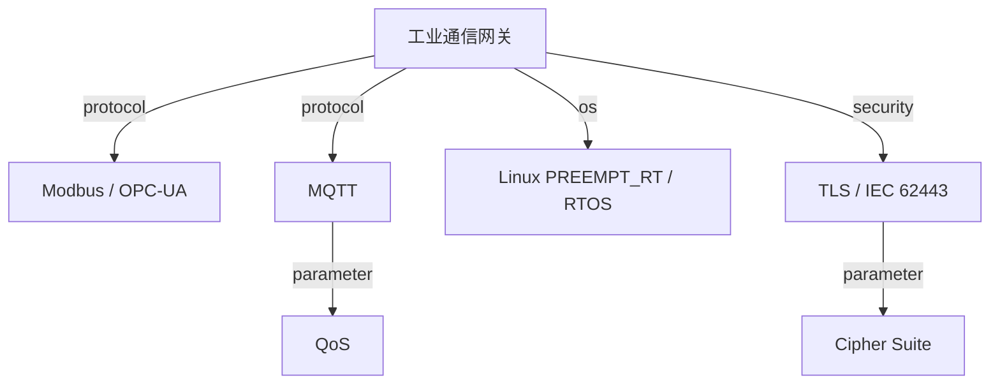

<!-- 创建理由：RTOS 需要独立的场景分析树文件，将实时性、确定性、低功耗、安全隔离等能力落地到工业控制、汽车电子、医疗设备、物联网传感器等具体工程场景。 -->

# RTOS 场景分析树（RTOS Scenario Analysis Tree）

<!-- TOC START -->

- [RTOS 场景分析树（RTOS Scenario Analysis Tree）](#rtos-场景分析树rtos-scenario-analysis-tree)
  - [1. 工业电机控制](#1-工业电机控制)
  - [2. 汽车电子控制单元（ECU）](#2-汽车电子控制单元ecu)
  - [3. 医疗设备](#3-医疗设备)
  - [4. 物联网传感器节点](#4-物联网传感器节点)
  - [5. 无人机飞控](#5-无人机飞控)
  - [6. 工业通信网关](#6-工业通信网关)
  - [7. 国际来源映射](#7-国际来源映射)
  - [8. 相关文件](#8-相关文件)

<!-- TOC END -->

> **权威来源**：FreeRTOS Documentation, Zephyr Documentation, QNX Documentation, Buttazzo *Hard Real-Time Computing Systems*, ISO 26262, IEC 61508, DO-178C。
>
> **目标**：把 RTOS 机制落地到具体工程场景，提供“场景 → 负载特征 → 机制选择 → 关键参数 → 验证指标 → 典型系统”的决策支持。

---

## 1. 工业电机控制

| 场景 | 负载特征 | 机制选择 | 关键参数 | 验证指标 | 典型系统 |
|------|----------|----------|----------|----------|----------|
| 伺服电机控制 | 周期性，硬实时，< 100us 控制环 | FreeRTOS/Zephyr + RMS + Mutex PI | 周期、WCET、优先级、死区时间 | 100% 截止时间满足，抖动 < 10us | 伺服驱动器 |
| PLC 逻辑控制 | 多任务，确定性 | RTEMS / VxWorks + 时间片 | 循环周期、I/O 刷新率 | 扫描周期稳定 | Siemens S7, Schneider M340 |

---

## 2. 汽车电子控制单元（ECU）

| 场景 | 负载特征 | 机制选择 | 关键参数 | 验证指标 | 典型系统 |
|------|----------|----------|----------|----------|----------|
| 动力总成 ECU | 硬实时，安全关键，ASIL-D | AUTOSAR OS + EDF + Memory Protection | 任务周期、WCET、分区预算 | 认证通过，最坏响应时间 | Bosch ECU |
| 底盘控制（ABS/ESP） | 高可靠，低延迟 | QNX / SafeRTOS + Partitioning + CAN | 中断延迟、消息周期 | 故障率 < 10^-8/h | Continental ESC |
| 信息娱乐 | 丰富生态，软实时 | Android Automotive / QNX + Hypervisor | 启动时间、多媒体延迟 | 用户体验 | 车机系统 |

---

## 3. 医疗设备

| 场景 | 负载特征 | 机制选择 | 关键参数 | 验证指标 | 典型系统 |
|------|----------|----------|----------|----------|----------|
| 输液泵 | 周期性，安全关键，Class C | SafeRTOS + RMS + Watchdog | 周期、看门狗超时、报警延迟 | IEC 62304 认证 | 输液泵控制器 |
| 呼吸机 | 多传感器融合，高可靠 | QNX for Medical + Partitioning | 控制周期、传感器采样率 | 气流精度，响应时间 | 高端呼吸机 |
| 手术机器人 | 硬实时，多轴同步 | RT-Linux / QNX + Time Partitioning | 同步精度、延迟 | 位置精度，安全停机 | 达芬奇手术系统 |

---

## 4. 物联网传感器节点

| 场景 | 负载特征 | 机制选择 | 关键参数 | 验证指标 | 典型系统 |
|------|----------|----------|----------|----------|----------|
| 环境监测节点 | 超低功耗，周期性采样 | Zephyr + Tickless + Deep Sleep | 唤醒周期、采样间隔 | 功耗 uA，电池寿命年 | 农业/环境传感器 |
| 资产追踪 | 间歇性通信，GPS | FreeRTOS + Low-Power UART + LoRa | 定位周期、发射功率 | 定位精度，电池寿命 | 物流追踪器 |
| 智能电表 | 长周期，数据上报 | RT-Thread / Zephyr + NB-IoT | 上报周期、数据缓存 | 通信成功率，功耗 | 智能电表 |

---

## 5. 无人机飞控

| 场景 | 负载特征 | 机制选择 | 关键参数 | 验证指标 | 典型系统 |
|------|----------|----------|----------|----------|----------|
| 消费级无人机 | 高频率控制环，多传感器 | FreeRTOS/ChibiOS + RMS + DMA | 控制环 1~4kHz，传感器融合 | 姿态稳定，悬停精度 | DJI 飞控 |
| 工业巡检无人机 | 长续航，可靠通信 | PX4 / ArduPilot on Linux/PREEMPT_RT | 控制环、通信延迟 | 航线精度，图传延迟 | 行业无人机 |

---

## 6. 工业通信网关

| 场景 | 负载特征 | 机制选择 | 关键参数 | 验证指标 | 典型系统 |
|------|----------|----------|----------|----------|----------|
| 工厂边缘网关 | 多协议转换，中等实时 | Linux PREEMPT_RT + Docker + MQTT | 协议转换延迟、容器资源 | 吞吐，协议兼容性 | 工业网关 |
| 变电站通信单元 | 高可靠，安全 | RTEMS / VxWorks + IEC 61850 | 消息延迟、GOOSE 周期 | 通信可用性 99.999% | 电力通信设备 |

---

## 7. 国际来源映射

| 场景 | 来源类型 | 来源 | 位置 |
|------|----------|------|------|
| 电机控制 | Documentation | FreeRTOS / Zephyr | Real-time examples |
| 汽车 ECU | Standard | ISO 26262 / AUTOSAR | 官方标准/规范 |
| 医疗设备 | Standard | IEC 62304 / FDA guidance | 官方标准 |
| 物联网低功耗 | Documentation | Zephyr / FreeRTOS | PM subsystems |
| 无人机飞控 | Open Source | PX4 / ArduPilot | Flight control design |
| 工业通信 | Standard | IEC 62443 / IEC 61850 | 官方标准 |

---

## 8. 相关文件

- [RTOS 概念树](./rtos-concept-tree.md)
- [RTOS 属性-关系映射](./rtos-attribute-relationship-map.md)
- [RTOS 机制组合树](./rtos-mechanism-composition-tree.md)
- [RTOS 依赖树](./rtos-dependency-tree.md)
- [RTOS 国际来源映射](./rtos-source-mapping.md)
- [Linux vs RTOS 决策树](../06-decision-trees/linux-vs-rtos.md)
