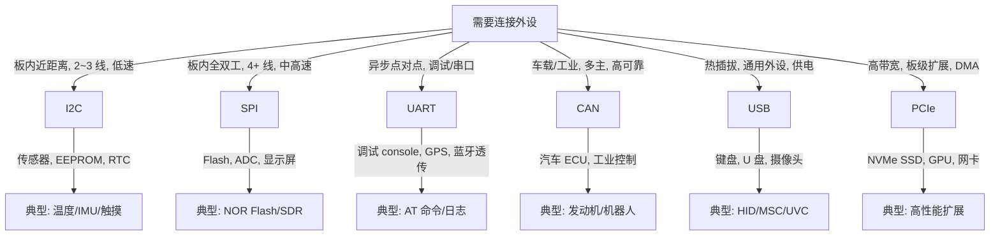

# 嵌入式外设总线选择决策树

> **目标**：为 MCU/MPU 嵌入式系统选择合适的外设总线：I2C / SPI / UART / CAN / USB / PCIe。

---

## 1. 决策树

---

## 2. 总线属性对比

| 总线 | 线数 | 速率 | 距离 | 拓扑 | 主从 | 典型距离 |
|------|------|------|------|------|------|----------|
| I2C | 2 (SDA+SCL) | ≤ 3.4 Mbps (HS) | 短 | 总线 | 多主 | 板内 cm |
| SPI | 4+ (MOSI/MISO/SCK/CS) | 数十 MHz | 短 | 星型 | 一主多从 | 板内 cm |
| UART | 2 (TX/RX) | ≤ 数 Mbps | 中 | 点对点 | 无 | 数米 |
| CAN | 2 (CANH/CANL) | ≤ 1 Mbps (CAN) / 8 Mbps (CAN-FD) | 长 | 总线 | 多主 | 数十米 |
| USB | 4 (2.0) / 9 (3.0) | ≤ 20 Gbps | 中 | 星型 | 主从 | 数米 |
| PCIe | ≥ 4 lane | GB/s 级 | 板内 | 点对点 | 主从 | cm |

---

## 3. 选择矩阵

| 需求 | 推荐总线 | 原因 |
|------|----------|------|
| 最少引脚 | I2C | 仅 2 线 |
| 最高吞吐 | PCIe / SPI | 高时钟/多 lane |
| 远距离高可靠 | CAN | 差分、仲裁、CRC |
| 热插拔 | USB | 标准协议栈、供电 |
| 调试串口 | UART | 简单、无需时钟 |
| 多主访问 | I2C / CAN | 总线仲裁 |
| 低功耗传感器 | I2C / SPI | 简单、可休眠 |

---

## 4. Linux/RTOS 映射

| 总线 | Linux 子系统 | RTOS 抽象 |
|------|--------------|-----------|
| I2C | `i2c_adapter` / `i2c_client` | I2C HAL |
| SPI | `spi_master` / `spi_device` | SPI HAL |
| UART | `uart_driver` / `tty` | UART HAL |
| CAN | `socketcan` / `can_dev` | CAN HAL |
| USB | `usb_hcd` / `usb_device` | USB Stack |
| PCIe | `pci_dev` / `pci_driver` | — |

---

## 5. 相关文件

- [外设总线决策树](../../../2.操作系统/02-operating-systems/07-peripherals/decision-tree-peripheral-bus.md)
- [I2C](../../../2.操作系统/02-operating-systems/07-peripherals/i2c.md)
- [SPI](../../../2.操作系统/02-operating-systems/07-peripherals/spi.md)
- [UART](../../../2.操作系统/02-operating-systems/07-peripherals/uart.md)
- [CAN](../../../2.操作系统/02-operating-systems/07-peripherals/can.md)
