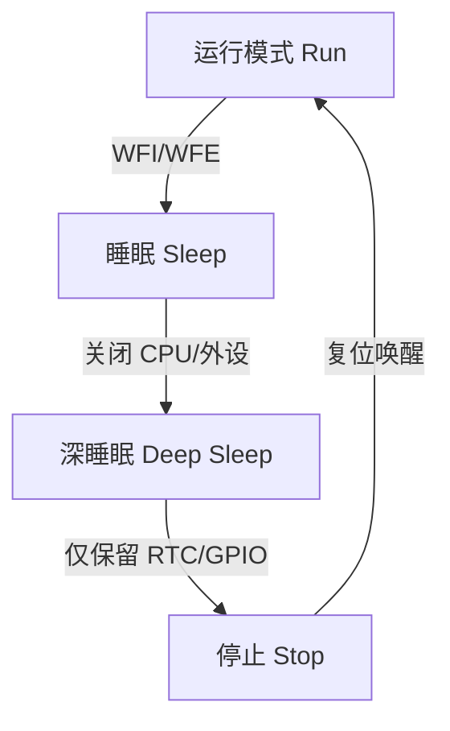

# 低功耗接口与电源管理映射

<!-- TOC START -->

- [低功耗接口与电源管理映射](#低功耗接口与电源管理映射)
  - [1. 低功耗层次](#1-低功耗层次)
  - [2. 功耗来源与优化](#2-功耗来源与优化)
  - [3. 唤醒源](#3-唤醒源)
  - [4. Linux / RTOS 实现](#4-linux--rtos-实现)
  - [5. 设计检查清单](#5-设计检查清单)
  - [6. 相关文件](#6-相关文件)
  - [国际权威来源链接 | International Authoritative Sources](#国际权威来源链接--international-authoritative-sources)

<!-- TOC END -->

> **目标**：梳理嵌入式/IoT 中低功耗接口设计：时钟门控、电源域、休眠唤醒、GPIO 中断唤醒。

---

## 1. 低功耗层次

---

## 2. 功耗来源与优化

| 来源 | 优化手段 |
|------|----------|
| 动态功耗 | 降频、时钟门控、减少翻转 |
| 静态漏电 | 电源域关闭、降低电压 |
| 外设功耗 | 不使用时关闭外设时钟/电源 |
| 通信功耗 | 缩短射频开启时间、批量传输 |

---

## 3. 唤醒源

| 唤醒源 | 说明 |
|--------|------|
| GPIO 中断 | 按键、传感器事件 |
| RTC 闹钟 | 定时唤醒 |
| UART RX | 串口数据唤醒 |
| 网络包 | WiFi/BLE 接收唤醒 |
| Watchdog | 看门狗复位 |

---

## 4. Linux / RTOS 实现

| 机制 | Linux | RTOS |
|------|-------|------|
| CPU Idle | `cpuidle` governor | `vTaskDelay` + Tickless |
| 运行时 PM | `runtime PM` | 手动开关外设 |
| 系统休眠 | `suspend-to-RAM` / `suspend-to-disk` | `pm_system_suspend` |
| 设备树电源域 | `power-domains` 属性 | 厂商 HAL |
| 唤醒源配置 | `wakeup-source` / `/sys/power/wakeup*` | 中断配置 |

---

## 5. 设计检查清单

- [ ] 识别各组件功耗占比
- [ ] 划分电源域与可关闭外设
- [ ] 选择合适休眠模式
- [ ] 配置 GPIO/RTC 唤醒源
- [ ] 测量休眠电流与唤醒时间
- [ ] 处理外设状态保存与恢复

---

## 6. 相关文件

- [传感器到 OS 映射](./sensor-to-os-mapping.md)
- [嵌入式总线决策树](./embedded-bus-decision-tree.md)

## 国际权威来源链接 | International Authoritative Sources

- [ARM Architecture Reference Manual](https://developer.arm.com/documentation)
- [RISC-V Privileged Spec](https://riscv.org/technical/specifications/)
- [Zephyr Project Documentation — Power Management](https://docs.zephyrproject.org/)
- [FreeRTOS Documentation](https://www.freertos.org/Documentation/RTOS-book)
- [Linux Kernel Documentation — CPU Idle](https://docs.kernel.org/admin-guide/pm/cpuidle.html)
- [Linux Kernel Documentation — Runtime PM](https://docs.kernel.org/power/runtime_pm.html)
- [项目国际化权威标准基线 — 3. 物联网嵌入式系统](../../../docs/international-baseline.md)
