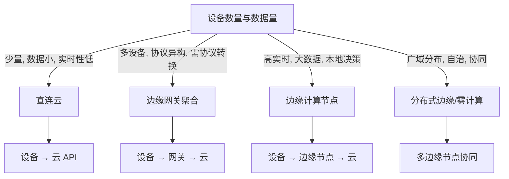

# 边缘计算架构决策树

> **目标**：为 IoT/嵌入式系统选择“云-边-端”分层架构：纯云端、网关聚合、边缘推理、分布式边缘。

---

## 1. 决策树

---

## 2. 架构模式对比

| 模式 | 延迟 | 带宽 | 成本 | 复杂度 | 自治性 |
|------|------|------|------|--------|--------|
| 直连云 | 高 | 高 | 低 | 低 | 低 |
| 边缘网关 | 中 | 中 | 中 | 中 | 中 |
| 边缘计算 | 低 | 低 | 中 | 高 | 高 |
| 分布式边缘 | 低 | 低 | 高 | 高 | 很高 |

---

## 3. 选型因素

| 因素 | 偏向边缘侧 | 偏向云端 |
|------|-----------|----------|
| 实时性 | 要求高 | 可容忍 |
| 数据隐私 | 敏感 | 可上传 |
| 网络带宽 | 有限/贵 | 充裕 |
| 算力需求 | 高（AI 推理） | 低 |
| 运维复杂度 | 可接受 | 希望简单 |

---

## 4. 关键技术与栈

| 层级 | 技术 |
|------|------|
| 端侧 | MCU + RTOS / Embedded Linux, MQTT/CoAP |
| 网关 | Embedded Linux + Docker/containerd, EdgeX Foundry / KubeEdge |
| 边缘节点 | Kubernetes / K3s, GPU/TPU, 时序数据库 |
| 云 | IoT Hub, Data Lake, AI 训练 |

---

## 5. 相关文件

- [协议选择决策树](./protocol-selection.md)
- [Linux vs RTOS 决策树](./linux-vs-rtos.md)
- [跨域映射](../../Analysis/操作系统-网络-嵌入式-接口跨域映射.md)
