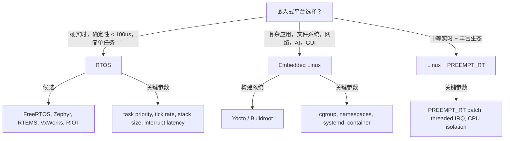

# Linux vs RTOS 平台选择决策树

<!-- TOC START -->

- [Linux vs RTOS 平台选择决策树](#linux-vs-rtos-平台选择决策树)
  - [1. 决策树](#1-决策树)
  - [2. 对比矩阵](#2-对比矩阵)
  - [3. 场景决策表](#3-场景决策表)
  - [4. Linux PREEMPT_RT 关键配置](#4-linux-preempt_rt-关键配置)
  - [5. 术语表](#5-术语表)
  - [6. 国际来源映射](#6-国际来源映射)
  - [7. 相关文件](#7-相关文件)
  - [国际权威来源链接 | International Authoritative Sources](#国际权威来源链接--international-authoritative-sources)

<!-- TOC END -->

> **权威来源**：Buttazzo *Hard Real-Time Computing Systems*, FreeRTOS Docs, Zephyr Docs, Linux Kernel Development。
>
> **目标**：根据实时性、复杂度、生态、功耗等约束，选择嵌入式 Linux 或 RTOS。

---

## 1. 决策树

---

## 2. 对比矩阵

| 特性 | FreeRTOS | Zephyr | RTEMS | VxWorks | Embedded Linux |
|------|----------|--------|-------|---------|----------------|
| 内核类型 | 微内核/宏内核 | 微内核 | 宏内核 | 宏内核 | 宏内核 |
| 许可证 | MIT | Apache 2.0 | BSD/GPL | 商业 | GPL |
| 任务调度 | 优先级抢占 | 优先级抢占 + 时间片 | 优先级抢占 | 优先级抢占 | CFS + 实时类 |
| 硬实时 | 可 | 可 | 可 | 强 | 需 PREEMPT_RT |
| 典型中断延迟 | < 1us | < 10us | < 10us | < 1us | 10~100us+ |
| 网络协议栈 | 轻量 | 完整 | 完整 | 完整 | 完整 |
| 文件系统 | 可选 | 可选 | 可选 | 完整 | 完整 |
| 开发板支持 | 极广 | 广 | 中 | 广 | 极广 |
| 适用 | 简单 MCU | IoT/边缘 | 航天/军工 | 工业/电信 | 复杂网关 |

---

## 3. 场景决策表

| 场景 | 推荐 | 关键参数 | 验证指标 |
|------|------|----------|----------|
| 电机控制/飞控 | FreeRTOS/Zephyr | 中断延迟，tickless | 最坏情况延迟 |
| 工业 PLC | VxWorks / RTEMS | 确定性，安全认证 | 周期抖动 |
| 物联网传感器节点 | Zephyr/RIOT | 功耗，内存 | 电池寿命 |
| 工业网关 | Linux PREEMPT_RT | 协议支持，实时性 | 延迟 P99 |
| 智能摄像头 | Embedded Linux | AI 推理，视频流 | 帧率，CPU% |
| 汽车信息娱乐 | Embedded Linux | 图形，多媒体 | 启动时间 |

---

## 4. Linux PREEMPT_RT 关键配置

| 配置 | 说明 |
|------|------|
| `CONFIG_PREEMPT_RT` | 实时抢占补丁 |
| `CONFIG_IRQ_FORCED_THREADING` | 强制中断线程化 |
| `CONFIG_NO_HZ_FULL` | 全动态 tick，减少调度干扰 |
| `isolcpus` | CPU 隔离 |
| `irq_affinity` | 中断亲和性 |
| `SCHED_FIFO` | 实时调度策略 |

---

## 5. 术语表

| 中文 | 英文 | 一句话定义 |
|------|------|------------|
| RTOS | Real-Time Operating System | 强调确定性与实时响应的操作系统 |
| tickless | Tickless Kernel | 无周期时钟中断，降低功耗 |
| PREEMPT_RT | Real-Time Preemption Patch | 使 Linux 具备硬实时能力的补丁 |
| WCET | Worst-Case Execution Time | 最坏执行时间 |
| CPU Isolation | CPU 隔离 | 将特定 CPU 从通用调度中隔离 |

---

## 6. 国际来源映射

| 概念 | 来源类型 | 来源 |
|------|----------|------|
| 实时调度理论 | Paper/Textbook | Liu & Layland 1973; Buttazzo |
| FreeRTOS | Docs | FreeRTOS.org |
| Zephyr | Docs | Zephyr Project |
| PREEMPT_RT | Docs | Linux Foundation Real-Time Linux |

---

## 7. 相关文件

- [嵌入式 Linux 启动流程](../03-embedded-linux/embedded-linux-bootflow.md)
- [PREEMPT_RT](../03-embedded-linux/preempt-rt-linux.md)
- [操作系统场景分析树](../../2.操作系统/02-operating-systems/00-concept-atlas/scenario-analysis-tree-os.md)

## 国际权威来源链接 | International Authoritative Sources

- [Liu & Layland, "Scheduling Algorithms for Multiprogramming in a Hard-Real-Time Environment", JACM 1973](https://doi.org/10.1145/321738.321743)
- [Buttazzo, *Hard Real-Time Computing Systems* (Springer)](https://link.springer.com/book/10.1007/978-3-031-04138-0)
- [FreeRTOS Documentation](https://www.freertos.org/Documentation/RTOS-book)
- [Zephyr Project Documentation](https://docs.zephyrproject.org/)
- [RTEMS Documentation](https://docs.rtems.org/)
- [Linux PREEMPT_RT Wiki](https://wiki.linuxfoundation.org/realtime/start)
- [项目国际化权威标准基线 — 3. 物联网嵌入式系统](../../../docs/international-baseline.md)
