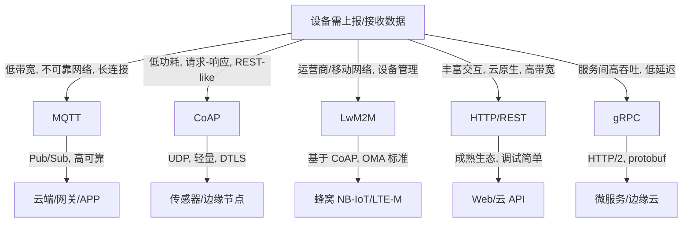

# 物联网协议选择决策树

> **目标**：为 IoT 场景选择 MQTT / CoAP / LwM2M / HTTP / gRPC 等协议。

---

## 1. 决策树

---

## 2. 协议属性对比

| 协议 | 传输 | 模式 | 开销 | 安全 | 适用网络 |
|------|------|------|------|------|----------|
| MQTT | TCP | Pub/Sub | 低 | TLS/SSL | WiFi/以太/蜂窝 |
| CoAP | UDP | 请求/响应 | 极低 | DTLS | 6LoWPAN/LoRa/NB-IoT |
| LwM2M | UDP (CoAP) | 设备管理 | 低 | DTLS/TLS | 蜂窝/低功耗广域 |
| HTTP | TCP | 请求/响应 | 高 | TLS | 宽带 |
| gRPC | TCP (HTTP/2) | RPC | 中 | TLS | 宽带/数据中心 |

---

## 3. 场景选择

| 场景 | 推荐协议 | 原因 |
|------|----------|------|
| 智能家居 | MQTT | 稳定、生态成熟 |
| 工业传感器 | MQTT/CoAP | 低带宽、可离线 |
| 资产追踪 | LwM2M | 标准设备管理、蜂窝优化 |
| 可穿戴 | CoAP/LwM2M | 超低功耗 |
| 云边协同 | gRPC/HTTP | 高吞吐、强类型 |

---

## 4. 相关文件

- [Linux vs RTOS 决策树](./linux-vs-rtos.md)
- [边缘架构决策树](./edge-architecture.md)

## 国际权威来源链接 / Authoritative Sources

- [MQTT v5.0 Specification (OASIS)](https://docs.oasis-open.org/mqtt/mqtt/v5.0/mqtt-v5.0.html)
- [CoAP RFC 7252](https://datatracker.ietf.org/doc/html/rfc7252)
- [LwM2M Specification (OMA SpecWorks)](https://omaspecworks.org/what-is-oma-specworks/iot/lightweight-m2m-lwm2m/)
- [HTTP/1.1 RFC 7230-7235](https://datatracker.ietf.org/doc/html/rfc7230)
- [gRPC Documentation](https://grpc.io/docs/)
