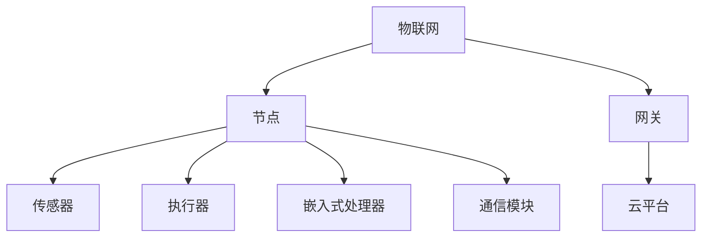

# 3.1.1 基本概念

## 1. 概念定义与背景

- **物联网（IoT, Internet of Things）**：通过各种信息传感设备与网络，实现物与物、物与人之间的信息交换和通信的网络系统。
- **嵌入式系统（Embedded System）**：以应用为中心，软硬件可裁剪，适用于特定功能的计算机系统，通常嵌入到设备内部。
- **智能终端**：具备感知、处理、通信能力的嵌入式设备。

## 2. 相关术语

- 节点（Node）：物联网中的基本单元，具备感知、处理、通信能力。
- 传感器（Sensor）：采集环境或对象信息的设备。
- 执行器（Actuator）：根据指令对环境或对象进行操作的设备。
- 网关（Gateway）：连接局域网与广域网，实现协议转换与数据中继。
- 协议栈（Protocol Stack）：实现通信协议的分层结构。

## 3. 结构化表达

- 概念图：

- 术语表：
| 编号 | 术语       | 定义 |
|------|------------|------|
| 3.1.1.1 | 物联网   | 物与物、物与人之间的信息网络 |
| 3.1.1.2 | 嵌入式系统 | 特定功能的软硬件系统 |
| 3.1.1.3 | 节点     | 具备感知、处理、通信能力的单元 |
| 3.1.1.4 | 传感器   | 采集信息的设备 |
| 3.1.1.5 | 执行器   | 执行操作的设备 |

## 4. 发展脉络

- 1990s：嵌入式系统广泛应用于工业、消费电子。
- 2000s：物联网概念提出，传感网、RFID等技术发展。
- 2010s：智能终端、云平台、边缘计算兴起，物联网规模化部署。
- 2020s：AIoT（人工智能+物联网）、5G、工业互联网等融合发展。

## 5. 主要理论/流派

- 感知层、网络层、应用层三层架构。
- 边缘计算、云计算、雾计算等体系。
- 嵌入式实时操作系统、轻量级协议栈。

## 6. 关键问题与挑战

- 异构设备的互联互通
- 能耗与资源受限
- 安全性与隐私保护
- 实时性与可靠性

## 7. 典型案例

- 智能家居系统：多种传感器与执行器协同。
- 工业物联网：设备监控、远程维护。
- 智能医疗：可穿戴设备、远程诊断。

## 8. 批判性分析

- 标准碎片化与兼容性问题
- 安全隐患与攻击面扩大
- 数据孤岛与平台封闭

## 9. 形式化结构与符号表达

- IoT = (N, S, A, G, C)
  - N：节点集合
  - S：传感器集合
  - A：执行器集合
  - G：网关集合
  - C：云平台

## 10. 形式化命题与推理

- 命题：若物联网节点具备感知与通信能力，则可实现远程监控。
- 证明：节点通过传感器采集数据，经通信模块上传，实现远程监控。

## 11. 多表征

- 结构层次图、通信流程图、资源分配矩阵等

## 12. 形式语义

- “物联网”语义：实现物与物、物与人之间的信息流动与智能决策。
- 语义模型：节点状态机、协议交互模型
- 语义分析方法：一致性验证、异常检测

---
> 本文件为递归细化与内容补全示范，后续可继续分解为3.1.1.1、3.1.1.2等子主题，支持持续递归完善。
