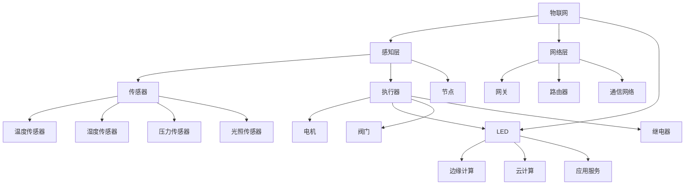
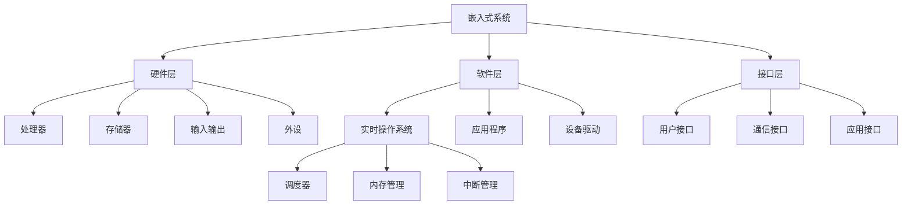
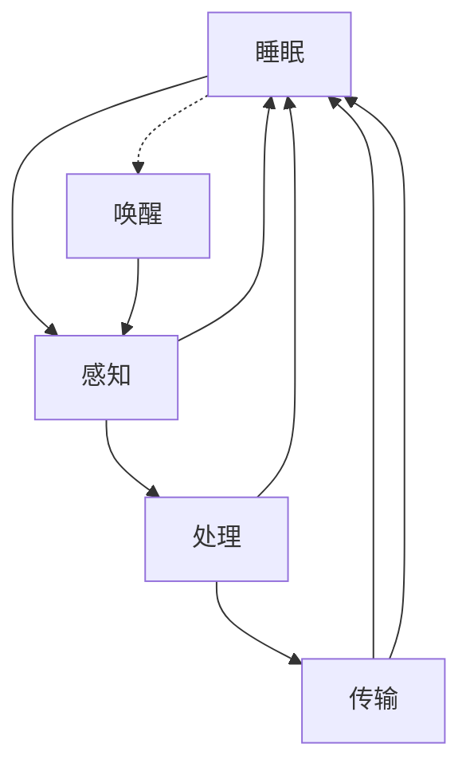

# 3.1.1 基本概念


<!-- TOC START -->

- [3.1.1 基本概念](#311-基本概念)
  - [1. 物联网形式化定义](#1-物联网形式化定义)
    - [1.1 物联网基本定义](#11-物联网基本定义)
    - [1.2 节点形式化定义](#12-节点形式化定义)
    - [1.3 传感器形式化定义](#13-传感器形式化定义)
  - [2. 嵌入式系统形式化定义](#2-嵌入式系统形式化定义)
    - [2.1 嵌入式系统基本定义](#21-嵌入式系统基本定义)
    - [2.2 实时系统定义](#22-实时系统定义)
    - [2.3 任务调度定义](#23-任务调度定义)
  - [3. 通信协议形式化定义](#3-通信协议形式化定义)
    - [3.1 协议栈定义](#31-协议栈定义)
    - [3.2 物联网协议](#32-物联网协议)
  - [4. 边缘计算形式化定义](#4-边缘计算形式化定义)
    - [4.1 边缘节点定义](#41-边缘节点定义)
    - [4.2 边缘计算任务](#42-边缘计算任务)
  - [5. 传感器网络形式化定义](#5-传感器网络形式化定义)
    - [5.1 传感器网络定义](#51-传感器网络定义)
    - [5.2 路由算法](#52-路由算法)
  - [6. 数据融合算法](#6-数据融合算法)
    - [6.1 数据融合定义](#61-数据融合定义)
    - [6.2 融合算法](#62-融合算法)
  - [7. 能量管理](#7-能量管理)
    - [7.1 能量模型](#71-能量模型)
    - [7.2 能量优化算法](#72-能量优化算法)
  - [8. 安全机制](#8-安全机制)
    - [8.1 安全模型](#81-安全模型)
    - [8.2 加密算法](#82-加密算法)
  - [9. 多表征](#9-多表征)
    - [9.1 物联网架构图](#91-物联网架构图)
    - [9.2 嵌入式系统层次图](#92-嵌入式系统层次图)
    - [9.3 协议栈层次表](#93-协议栈层次表)
    - [9.4 节点状态转换图](#94-节点状态转换图)
  - [10. 规范说明](#10-规范说明)

<!-- TOC END -->

## 1. 物联网形式化定义

### 1.1 物联网基本定义

**定义3.1.1.1（物联网）**：物联网IoT是一个有序六元组：

```text
IoT = (N, S, A, G, C, P)
```

其中：

- N = {n₁, n₂, ..., nₖ} 是节点集合
- S = {s₁, s₂, ..., sₘ} 是传感器集合
- A = {a₁, a₂, ..., aₙ} 是执行器集合
- G = {g₁, g₂, ..., gₚ} 是网关集合
- C = (C_edge, C_fog, C_cloud) 是计算平台
- P = {p₁, p₂, ..., pᵣ} 是协议栈集合

### 1.2 节点形式化定义

**定义3.1.1.2（节点）**：节点n是一个五元组：

```text
n = (node_id, sensors, actuators, processor, communication)
```

其中：

- node_id ∈ ℕ 是节点标识符
- sensors ⊆ S 是节点上的传感器集合
- actuators ⊆ A 是节点上的执行器集合
- processor = (cpu, memory, storage) 是处理器资源
- communication = (protocol, bandwidth, power) 是通信能力

### 1.3 传感器形式化定义

**定义3.1.1.3（传感器）**：传感器s是一个四元组：

```text
s = (sensor_id, sensor_type, measurement_range, accuracy)
```

其中：

- sensor_id ∈ ℕ 是传感器标识符
- sensor_type ∈ {temperature, humidity, pressure, light, motion, ...} 是传感器类型
- measurement_range = [min_value, max_value] 是测量范围
- accuracy ∈ ℝ⁺ 是测量精度

## 2. 嵌入式系统形式化定义

### 2.1 嵌入式系统基本定义

**定义3.1.1.4（嵌入式系统）**：嵌入式系统ES是一个有序五元组：

```text
ES = (H, S, RTOS, A, I)
```

其中：

- H = (CPU, Memory, I/O, Peripherals) 是硬件平台
- S = (Application, Middleware, Drivers) 是软件栈
- RTOS = (Scheduler, Memory_Manager, I/O_Manager) 是实时操作系统
- A = (Real_time, Reliability, Efficiency) 是系统属性
- I = (Interfaces, Protocols, Standards) 是接口规范

### 2.2 实时系统定义

**定义3.1.1.5（实时系统）**：实时系统RTS是一个四元组：

```text
RTS = (Tasks, Timing, Scheduler, Constraints)
```

其中：

- Tasks = {t₁, t₂, ..., tₙ} 是任务集合
- Timing = (deadline, period, execution_time) 是时间约束
- Scheduler: Tasks × Time → Tasks 是调度器
- Constraints = (hard_real_time, soft_real_time) 是实时约束

### 2.3 任务调度定义

**定义3.1.1.6（任务）**：任务t是一个六元组：

```text
t = (task_id, priority, deadline, period, execution_time, state)
```

其中：

- task_id ∈ ℕ 是任务标识符
- priority ∈ ℕ 是优先级
- deadline ∈ ℝ⁺ 是截止时间
- period ∈ ℝ⁺ 是周期（周期性任务）
- execution_time ∈ ℝ⁺ 是执行时间
- state ∈ {READY, RUNNING, BLOCKED, SUSPENDED} 是任务状态

## 3. 通信协议形式化定义

### 3.1 协议栈定义

**定义3.1.1.7（协议栈）**：协议栈P是一个分层结构：

```text
P = (L₁, L₂, L₃, L₄, L₅, L₆, L₇)
```

其中：

- L₁：物理层（Physical Layer）
- L₂：数据链路层（Data Link Layer）
- L₃：网络层（Network Layer）
- L₄：传输层（Transport Layer）
- L₅：会话层（Session Layer）
- L₆：表示层（Presentation Layer）
- L₇：应用层（Application Layer）

### 3.2 物联网协议

**MQTT协议**：

```text
MQTT = {
  broker: Broker,
  clients: Set<Client>,
  topics: Set<Topic>,
  messages: Queue<Message>
}

Message = {
  topic: Topic,
  payload: Data,
  qos: {0, 1, 2},
  retain: boolean
}
```

**CoAP协议**：

```text
CoAP = {
  method: {GET, POST, PUT, DELETE},
  uri_path: string,
  payload: Data,
  confirmable: boolean,
  message_id: ℕ
}
```

## 4. 边缘计算形式化定义

### 4.1 边缘节点定义

**定义3.1.1.8（边缘节点）**：边缘节点EN是一个四元组：

```text
EN = (edge_id, computing_power, storage_capacity, network_bandwidth)
```

其中：

- edge_id ∈ ℕ 是边缘节点标识符
- computing_power ∈ ℝ⁺ 是计算能力（FLOPS）
- storage_capacity ∈ ℝ⁺ 是存储容量（字节）
- network_bandwidth ∈ ℝ⁺ 是网络带宽（bps）

### 4.2 边缘计算任务

**定义3.1.1.9（边缘计算任务）**：边缘计算任务ECT是一个五元组：

```text
ECT = (task_id, input_data, algorithm, resource_requirements, deadline)
```

其中：

- task_id ∈ ℕ 是任务标识符
- input_data ⊆ Data 是输入数据
- algorithm: Data → Result 是计算算法
- resource_requirements = (cpu, memory, bandwidth) 是资源需求
- deadline ∈ ℝ⁺ 是截止时间

## 5. 传感器网络形式化定义

### 5.1 传感器网络定义

**定义3.1.1.10（传感器网络）**：传感器网络SN是一个四元组：

```text
SN = (Nodes, Topology, Communication, Energy)
```

其中：

- Nodes = {n₁, n₂, ..., nₙ} 是传感器节点集合
- Topology = (V, E) 是网络拓扑图
- Communication = (protocol, routing, mac) 是通信机制
- Energy = (battery_level, power_consumption, lifetime) 是能量管理

### 5.2 路由算法

**LEACH算法**：

```text
LEACH(round):
  if is_cluster_head(round):
    broadcast_cluster_head_message()
    receive_join_requests()
    create_tdma_schedule()
    aggregate_data()
    transmit_to_sink()
  else:
    select_cluster_head()
    send_join_request()
    send_data_to_cluster_head()
```

**AODV路由算法**：

```text
AODV(source, destination):
  if route_exists(destination):
    return route
  else:
    broadcast_rreq(source, destination)
    wait_for_rrep()
    if rrep_received():
      update_routing_table()
      return route
    else:
      return null
```

## 6. 数据融合算法

### 6.1 数据融合定义

**定义3.1.1.11（数据融合）**：数据融合DF是一个函数：

```text
DF: Data₁ × Data₂ × ... × Dataₙ → Fused_Data
```

### 6.2 融合算法

**加权平均融合**：

```text
WeightedAverage(data_sources, weights):
  fused_data = 0
  for i = 1 to n:
    fused_data += data_sources[i] × weights[i]
  return fused_data / sum(weights)
```

**卡尔曼滤波融合**：

```text
KalmanFilter(measurement, prediction):
  // 预测步骤
  x_pred = F × x_prev
  P_pred = F × P_prev × F^T + Q
  
  // 更新步骤
  K = P_pred × H^T × (H × P_pred × H^T + R)^(-1)
  x_new = x_pred + K × (measurement - H × x_pred)
  P_new = (I - K × H) × P_pred
  
  return (x_new, P_new)
```

## 7. 能量管理

### 7.1 能量模型

**定义3.1.1.12（能量模型）**：节点能量消耗模型：

```text
E_total = E_sensing + E_processing + E_communication + E_idle
```

其中：

- E_sensing = P_sensing × t_sensing 是感知能耗
- E_processing = P_processing × t_processing 是处理能耗
- E_communication = P_tx × t_tx + P_rx × t_rx 是通信能耗
- E_idle = P_idle × t_idle 是空闲能耗

### 7.2 能量优化算法

**能量感知路由**：

```text
EnergyAwareRouting(source, destination):
  for each path in all_paths(source, destination):
    energy_cost[path] = calculate_energy_cost(path)
  return path_with_minimum_energy_cost
```

**动态功率管理**：

```text
DynamicPowerManagement(node):
  if node.battery_level < threshold:
    node.power_mode = LOW_POWER
    reduce_sampling_rate()
    increase_sleep_time()
  else:
    node.power_mode = NORMAL
    normal_operation()
```

## 8. 安全机制

### 8.1 安全模型

**定义3.1.1.13（安全模型）**：物联网安全模型：

```text
Security = (Authentication, Authorization, Encryption, Integrity)
```

其中：

- Authentication: User × Credentials → boolean 是身份认证
- Authorization: User × Resource × Action → boolean 是权限控制
- Encryption: Plaintext × Key → Ciphertext 是数据加密
- Integrity: Data × Hash → boolean 是数据完整性

### 8.2 加密算法

**AES加密**：

```text
AES_Encrypt(plaintext, key):
  state = plaintext
  for round = 1 to 10:
    state = SubBytes(state)
    state = ShiftRows(state)
    if round < 10:
      state = MixColumns(state)
    state = AddRoundKey(state, key[round])
  return state
```

**RSA加密**：

```text
RSA_Encrypt(message, public_key):
  n, e = public_key
  ciphertext = message^e mod n
  return ciphertext

RSA_Decrypt(ciphertext, private_key):
  n, d = private_key
  message = ciphertext^d mod n
  return message
```

## 9. 多表征

### 9.1 物联网架构图



### 9.2 嵌入式系统层次图



### 9.3 协议栈层次表

| 层次 | 协议 | 功能 | 数据单元 |
|------|------|------|---------|
| 应用层 | MQTT, CoAP, HTTP | 应用服务 | 消息 |
| 表示层 | JSON, XML, Protocol Buffers | 数据格式 | 数据 |
| 会话层 | TLS, DTLS | 安全传输 | 会话 |
| 传输层 | TCP, UDP | 端到端传输 | 段 |
| 网络层 | IP, 6LoWPAN | 路由转发 | 包 |
| 数据链路层 | IEEE 802.15.4, WiFi | 帧传输 | 帧 |
| 物理层 | 无线电, 有线 | 比特传输 | 比特 |

### 9.4 节点状态转换图



## 10. 规范说明

- 内容需递归细化，支持多表征
- 保留批判性分析、符号、图表等
- 如有遗漏，后续补全并说明
- 所有定义需严格形式化
- 算法需提供伪代码
- 图表需使用mermaid语法
- 表格需包含完整信息
- 安全机制需详细说明

> 本文件为递归细化与内容补全示范，后续可继续分解为3.1.1.1、3.1.1.2等子主题，支持持续递归完善。
