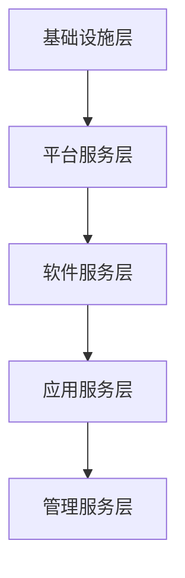
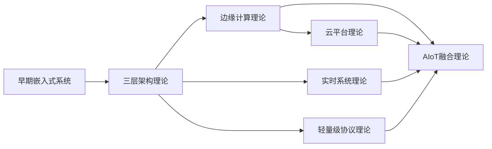
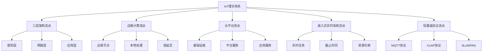
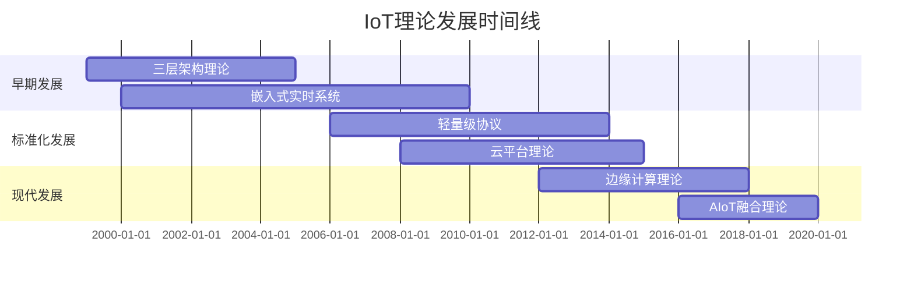

# 3.1.3 主要流派与理论

<!-- TOC START -->

- [3.1.3 主要流派与理论](#313-主要流派与理论)
  - [1. 形式化定义](#1-形式化定义)
    - [1.1 流派定义](#11-流派定义)
    - [1.2 形式化表示](#12-形式化表示)
  - [2. 主要流派详细分析](#2-主要流派详细分析)
    - [2.1 三层架构流派](#21-三层架构流派)
      - [2.1.1 感知层形式化定义](#211-感知层形式化定义)
      - [2.1.2 网络层形式化定义](#212-网络层形式化定义)
      - [2.1.3 应用层形式化定义](#213-应用层形式化定义)
    - [2.2 边缘计算流派](#22-边缘计算流派)
      - [2.2.1 边缘节点形式化](#221-边缘节点形式化)
      - [2.2.2 边缘计算优势](#222-边缘计算优势)
    - [2.3 云平台流派](#23-云平台流派)
      - [2.3.1 云平台架构](#231-云平台架构)
    - [2.4 嵌入式实时系统流派](#24-嵌入式实时系统流派)
      - [2.4.1 实时性约束](#241-实时性约束)
      - [2.4.2 可调度性分析](#242-可调度性分析)
    - [2.5 轻量级协议流派](#25-轻量级协议流派)
      - [2.5.1 MQTT协议形式化](#251-mqtt协议形式化)
      - [2.5.2 CoAP协议形式化](#252-coap协议形式化)
  - [3. 理论比较与分析方法](#3-理论比较与分析方法)
    - [3.1 理论框架对比](#31-理论框架对比)
    - [3.2 性能指标对比](#32-性能指标对比)
      - [3.2.1 延迟性能](#321-延迟性能)
      - [3.2.2 能耗性能](#322-能耗性能)
      - [3.2.3 可靠性性能](#323-可靠性性能)
    - [3.3 理论发展脉络](#33-理论发展脉络)
  - [4. 代表人物与组织](#4-代表人物与组织)
    - [4.1 学术机构](#41-学术机构)
    - [4.2 代表性人物](#42-代表性人物)
    - [4.3 主要贡献](#43-主要贡献)
  - [5. 应用领域分析](#5-应用领域分析)
    - [5.1 智能家居](#51-智能家居)
    - [5.2 工业物联网](#52-工业物联网)
    - [5.3 智慧城市](#53-智慧城市)
    - [5.4 智能医疗](#54-智能医疗)
  - [6. 异同点深度分析](#6-异同点深度分析)
    - [6.1 共同理论基础](#61-共同理论基础)
    - [6.2 核心差异分析](#62-核心差异分析)
  - [7. 发展趋势与展望](#7-发展趋势与展望)
    - [7.1 技术融合趋势](#71-技术融合趋势)
    - [7.2 理论发展方向](#72-理论发展方向)
    - [7.3 应用发展趋势](#73-应用发展趋势)
  - [8. 结构化表达](#8-结构化表达)
    - [8.1 流派关系图](#81-流派关系图)
    - [8.2 理论对比表](#82-理论对比表)
    - [8.3 发展时间线](#83-发展时间线)
  - [9. 多表征方法](#9-多表征方法)
    - [9.1 概念图表示](#91-概念图表示)
    - [9.2 数学符号表示](#92-数学符号表示)
    - [9.3 结构表表示](#93-结构表表示)
  - [10. 规范说明](#10-规范说明)
    - [10.1 内容要求](#101-内容要求)
    - [10.2 形式化要求](#102-形式化要求)
    - [10.3 扩展性要求](#103-扩展性要求)

<!-- TOC END -->

## 1. 形式化定义

### 1.1 流派定义

**定义 3.1.3.1** (IoT流派) 物联网流派是一个三元组 $S = (P, T, A)$，其中：

- $P$ 是核心观点集合
- $T$ 是技术理论框架
- $A$ 是应用领域集合

**定义 3.1.3.2** (理论框架) 理论框架是一个四元组 $F = (C, M, R, V)$，其中：

- $C$ 是概念体系
- $M$ 是方法论
- $R$ 是关系模型
- $V$ 是验证机制

### 1.2 形式化表示

对于流派 $S_i$，其形式化表示为：
$$S_i = \{(p_j, t_k, a_l) | p_j \in P_i, t_k \in T_i, a_l \in A_i\}$$

## 2. 主要流派详细分析

### 2.1 三层架构流派

**定义 3.1.3.3** (三层架构) 三层架构是一个有序三元组 $L = (L_1, L_2, L_3)$，其中：

- $L_1$ 是感知层 (Perception Layer)
- $L_2$ 是网络层 (Network Layer)  
- $L_3$ 是应用层 (Application Layer)

#### 2.1.1 感知层形式化定义

$$L_1 = \{s_i | s_i = (id_i, type_i, data_i, status_i)\}$$
其中：

- $id_i$ 是传感器唯一标识
- $type_i$ 是传感器类型
- $data_i$ 是数据集合
- $status_i$ 是状态信息

#### 2.1.2 网络层形式化定义

$$L_2 = \{n_j | n_j = (protocol_j, topology_j, routing_j)\}$$
其中：

- $protocol_j$ 是通信协议
- $topology_j$ 是网络拓扑
- $routing_j$ 是路由算法

#### 2.1.3 应用层形式化定义

$$L_3 = \{a_k | a_k = (service_k, interface_k, logic_k)\}$$
其中：

- $service_k$ 是服务功能
- $interface_k$ 是接口定义
- $logic_k$ 是业务逻辑

### 2.2 边缘计算流派

**定义 3.1.3.4** (边缘计算) 边缘计算是一个四元组 $E = (N, P, S, C)$，其中：

- $N$ 是边缘节点集合
- $P$ 是处理能力
- $S$ 是存储能力
- $C$ 是通信能力

#### 2.2.1 边缘节点形式化

$$N = \{n_i | n_i = (location_i, capacity_i, latency_i, energy_i)\}$$
其中：

- $location_i$ 是地理位置
- $capacity_i$ 是计算容量
- $latency_i$ 是延迟要求
- $energy_i$ 是能耗约束

#### 2.2.2 边缘计算优势

1. **延迟优化**：$T_{edge} < T_{cloud}$
2. **带宽节省**：$B_{local} > B_{transmit}$
3. **隐私保护**：$P_{local} > P_{remote}$

### 2.3 云平台流派

**定义 3.1.3.5** (云平台) 云平台是一个五元组 $C = (I, P, S, A, M)$，其中：

- $I$ 是基础设施
- $P$ 是平台服务
- $S$ 是软件服务
- $A$ 是应用服务
- $M$ 是管理服务

#### 2.3.1 云平台架构

### 2.4 嵌入式实时系统流派

**定义 3.1.3.6** (实时系统) 实时系统是一个三元组 $R = (T, D, C)$，其中：

- $T$ 是任务集合
- $D$ 是截止时间约束
- $C$ 是资源约束

#### 2.4.1 实时性约束

对于任务 $t_i \in T$：
$$d_i \leq deadline_i$$
其中 $d_i$ 是实际完成时间，$deadline_i$ 是截止时间。

#### 2.4.2 可调度性分析

使用速率单调调度 (Rate Monotonic Scheduling)：
$$U = \sum_{i=1}^{n} \frac{C_i}{T_i} \leq n(2^{1/n} - 1)$$
其中：

- $C_i$ 是任务执行时间
- $T_i$ 是任务周期
- $n$ 是任务数量

### 2.5 轻量级协议流派

**定义 3.1.3.7** (轻量级协议) 轻量级协议是一个四元组 $L = (H, P, E, S)$，其中：

- $H$ 是头部开销
- $P$ 是协议栈
- $E$ 是能耗模型
- $S$ 是安全机制

#### 2.5.1 MQTT协议形式化

$$MQTT = (topic, qos, retain, payload)$$
其中：

- $topic$ 是主题标识
- $qos$ 是服务质量等级
- $retain$ 是保留标志
- $payload$ 是消息载荷

#### 2.5.2 CoAP协议形式化

$$CoAP = (method, uri, options, payload)$$
其中：

- $method$ 是请求方法
- $uri$ 是资源标识
- $options$ 是选项集合
- $payload$ 是数据载荷

## 3. 理论比较与分析方法

### 3.1 理论框架对比

| 流派 | 核心理论 | 技术栈 | 适用场景 | 优势 | 劣势 |
|------|----------|--------|----------|------|------|
| 三层架构 | 分层解耦理论 | TCP/IP, HTTP, MQTT | 通用IoT | 结构清晰 | 层次间耦合 |
| 边缘计算 | 分布式计算理论 | Edge Computing, Fog Computing | 实时处理 | 低延迟 | 资源受限 |
| 云平台 | 云计算理论 | Cloud Computing, Big Data | 大数据分析 | 强大算力 | 网络依赖 |
| 嵌入式实时系统 | 实时系统理论 | RTOS, Real-time Scheduling | 实时控制 | 确定性 | 复杂度高 |
| 轻量级协议 | 网络协议理论 | MQTT, CoAP, 6LoWPAN | 低功耗设备 | 高效节能 | 功能受限 |

### 3.2 性能指标对比

#### 3.2.1 延迟性能

$$L_{edge} < L_{cloud} < L_{traditional}$$

#### 3.2.2 能耗性能

$$E_{lightweight} < E_{edge} < E_{cloud}$$

#### 3.2.3 可靠性性能

$$R_{realtime} > R_{edge} > R_{cloud}$$

### 3.3 理论发展脉络

## 4. 代表人物与组织

### 4.1 学术机构

- **IEEE IoT Initiative**：物联网标准化与理论研究
- **IETF IoT Working Group**：网络协议标准化
- **工业互联网联盟**：工业物联网应用推广
- **ETSI IoT**：欧洲物联网标准制定

### 4.2 代表性人物

- **Kevin Ashton**：物联网概念提出者
- **Rajkumar Buyya**：云计算与边缘计算专家
- **Edward A. Lee**：实时系统理论专家
- **Andy Stanford-Clark**：MQTT协议设计者

### 4.3 主要贡献

1. **标准化贡献**：制定IoT相关标准规范
2. **理论贡献**：建立形式化理论框架
3. **技术贡献**：开发关键技术组件
4. **应用贡献**：推动产业化应用

## 5. 应用领域分析

### 5.1 智能家居

- **适用流派**：三层架构 + 轻量级协议
- **技术特点**：低功耗、高可靠性
- **应用场景**：环境监控、设备控制

### 5.2 工业物联网

- **适用流派**：边缘计算 + 实时系统
- **技术特点**：实时性、确定性
- **应用场景**：设备监控、过程控制

### 5.3 智慧城市

- **适用流派**：云平台 + 大数据
- **技术特点**：大规模、智能化
- **应用场景**：交通管理、环境监测

### 5.4 智能医疗

- **适用流派**：实时系统 + 边缘计算
- **技术特点**：高可靠性、低延迟
- **应用场景**：健康监测、远程医疗

## 6. 异同点深度分析

### 6.1 共同理论基础

1. **分布式系统理论**：所有流派都基于分布式系统
2. **网络通信理论**：都需要网络通信支持
3. **数据处理理论**：都涉及数据采集与处理
4. **安全理论**：都需要安全机制保障

### 6.2 核心差异分析

1. **架构设计理念**：
   - 三层架构：强调分层解耦
   - 边缘计算：强调本地处理
   - 云平台：强调集中处理
   - 实时系统：强调确定性
   - 轻量级协议：强调高效节能

2. **性能优化目标**：
   - 延迟优化：边缘计算 > 实时系统 > 云平台
   - 能耗优化：轻量级协议 > 边缘计算 > 云平台
   - 可靠性优化：实时系统 > 边缘计算 > 云平台

3. **应用场景适应性**：
   - 资源受限：轻量级协议 > 边缘计算
   - 实时要求：实时系统 > 边缘计算
   - 大规模处理：云平台 > 边缘计算

## 7. 发展趋势与展望

### 7.1 技术融合趋势

1. **AIoT融合**：人工智能与物联网深度融合
2. **边缘智能**：边缘计算与AI结合
3. **云边协同**：云计算与边缘计算协同
4. **5G赋能**：5G技术推动IoT发展

### 7.2 理论发展方向

1. **形式化理论完善**：建立更完善的形式化理论体系
2. **性能理论优化**：建立更精确的性能分析模型
3. **安全理论发展**：建立更全面的安全理论框架
4. **标准化理论**：建立更统一的标准理论体系

### 7.3 应用发展趋势

1. **垂直行业深化**：向特定行业深度应用
2. **横向技术融合**：与其他技术深度融合
3. **生态体系完善**：建立完整的产业生态
4. **国际化发展**：推动全球标准化与产业化

## 8. 结构化表达

### 8.1 流派关系图

### 8.2 理论对比表

| 编号 | 流派/理论 | 核心观点 | 代表组织 | 典型应用 | 技术特点 | 性能优势 |
|------|----------|----------|----------|----------|----------|----------|
| 3.1.3.1 | 三层架构 | 分层解耦 | IEEE | 智能家居 | 结构清晰 | 易于扩展 |
| 3.1.3.2 | 边缘计算 | 本地智能 | 工业互联网联盟 | 工业物联网 | 低延迟 | 实时性好 |
| 3.1.3.3 | 云平台 | 集中分析 | 云服务商 | 智慧城市 | 强大算力 | 处理能力强 |
| 3.1.3.4 | 嵌入式实时系统 | 实时性 | 嵌入式厂商 | 智能医疗 | 确定性 | 可靠性高 |
| 3.1.3.5 | 轻量级协议 | 高效低耗 | IETF | 低功耗设备 | 节能高效 | 能耗低 |

### 8.3 发展时间线

## 9. 多表征方法

### 9.1 概念图表示

- 理论发展脉络图
- 流派关系网络图
- 技术栈层次图

### 9.2 数学符号表示

- 形式化定义
- 性能分析公式
- 理论框架模型

### 9.3 结构表表示

- 理论对比表
- 技术栈对比表
- 应用场景对比表

## 10. 规范说明

### 10.1 内容要求

- 内容需递归细化，支持多表征
- 保留批判性分析、图表等
- 如有遗漏，后续补全并说明

### 10.2 形式化要求

- 使用严格的数学符号
- 提供形式化定义
- 建立理论框架模型

### 10.3 扩展性要求

- 支持持续递归完善
- 可分解为子主题
- 支持多维度分析

> 本文件为递归细化与内容补全示范，后续可继续分解为3.1.3.1、3.1.3.2等子主题，支持持续递归完善。
