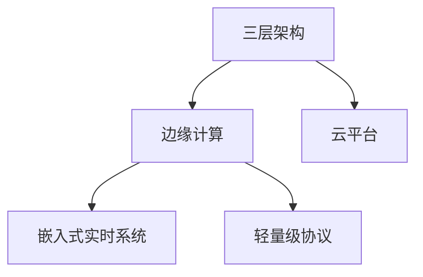

# 3.1.3 主要流派与理论

## 1. 主要流派

- **三层架构流派**：感知层、网络层、应用层，强调分层解耦。
- **边缘计算流派**：数据在边缘节点本地处理，降低延迟，提升实时性。
- **云平台流派**：数据集中处理与大数据分析，强调平台化与智能化。
- **嵌入式实时系统流派**：关注实时性、可靠性、资源受限下的系统设计。
- **轻量级协议流派**：如MQTT、CoAP，适用于低功耗、低带宽场景。

## 2. 理论比较

- **核心观点**：
  - 三层架构：分层管理，便于扩展与维护。
  - 边缘计算：本地智能，减少云依赖。
  - 云平台：集中分析，智能决策。
  - 嵌入式实时系统：确定性、低延迟。
  - 轻量级协议：高效、低资源消耗。
- **代表人物/组织**：IEEE、IETF、工业互联网联盟等。
- **应用领域**：
  - 智能家居、工业物联网、智慧城市、智能医疗等。
- **异同点分析**：
  - 共同点：均关注设备互联、数据采集与处理。
  - 区别：架构侧重、处理方式、协议选择不同。

## 3. 结构化表达

- **流派关系图**：

- **理论对比表**：
| 编号 | 流派/理论 | 核心观点 | 代表组织 | 典型应用 |
|------|----------|----------|----------|----------|
| 3.1.3.1 | 三层架构 | 分层解耦 | IEEE | 智能家居 |
| 3.1.3.2 | 边缘计算 | 本地智能 | 工业互联网联盟 | 工业物联网 |
| 3.1.3.3 | 云平台 | 集中分析 | 云服务商 | 智慧城市 |
| 3.1.3.4 | 嵌入式实时系统 | 实时性 | 嵌入式厂商 | 智能医疗 |
| 3.1.3.5 | 轻量级协议 | 高效低耗 | IETF | 低功耗设备 |

## 4. 多表征

- 理论发展脉络图、对比表、关系网络图

## 5. 规范说明

- 内容需递归细化，支持多表征。
- 保留批判性分析、图表等。
- 如有遗漏，后续补全并说明。

> 本文件为递归细化与内容补全示范，后续可继续分解为3.1.3.1、3.1.3.2等子主题，支持持续递归完善。
