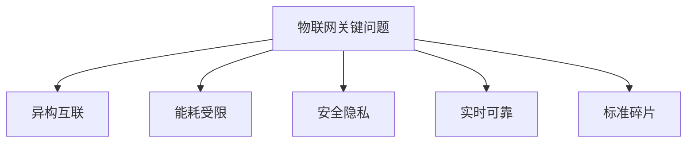

# 3.1.4 关键问题与挑战

## 1. 主要问题

- **异构设备互联互通**：多种协议、平台、硬件的兼容性问题。
- **能耗与资源受限**：节点设备功耗低、计算与存储资源有限。
- **安全性与隐私保护**：数据传输、存储、访问的安全风险。
- **实时性与可靠性**：关键应用对延迟和稳定性的高要求。
- **标准化与碎片化**：协议、平台标准不统一，影响生态发展。

## 2. 挑战分析

- **理论与实际的差距**：模型简化现实，实际部署复杂多变。
- **多学科交叉的难点**：涉及通信、嵌入式、云计算、AI等多领域。
- **未来发展趋势**：AIoT、5G、工业互联网等新兴技术带来新挑战。
- **自组织与自适应能力**：系统需具备动态调整与自愈能力。

## 3. 结构化表达

- **问题树**：

- **挑战矩阵**：
| 编号 | 挑战 | 影响领域 | 典型难点 |
|------|------|----------|----------|
| 3.1.4.1 | 理论与实际差距 | 工程实现 | 不确定性、模型失效 |
| 3.1.4.2 | 多学科交叉 | 系统设计 | 知识整合、术语不统一 |
| 3.1.4.3 | 未来趋势 | 前沿技术 | AIoT、5G、工业互联网 |
| 3.1.4.4 | 自组织自适应 | 智能系统 | 动态优化、自愈能力 |

## 4. 多表征

- 问题树、挑战矩阵、趋势图、案例分析

## 5. 规范说明

- 内容需递归细化，支持多表征。
- 保留批判性分析、图表等。
- 如有遗漏，后续补全并说明。

> 本文件为递归细化与内容补全示范，后续可继续分解为3.1.4.1、3.1.4.2等子主题，支持持续递归完善。
